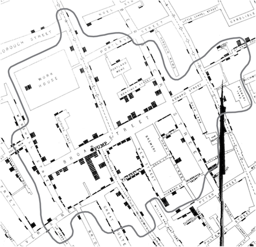

<!-- README.md is generated from README.Rmd. Please edit that file -->

```{r, echo = FALSE}
knitr::opts_chunk$set(
  collapse = TRUE,
  comment = "#>",
  fig.path = "README-"
)
```

### cholera: amend, augment and aid analysis of John Snow's 1854 cholera data

John Snow's map of the 1854 cholera outbreak in London's Soho is one of the best known examples of data visualization and information design. As evidence of his claim that cholera is a waterborne rather than airborne disease, Snow plots the water pumps, the primary source of drinking water in 1854, and the location and count of cholera fatalities as stacks of horizontal bars:


While the map shows a concentration of fatalities around the Broad Street pump, which Snow suspected was the source of the cholera, it actually doesn't do the best job of excluding rival explanation. The pattern we see is not clearly different from what airborne transmission might look like. To address this problem, Snow added a graphical annotation to a second, lesser-known version of the map that was published in the official report on the outbreak:



### pump neighborhoods

This annotation outlines the Broad Street _pump neighborhood_, the residences Snow claims are within "close" walking distance to the pump. What makes this and other pump neighborhoods so important is that they provide a very specific (testable) prediction about the spatial distribution of cases. The line of thinking is this: if water is cholera's mode of transmission and and if water pumps located on the street are the primary source of drinking water, then most, if not all fatalities should be found _within_ the neighborhood. To put it simply, fatalities should stop at the neighborhood's borders. In this way, pump neighborhoods can help distinguish waterborne from airborne patterns of disease transmission.

To that end, this package builds on Snow's work by offering two systematic ways to compute pump neighborhoods. Doing so not only provides a way to replicate and validate Snow's efforts, it also allows greater exploration of the data by allowing you to compute all or any selection of pump neighborhoods. The can help you to determine which case belongs to which neighborhood, and to explore scenarios, like the possibility that the choice of pump is affected by water quality.

The first uses Voronoi tessellation. It is based on the Euclidean distance between pumps. While popular and easy to compute, its only drawback is that roads and walking distance play no role in people's choice of pump. The method assumes that people can walk through walls to get to their preferred pump:

```{r voronoi, fig.width = 6, fig.height = 6, message = FALSE}
library(cholera)
plot(neighborhoodVoronoi())
```

The second method, which builds on Snow's example, computes neighborhoods based on walking distance. While more accurate, it is harder to compute. I wrote functions that transform the roads on the map into a "social" graph and turn the computation of walking distance into a graph theory problem. For a given case (observed or simulated), I compute the shortest weighted path to the nearest pump:

```{r path, fig.width = 6, fig.height = 6, message = FALSE}
walkingPath(150)
```

Then, by applying the "rinse and repeat" principle, the different pump neighborhoods will begin to emerge:

```{r walk, fig.width = 6, fig.height = 6, message = FALSE}
plot(neighborhoodWalking())
```

To exploring scenarios like the water quality problem mentioned above, you simply exclude the pump with low quality and see how it affect the spatial distribution of cases:

```{r walk6, fig.width = 6, fig.height = 6, message = FALSE}
plot(neighborhoodWalking(-6))
```

### getting started

To install "cholera", use the expression below. Note that you need to have already installed the "devtools" R package.

```{r, eval = FALSE}
# install.packages("devtools")
devtools::install_github("lindbrook/cholera", build_vignettes = TRUE)
```

Besides the help pages, the vignettes include detailed discussion about the data and functions included in this package:

```{r, eval = FALSE}
vignette("duplicate.missing.cases")
vignette("unstacking.fatalities")
vignette("pump.neighborhoods")
vignette("roads")
vignette("time.series")
```

### other package features

* Fixes three apparent coding errors in Dodson and Tobler's 1992 digitization of Snow's map.
* "Unstacks" the data in two ways to improve analysis and visualization.
* Adds the ability to overlay graphical features like kernel density, Voronoi diagrams, and notable landmarks (the plague pit, the Lion Brewery, etc.).
* Includes a variety of helper functions to find and locate cases, roads, pumps and walking paths.
* Appends street names to roads data.
* Includes the revised pump data used in the second version of Snow's map.
* Adds two different aggregate time series fatalities data from the Vestry report.

