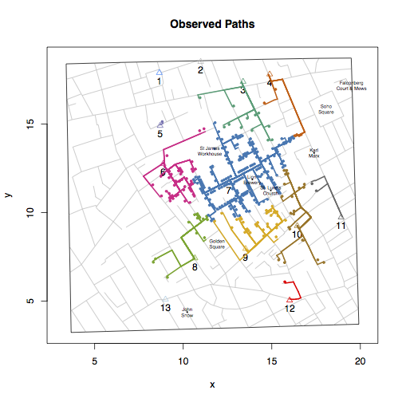

## cholera: amend, augment and aid analysis of John Snow's 1854 cholera data

John Snow's map of the 1854 London cholera outbreak is one of the best known examples of data visualization.

To facilitate analysis and study of that map, the `cholera` package does the following. First, the package amends and augments [Dodson and Tobler](http://www.ncgia.ucsb.edu/pubs/snow/snow.html)'s 1992 digitiztion of John Snow maps of the 1854 London cholera outbreak: 1) it fixes three apparent coding errors; 2) it "unstacks" the data to facilitate numeric and statistical analysis; and 3) it appends road names to the street data. Second, to help navigate the map the package offers functions that help locate specific fatalities, streets, and water pumps. Third, to help assess the ability of the map to support Snow's claims that cholera is a waterborne disease and that the pump on Broad Street was the source of the outbreak the package offers functions that visualize and compute the "neighborhoods" of selected pumps: the set of addresses and roads that are closest to that pump. Fourth, the package collects associated data of interest. It adds two different sets of fatalities time series data. It includes data from the revised second version of the map that adds a fourteenth pump and that relocates the pump on Broad Street. It adds landmarks of interest (e.g., Lion Brewery, St. James Workhouse, St. Luke's Church).

This is a development version.



## Installation

```R
# install.packages("devtools")
devtools::install_github("lindbrook/cholera", build_vignettes = TRUE)
```
