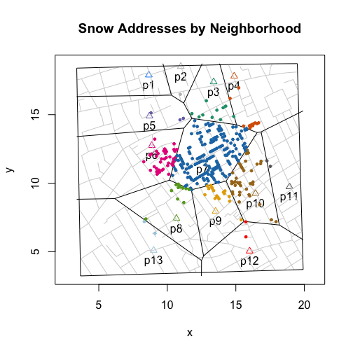
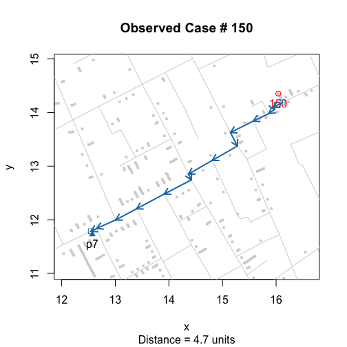
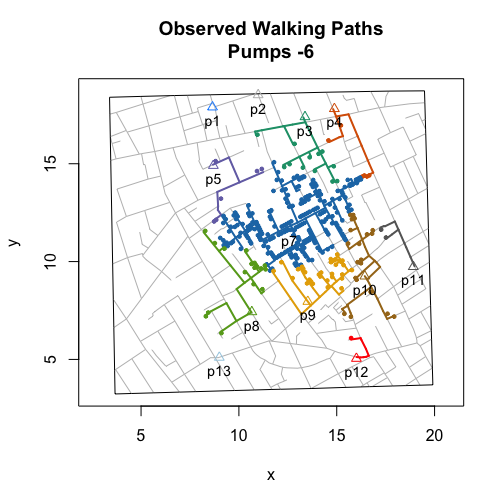

<!-- README.md is generated from README.Rmd. Please edit that file -->
### cholera: amend, augment and aid analysis of John Snow's 1854 cholera data

John Snow's map of the 1854 Soho, London cholera outbreak is one of the best known examples of data visualization and information design:


The "textbook" account is that Snow used the map to show that cholera was a waterborne not airborne disease, to identify the water pump on Broad Street as the source of the disease, and to convince officials to remove pump's handle thereby stemming the tide of the outbreak. Little of this stands up to careful scrutiny. The greater puzzle is why despite the evidence (and the map), Snow failed to convince both local officials and his peers in the scientific community of the validity of his claims, and why we hold the map in such high regard today. To address these questions, this package helps users assess and explore the map and its data.

### pump neighborhoods

The key to understanding what Snow hoped to achieve with his map lies with the second, lesser-known version that appeared in the official report on the outbreak:


What makes this version important is the addition of a graphical annotation that describes the Broad Street pump "neighborhood": the residences that were most likely to use the pump that Snow suspected as being the source of the outbreak. Because getting drinking water in 1854 London meant physically fetching it from a public pump, the notion of a "neighborhood" is pivotal to Snow's claim that cholera is a waterborne disease. If he was right, the outbreak should literally stop at the neighborhood's borders.

While the details of how Snow "computed" his annotation are lost to history, this package offers a variety of ways, including Snow's, to compute pump neighborhoods. The two more systematic methods compute the neighborhoods for all selected pumps. The first uses Voronoi tessellation. It is based on the Euclidean distance between pumps:

``` r
library(cholera)
plot(neighborhoodVoronoi())
```



While popular and easy-to-compute, the drawback is by using the Euclidean distance or the distance "as-the-crow-flies", it assumes that people can walk through walls.

The more accurate but hard-to-compute approach would be to use the "actual" walking distances along the streets of Soho. This, in fact, appears to be what Snow himself claims to to do. He writes that his annotation includes "the various points which have been found by careful measurement to be at an equal distance by the nearest road from the pump in Broad Street and the surrounding pumps".

To replicate and extend his efforts, I wrote functions that compute walking distance pump neighborhoods. They work by transforming the roads on the map into a "social" graph and by turning the computation of walking distances into a graph theory problem. Essentially, I compute the shortest path between a case (observed or simulated) and its nearest pump:

``` r
walkingPath(150)
```



"Rinse and repeat" and the different pump neighborhoods will emerge:

``` r
plot(neighborhoodWalking())
```


One nice feature of these functions is that you can explore the data by including or excluding pumps. This can be important if factors other than distance play a role in the choice of pump. For example, Snow argued that water from the pump on Little Marlborough Street pump (\#6) was of low quality and that people in that neighborhood actually preferred the water from the Broad Street pump (\#7). To investigate this scenario, you simply exclude the pump on Little Marlborough Street (\#6):

``` r
plot(neighborhoodWalking(-6))
```



### getting started

To install "cholera", use the expression below. Note that you need to have already installed the "devtools" R package.

``` r
# install.packages("devtools")
devtools::install_github("lindbrook/cholera", build_vignettes = TRUE)
```

Besides the help pages, the vignettes include detailed discussion about the data and functions included in this package:

``` r
vignette("duplicate.missing.cases")
vignette("unstacking.fatalities")
vignette("pump.neighborhoods")
vignette("roads")
vignette("time.series")
```
