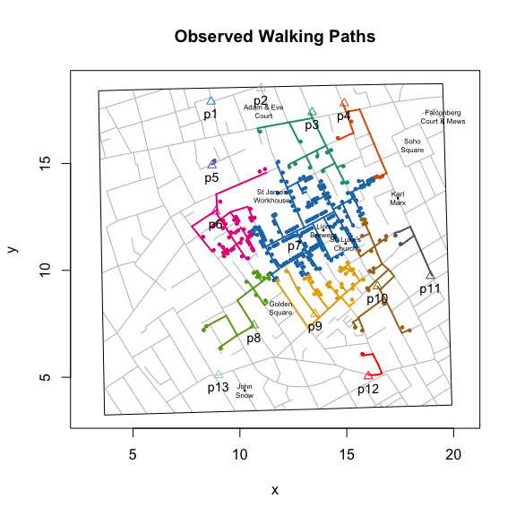

<!-- README.md is generated from README.Rmd. Please edit that file -->
cholera: amend, augment and aid analysis of John Snow's 1854 cholera data
-------------------------------------------------------------------------

John Snow's map of the 1854 London cholera outbreak is one of the best known examples of data visualization:


However, as evidence of Snow's claims that cholera is a waterborne illness or that the Broad Street pump is the source of the outbreak, the map may not be as successful as is commonly thought.

To help assess such criticisms and to allow people to analyze Snow's data for themselves, this package offers the following. First, it amends and augments [Dodson and Tobler](http://www.ncgia.ucsb.edu/pubs/snow/snow.html)'s 1992 digitization of Snow's map. Second, it allows users to compute and visualize pump neighborhoods, based on either Voronoi tessellation and walking distances, for any desired set of pumps (e.g., all but the Broad Street pump). Third, it allows users to locate and visualize individual cases, pumps, roads and walking paths.

``` r
plot(neighborhoodWalking())
addLandmarks()
```



Installation
------------

``` r
# install.packages("devtools")
devtools::install_github("lindbrook/cholera", build_vignettes = TRUE)
```
