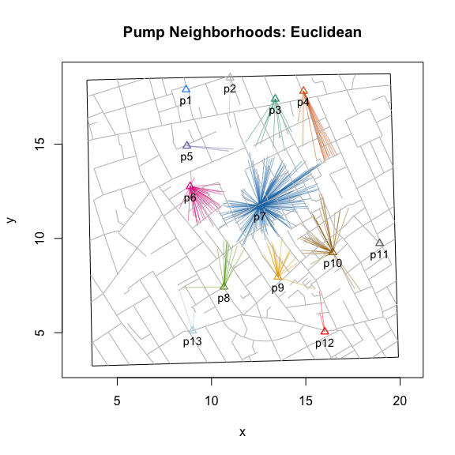
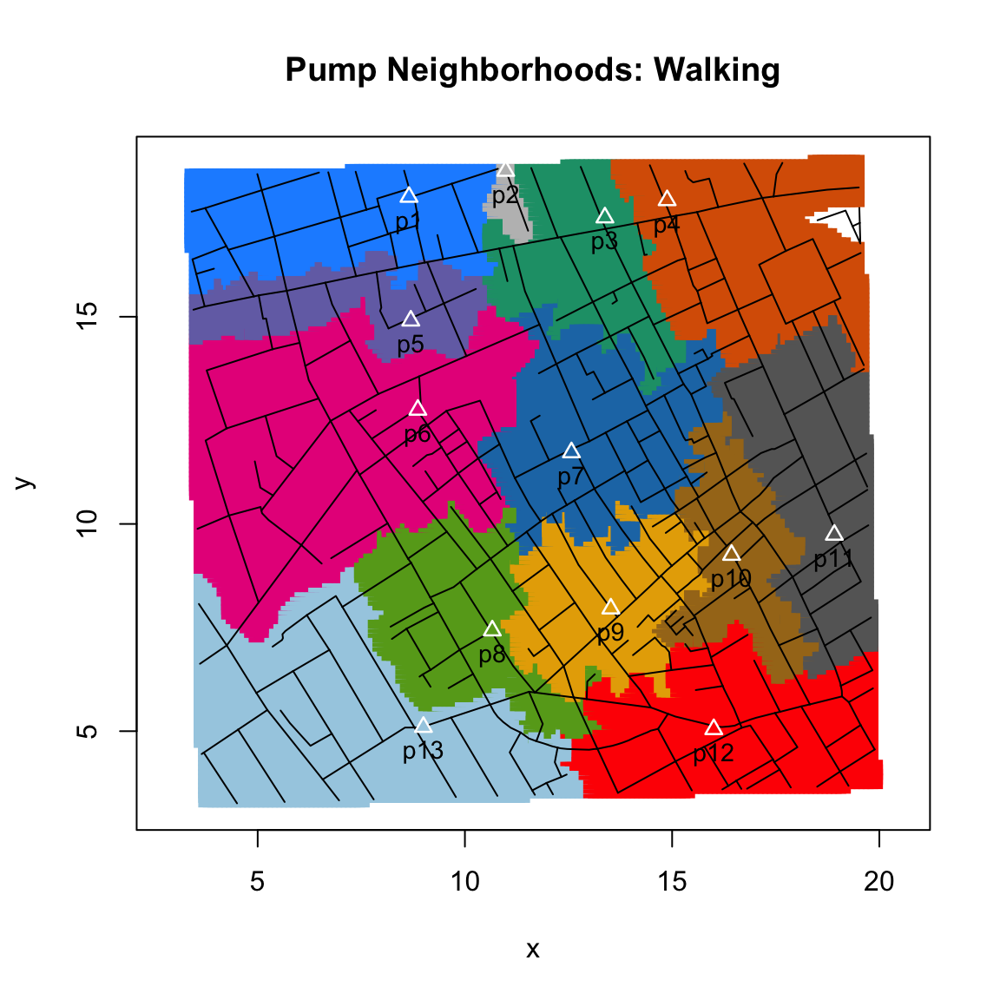

<!-- README.md is generated from README.Rmd. Please edit that file -->
## cholera: amend, augment and aid analysis of Snow’s cholera map

### package features

  - Fixes three apparent coding errors in Dodson and Tobler’s 1992
    digitization of Snow’s map.
  - “Unstacks” the data in two ways to make analysis and visualization
    easier and more meaningful.
  - Computes and visualizes “pump neighborhoods” based on Voronoi
    tessellation, Euclidean distance, and walking distance.
  - Ability to overlay graphical elements and features like kernel
    density, Voronoi diagrams, Snow’s Broad Street neighborhood, and
    notable landmarks (John Snow’s residence, the Lion Brewery, etc.)
    via `add*()` functions.
  - Includes a variety of functions to find and highlight specific
    cases, roads, pumps and paths.
  - Appends street names to the `roads` data set.
  - Includes the revised pump data used in the second version of Snow’s
    map from the Vestry report, which also includes the “correct”
    location of the Broad Street pump.
  - Adds two different aggregate time series fatalities data sets, taken
    from the Vestry report.

### background

John Snow’s map of the 1854 cholera outbreak in London is one of the
best known examples of data visualization and information design.


By plotting the number and location of fatalities on a map, Snow was
able to do something that is easily taken for granted today: the ability
to create and disseminate a visualization of a spatial distribution. To
our modern eye, the pattern is unmistakable. It seems self-evident that
the map elegantly supports Snow’s claims that cholera is a waterborne
disease and that the pump on Broad Street is the source of the outbreak.
And yet, despite its virtues, the map failed to convince both the
authorities and Snow’s colleagues in the medical and scientific
communities.

Beyond considerations of time and place, there are “scientific” reasons
for this failure. The map shows a concentration of cases around the
Broad Street pump, but that alone should not convince us that Snow is
right. The map doesn’t refute the primary rival explanation, miasma
theory: the pattern we see is not unlike what airborne transmission
might look like. And while the presence of a pump near or at the
epicenter of the distribution of fatalities is strong circumstantial
evidence, it is still circumstantial. There are a host of rival
explanations that the map doesn’t consider and cannot rule out: location
of sewer grates, elevation, weather patterns, etc..

Arguably, this may be one reason why Snow added a graphical annotation
to the second, lesser-known version of the map that was published in the
official report on the outbreak (*Report On The Cholera Outbreak In The
Parish Of St. James, Westminster, During The Autumn Of 1854*):


### pump neighborhoods

The annotation outlines what we might call the Broad Street *pump
neighborhood*: the set of addresses that are, according to Snow, within
“close” walking distance to the pump. The notion of a pump
neighborhood is important because it provides a prediction about where
we should and should *not* expect to find cases. If water is cholera’s
mode of transmission and if water pumps are the primary source of
drinking water, then most, if not all, fatalities should be found
*within* the pump neighborhood. The disease should stop at the
neighborhood’s borders.

Creating this annotation is not a trivial matter. To identify the
neighborhood of the Broad Street pump, you need to identify the
neighborhoods of surrounding pumps. Snow writes: “The inner dotted line
on the map shews \[sic\] the various points which have been found by
careful measurement to be at an equal distance by the nearest road from
the pump in Broad Street and the surrounding pumps …” (Ibid., p. 109.).

I build on Snow’s efforts by writing functions that allow you to compute
three flavors of pump neighborhoods. The first is based on Voronoi
tessellation. It works by using the Euclidean distances between pumps.
It’s easy to compute and has been a popular choice for analysts of
Snow’s map. However, it has two drawbacks: 1) roads and buildings play
no role in determining neighborhoods (it assumes that people walk
directly, “as the crow flies”, to their preferred pump); and 2) it’s not
what Snow has in mind. For that, you’ll need to consider the second type
of
neighborhood.

``` r
plot(neighborhoodVoronoi())
```


The second flavor is based on the Euclidean distances between cases and
pumps. This serves as a check on the Voronoi-based method, as a more
granular estimate of Euclidean distance based neighborhoods, and
provides a more flexible way to visualize Euclidean distance based
neighborhoods.

``` r
plot(neighborhoodEuclidean())
```



The third and final flavor is based on the walking distance along the
roads on the map. While more accurate, it’s computationally more
demanding. To compute these distances, I transform the roads on the map
into a network graph and turn the computation of walking distance into a
graph theory problem. For each case (observed or simulated), I compute
the shortest path, weighted by the length of roads (edges), to the
nearest pump. “Rinse and repeat” and the different pump neighborhoods
emerge:

``` r
plot(neighborhoodWalking())
```


To explore the data, you can consider a variety of scenarios by
computing different sets of neighborhoods. Here’s the result excluding
the Broad Street
pump.

``` r
plot(neighborhoodWalking(-7))
```


### “expected” pump neighborhoods

You can also explore “expected” neighborhoods. Currently, you can do so
in three ways. The first colors
roads.

``` r
plot(neighborhoodWalking(case.set = "expected"))
```


The second colors the expected area of neighborhoods using
points().

``` r
plot(neighborhoodWalking(case.set = "expected"), type = "area.points")
```



The third colors the expected area of neighborhoods using
polygon().

``` r
plot(neighborhoodWalking(case.set = "expected"), type = "area.polygons")
```


For exploration, the first two options are faster.

### getting started

To install ‘cholera’ from CRAN:

``` r
install.packages("cholera")
```

To install the development version of ‘cholera’ from GitHub:

``` r
# Note that you may need to install the 'devtools' package:
# install.packages("devtools")

# For 'devtools' (< 2.0.0)
devtools::install_github("lindbrook/cholera", build_vignettes = TRUE)

# For 'devtools' (>= 2.0.0)
devtools::install_github("lindbrook/cholera", build_opts = c("--no-resave-data", "--no-manual"))
```

### vignettes

The vignettes, which are available in the package as well as online at
the links below, go into detail on a variety of topics.

[Duplicate and Missing
Cases](https://github.com/lindbrook/cholera/blob/master/docs/vignettes/duplicate.missing.cases.md)
describes the two coding errors and three misplaced cases I argue are
present in Dodson and Tobler’s (1992) digitization of Snow’s map.
Documentation and details about the fix are found online in [“Note on
Duplicate and Missing
Cases”](https://github.com/lindbrook/cholera/blob/master/docs/notes/duplicate.missing.cases.notes.md).

[“Unstacking”
Bars](https://github.com/lindbrook/cholera/blob/master/docs/vignettes/unstacking.bars.md)
discusses the inferential and visual importance of “unstacking” the bars
in Snow’s map and the two “unstacked” data sets, which use “fatalities”
and “addresses” as the units of observation.

[Pump
Neighborhoods](https://github.com/lindbrook/cholera/blob/master/docs/vignettes/pump.neighborhoods.md)
expands on the notion of a pump neighborhood and describes the two
flavors of neighborhoods: two based on Euclidean (i.e.,
`neighborhoodEuclidean()` and `neighborhoodVoronoi`) and one based on
walking distance (i.e.,
`neighborhoodWalking()`).

[Roads](https://github.com/lindbrook/cholera/blob/master/docs/vignettes/roads.md)
covers issues related to roads. This includes discussion of how and why
I move pump \#5 from Queen Street (I) to Marlborough Mews, the overall
structure of the `roads` data set, “valid” road names, and my back of
the envelope translation from the map’s nominal scale to meters (and
yards).

[deldirVertices(): Tiles, Triangles and
Polygons](https://github.com/lindbrook/cholera/blob/master/docs/vignettes/tiles.polygons.md)
focuses on the `deldirVertices()`, which extracts the vertices of
triangles (Delauny triangulation) and tiles (Dirichelet or Voronoi
tessellation) from `deldir::deldir()` for use with polygon() and related
functions.

[Kernel Density
Plot](https://github.com/lindbrook/cholera/blob/master/docs/vignettes/kernel.density.md)
discusses the the syntax of `addKernelDensity()`, which allows you to
define “populations” and subsets of pumps. This syntax is used in many
of the functions in ‘cholera’.

[Time
Series](https://github.com/lindbrook/cholera/blob/master/docs/vignettes/time.series.md)
discusses functions and data related to fatalities time series data and
the question of the effect of the removal of the handle from the Broad
Street pump.

### lab notes

The lab notes, which are only available online, go into greater detail
about some of the issues and topics discussed in the vignettes:

[note on duplicate and missing
cases](https://github.com/lindbrook/cholera/blob/master/docs/notes/duplicate.missing.cases.notes.md)
documents the specifics of how I “fixed” two apparent coding errors and
three misplaced case in Dodson and Tobler’s data.

[computing street
addresses](https://github.com/lindbrook/cholera/blob/master/docs/notes/unstacking.bars.notes.md)
discusses how I use orthogonal projection and hierarchical cluster
analysis to “unstack” bars and compute a stack’s “address”.

[Euclidean v. Voronoi
neighborhoods](https://github.com/lindbrook/cholera/blob/master/docs/notes/euclidean.voronoi.md)
discusses why there are separate functions for `neighborhoodEuclidean()`
and `neighborhoodVoronoi()`.

[points v.
polygons](https://github.com/lindbrook/cholera/blob/master/docs/notes/pump.neighborhoods.notes.md)
discusses the tradeoff between using points() and polygon() to plot
“expected” area neighborhood plots and the computation of polygon
vertices.

[references](https://github.com/lindbrook/cholera/blob/master/docs/notes/references.md)
is an informal list of articles and books about cholera, John Snow and
the 1854 outbreak.

### note on `neighborhoodWalking()`

`neighborhoodWalking()` is computationally intensive. Using R version
3.5.2 on a single core of a 2.3 GHz Intel i7, plotting observed paths to
PDF takes about 5 seconds; doing the same for expected paths takes about
30 seconds. Using the function’s parallel implementation on 4 physical
(8 logical) cores, the times fall to about 4 and 13 seconds.

Note that parallelization is currently only available on Linux and Mac.

Also, note that although some precautions are taken in R.app on macOS,
the developers of the ‘parallel’ package, which `neighborhoodWalking()`
uses, strongly discourage against using parallelization within a GUI or
embedded environment. See `vignette("parallel")` for details.

### contributing

Contributions to the ‘cholera’ package are welcome. If interested,
please see the suggested
[guidelines](https://github.com/lindbrook/cholera/blob/master/CONTRIBUTING.md).
