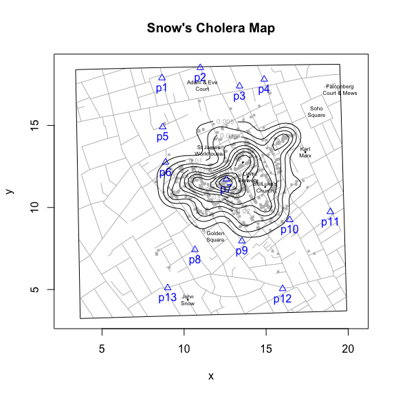
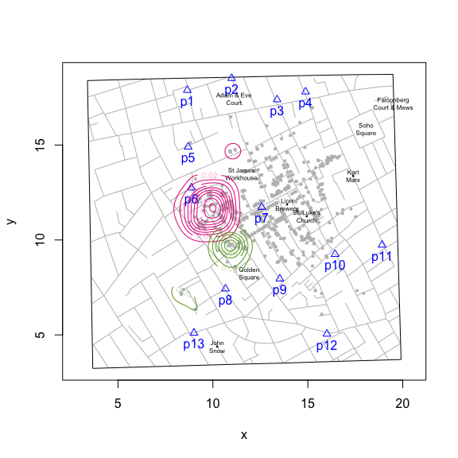
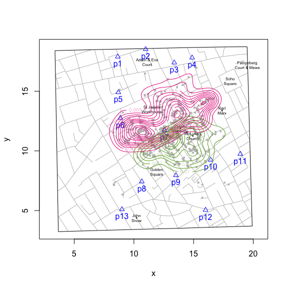
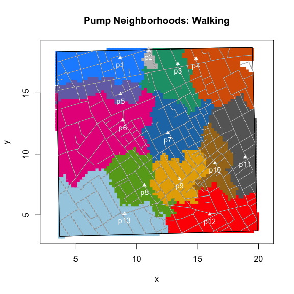

<!-- README.md is generated from README.Rmd. Please edit that file -->
[](https://cran.r-project.org/package=cholera)
[](https://github.com/lindbrook/cholera/blob/master/NEWS)

### what's new (current/development version)

The original addKernelDensity() function pools all observations:

``` r
snowMap(add.landmarks = TRUE)
addKernelDensity()
```



Now you can view the kernel densitities of pump neighborhoods separately. Either as a subset of the observed neighborhoods:

``` r
snowMap(add.title = FALSE)
addKernelDensity(neighborhood = c(6, 8))
```



Or from neighborhoods you construct from a specified set of pumps:

``` r
snowMap(add.title = FALSE)
addKernelDensity(pump.select = c(6, 8))
```



### cholera: amend, augment and aid analysis of John Snow's 1854 cholera data

John Snow's map of the 1854 cholera outbreak in London is one of the best known examples of data visualization and information design.


By plotting the number and location of fatalities on a map, Snow was able to do something that is easily taken for granted today: the ability to create and disseminate a visualization of a spatial distribution. To our modern eye, the pattern is unmistakable. It seems self-evident that the map elegantly supports Snow's claims: cholera is a waterborne disease and the pump on Broad Street is the source of the outbreak. And yet, despite its virtues, the map failed to convince both the authorities and Snow's colleagues in the medical and scientific communities.

Beyond considerations of time and place, there are "scientific" reasons for this failure. The map shows a concentration of cases around the Broad Street pump, but that alone should not convince us that Snow is right. The map doesn't refute Snow's primary rival, miasma theory. The pattern we see is not unlike what airborne transmission might look like. And while the presence of a pump near or at the epicenter of the distribution of fatalities is strong circumstantial evidence, it is still circumstantial. There are a host of rival explanations that the map doesn't consider and cannot rule out: location of sewer grates, elevation, weather patterns, etc..

Arguably, this may be one reason why Snow added a graphical annotation in a second, lesser-known version of the map that was published in the official report on the outbreak (*Report On The Cholera Outbreak In The Parish Of St. James, Westminster, During The Autumn Of 1854*):


### pump neighborhoods

The annotation outlines what we might call the Broad Street *pump neighborhood*: the set of addresses that are, according to Snow, within "close" walking distance to the pump. The notion of a pump neighborhood is important because it provides a prediction about where we should and should *not* expect to find cases. If water is cholera's mode of transmission and if water pumps are the primary source of drinking water, then most, if not all, fatalities should be found *within* the pump neighborhood. The disease should stop at the neighborhood's borders.

Creating this annotation is not a trivial matter. To identify the neighborhood of the Broad Street pump, you actually need to identify the neighborhoods of surrounding pumps. Snow writes: "The inner dotted line on the map shews \[sic\] the various points which have been found by careful measurement to be at an equal distance by the nearest road from the pump in Broad Street and the surrounding pumps ..." (Ibid., p. 109.).

I build on Snow's efforts by writing functions that allow you to compute pump neighborhoods. There are two flavors. The first is based on Voronoi tessellation. It works by computing the Euclidean distances between pumps. It's easy to compute and has been a popular choice for analysts of Snow's map. However, it has two drawbacks: 1) roads and buildings play no role. It assumes that people can walk directly to their preferred pump; and 2) it's not what Snow has in mind. For that, you'll need to consider the second flavor.

``` r
plot(neighborhoodVoronoi())
addLandmarks()
```


The second flavor is based on the walking distance along the roads on the map. While more accurate, it's computationally more demanding. To compute these distances, I transform the roads on the map into a network graph and turn the computation of walking distance into a graph theory problem. For each case (observed or simulated), I compute the shortest path, weighted by the length of roads, to the nearest pump. Then, applying the "rinse and repeat" principle, the different pump neighborhoods emerge:

``` r
plot(neighborhoodWalking())
addLandmarks()
```


To explore the data, you can consider a variety of scenarios by computing neighborhoods using any desired subset of pumps. Here's the result excluding the Broad Street pump.

``` r
plot(neighborhoodWalking(-7))
```


You can also explore "expected" neighborhoods:

``` r
plot(neighborhoodWalking(case.set = "expected"))
```


Or highlight the area of "expected" neighborhoods:

``` r
plot(neighborhoodWalking(case.set = "expected"), type = "area")
```



### other package features

-   Fixes three apparent coding errors in Dodson and Tobler's 1992 digitization of Snow's map.
-   "Unstacks" the data in two ways to improve analysis and visualization.
-   Adds the ability to overlay graphical features like kernel density, Voronoi diagrams, Snow's annotation, and notable landmarks (John Snow's residence, the Lion Brewery, etc.).
-   Includes a variety of functions to highlight specific cases, roads, pumps and walking paths.
-   Appends street names to the roads data set.
-   Includes the revised pump data used in the second version of Snow's map from the Vestry report. This includes the corrected location of the Broad Street pump.
-   Adds two different aggregate time series fatalities data sets, taken from the Vestry report.

### getting started

To install 'cholera' from CRAN:

``` r
install.packages("cholera")
```

The current/development version of 'cholera' is available on GitHub:

``` r
# Note that you may need to install the 'devtools' package:
# install.packages("devtools")
devtools::install_github("lindbrook/cholera", build_vignettes = TRUE)
```

Read the package's vignettes. They include detailed discussions about the data, the functions and the methods used to "fix" the data and to compute walking distances and neighborhoods.

### note

neighborhoodWalking() is computationally intensive. Using the current/development version on a single core of a 2.3 GHz Intel i7, plotting observed or expected paths take about 30 seconds. When using the function's parallel implementation, the time falls to approximately 12 seconds using 4 physical or 8 logical cores.

Note that the parallelized version is currently only available on Linux and Mac. Also, note that the developers of the 'parallel' package strongly discourage against using parallelization within a GUI or embedded environment.
