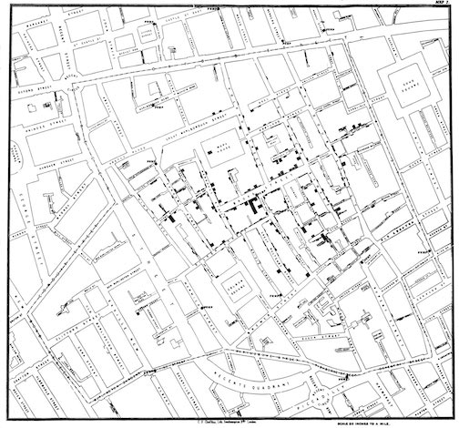
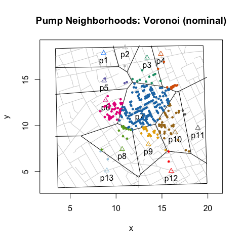
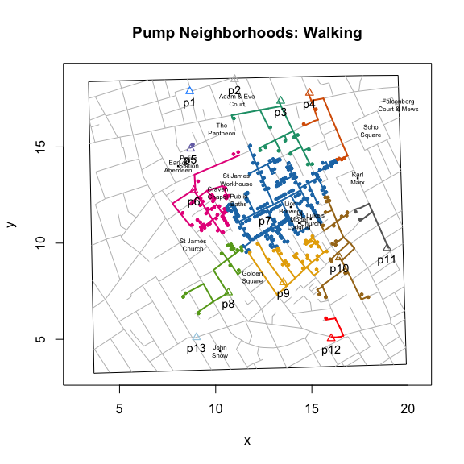
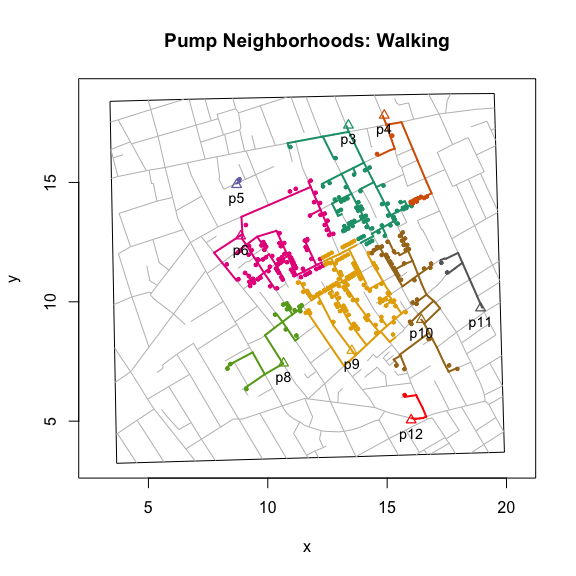
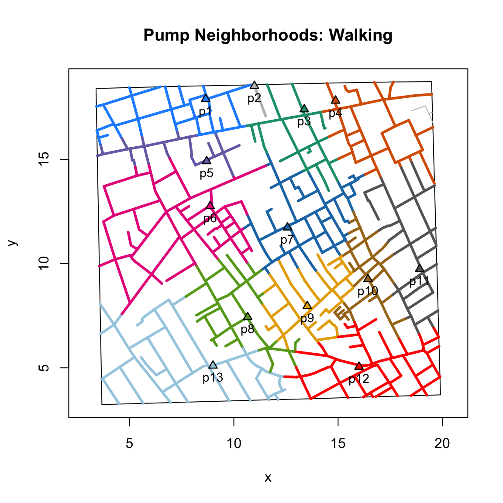
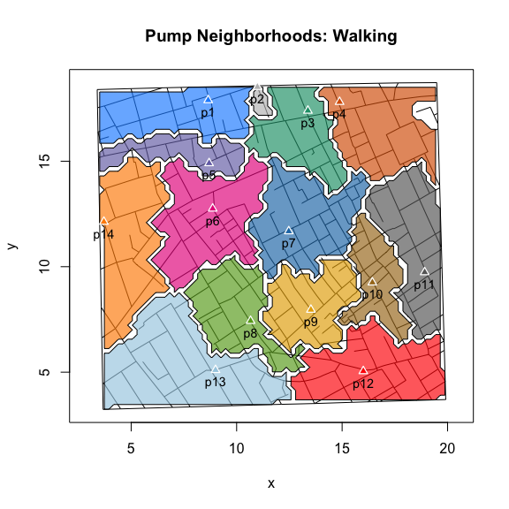
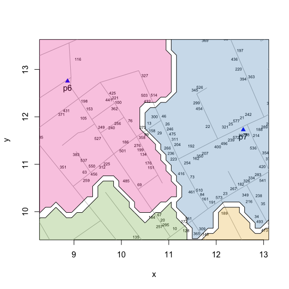

<!-- README.md is generated from README.Rmd. Please edit that file -->
[](https://cran.r-project.org/package=cholera)
[](https://github.com/lindbrook/cholera/blob/master/NEWS)

cholera: amend, augment and aid analysis of John Snow's 1854 cholera map
------------------------------------------------------------------------

### package features

-   Fixes three apparent coding errors in Dodson and Tobler's 1992 digitization of Snow's map.
-   "Unstacks" the data in two ways to make analysis and visualization easier and more meaningful.
-   Computes and visualizes "pump neighborhoods" based on Voronoi tessellation, Euclidean distance, and walking distance.
-   Ability to overlay graphical elements and features like kernel density, Voronoi diagrams, Snow's Broad Street neighborhood, and notable landmarks (John Snow's residence, the Lion Brewery, etc.) via add\*() functions.
-   Includes a variety of functions to highlight specific cases, roads, pumps and paths.
-   Appends street names to the roads data set.
-   Includes the revised pump data used in the second version of Snow's map from the Vestry report, which includes the "correct" location of the Broad Street pump.
-   Adds two different aggregate time series fatalities data sets, taken from the Vestry report.

### background

John Snow's map of the 1854 cholera outbreak in London is one of the best known examples of data visualization and information design.



By plotting the number and location of fatalities on a map, Snow was able to do something that is easily taken for granted today: the ability to create and disseminate a visualization of a spatial distribution. To our modern eye, the pattern is unmistakable. It seems self-evident that the map elegantly supports Snow's claims that cholera is a waterborne disease and that the pump on Broad Street is the source of the outbreak. And yet, despite its virtues, the map failed to convince both the authorities and Snow's colleagues in the medical and scientific communities.

Beyond considerations of time and place, there are "scientific" reasons for this failure. The map shows a concentration of cases around the Broad Street pump, but that alone should not convince us that Snow is right. The map doesn't refute the primary rival explanation, miasma theory: the pattern we se is not unlike what airborne transmission might look like. And while the presence of a pump near or at the epicenter of the distribution of fatalities is strong circumstantial evidence, it is still circumstantial. There are a host of rival explanations that the map doesn't consider and cannot rule out: location of sewer grates, elevation, weather patterns, etc..

Arguably, this may be one reason why Snow added a graphical annotation in the second, lesser-known version of the map that was published in the official report on the outbreak (*Report On The Cholera Outbreak In The Parish Of St. James, Westminster, During The Autumn Of 1854*):


### pump neighborhoods

The annotation outlines what we might call the Broad Street *pump neighborhood*: the set of addresses that are, according to Snow, within "close" walking distance to the pump. The notion of a pump neighborhood is important because it provides a prediction about where we should and should *not* expect to find cases. If water is cholera's mode of transmission and if water pumps are the primary source of drinking water, then most, if not all, fatalities should be found *within* the pump neighborhood. The disease should stop at the neighborhood's borders.

Creating this annotation is not a trivial matter. To identify the neighborhood of the Broad Street pump, you actually need to identify the neighborhoods of surrounding pumps. Snow writes: "The inner dotted line on the map shews \[sic\] the various points which have been found by careful measurement to be at an equal distance by the nearest road from the pump in Broad Street and the surrounding pumps ..." (Ibid., p. 109.).

I build on Snow's efforts by writing functions that allow you to compute two flavors of pump neighborhoods. The first is based on Voronoi tessellation. It works by computing the Euclidean distances between pumps. It's easy to compute and has been a popular choice for analysts of Snow's map. However, it has two drawbacks: 1) roads and buildings play no role in determining neighborhoods (it assumes that people walk directly, "as the crow flies", to their preferred pump); and 2) it's not what Snow has in mind. For that, you'll need to consider the second type of neighborhood.

``` r
plot(neighborhoodVoronoi())
```



The second flavor is based on the walking distance along the roads on the map. While more accurate, it's computationally more demanding. To compute these distances, I transform the roads on the map into a network graph and turn the computation of walking distance into a graph theory problem. For each case (observed or simulated), I compute the shortest path, weighted by the length of roads, to the nearest pump. Then, "rinse and repeat" and the different pump neighborhoods emerge:

``` r
plot(neighborhoodWalking())
```



To explore the data, you can consider a variety of scenarios by computing neighborhoods based on any subset of pumps. Here's the result excluding the Broad Street pump.

``` r
plot(neighborhoodWalking(-7))
```



### "expected" pump neighborhoods

You can also explore "expected" neighborhoods. Currently, you can do so in three ways. The first colors roads.

``` r
plot(neighborhoodWalking(case.set = "expected"))
```



The second and third color each neighborhood's area by using either points or polygons. The polygon implementation is shown below. For exploration, the other options faster.

``` r
plot(neighborhoodWalking(case.set = "expected"), type = "area.polygons")
```



The main virtue of the polygon approach is that it better lends itself to building graphs at different scales:

``` r
streetNameLocator("marshall street", zoom = TRUE, highlight = FALSE,
  add.title = FALSE, radius = 0.5)
addNeighborhood()
```



### getting started

To install 'cholera' from CRAN:

``` r
install.packages("cholera")
```

To install the development version of 'cholera' from GitHub:

``` r
# Note that you may need to install the 'devtools' package:
# install.packages("devtools")
devtools::install_github("lindbrook/cholera", build_vignettes = TRUE)
```

Read the package vignettes (and the lab notes, if interested). They expand on the concept of a "pump neighborhood", and go into greater detail on how the data was "fixed" and on the methods used to compute walking distances and pump neighborhoods.

They are also available online at the links below:

[Pump Neighborhoods](https://github.com/lindbrook/cholera/blob/master/docs/pump.neighborhoods.md) [+ lab notes](https://github.com/lindbrook/cholera/blob/master/docs/pump.neighborhoods.notes.md)   
[Duplicate and Missing Cases](https://github.com/lindbrook/cholera/blob/master/docs/duplicate.missing.cases.md) [+ lab notes](https://github.com/lindbrook/cholera/blob/master/docs/duplicate.missing.cases.notes.md)   
["Unstacking" Bars](https://github.com/lindbrook/cholera/blob/master/docs/unstacking.bars.md) [+ lab notes](https://github.com/lindbrook/cholera/blob/master/docs/unstacking.bars.notes.md)   
[Roads](https://github.com/lindbrook/cholera/blob/master/docs/roads.md)   
[Time Series](https://github.com/lindbrook/cholera/blob/master/docs/time.series.md)   
[Kernel Density Plot](https://github.com/lindbrook/cholera/blob/master/docs/kernel.density.md)

### note

neighborhoodWalking() and addNeighborhood() are computationally intensive. Using R version 3.5.1 on a single core of a 2.3 GHz Intel i7, plotting observed paths to PDF takes about 5 seconds; doing the same for expected paths takes about 28 seconds. Using the functions' parallel implementation on 4 physical (8 logical) cores, the times fall to about 4 and 11 seconds.

Note that parallelization is currently only available on Linux and Mac.

Also, note that although some precautions are taken in R.app on macOS, the developers of the 'parallel' package, which neighborhoodWalking() uses, strongly discourage against using parallelization within a GUI or embedded environment. See vignette("parallel") for details.
