<!-- README.md is generated from README.Rmd. Please edit that file -->
## cholera: amend, augment and aid analysis of Snow’s cholera map

#### package features

-   Fixes three apparent coding errors in Dodson and Tobler’s 1992
    digitization of Snow’s map.
-   “Unstacks” the data in two ways to make analysis and visualization
    easier and more meaningful.
-   Computes and visualizes “pump neighborhoods” based on Euclidean
    distance (Voronoi tessellation) and walking distance.
-   Overlay graphical elements and features like kernel density
    estimates, Voronoi diagrams, Snow’s Broad Street neighborhood, and
    notable landmarks (John Snow’s residence, the Lion Brewery, etc.)
    via `add*()` functions.
-   Includes a variety of functions to find and highlight cases, roads,
    pumps and paths.
-   Appends street names to the `roads` data set.
-   Includes the revised pump data used in the second version of Snow’s
    map from the Vestry report, which also includes the “correct”
    location of the Broad Street pump.
-   Adds two aggregate time series fatalities data sets, taken from the
    Vestry report.
-   With ‘cholera’ version >= 0.7.0, support for parallel computation
    now includes Windows in addition to Linux and macOS.

#### getting started

To install ‘cholera’ from CRAN:

``` r
install.packages("cholera")
```

To install the current development version from GitHub:

``` r
# You may need to first install the 'remotes' via install.packages("remotes").
remotes::install_github("lindbrook/cholera", build_vignettes = TRUE)
```

## background

John Snow’s map, published in his *On The Mode Of Communication Of
Cholera*, of the 1854 cholera outbreak in London is one of the best
known examples of data visualization and information design:


By plotting the number and location of fatalities using stacks of bars
on a map, Snow was able to perform a task that is now easily taken for
granted: he visualized a spatial distribution. Looking at the results,
the pattern on the map seems unmistakable. The map appears to support
Snow’s claims that cholera is a waterborne disease and that the pump on
Broad Street is the source of the outbreak.

And yet, despite its virtues, the map failed to convince either the
authorities or Snow’s colleagues in the medical and scientific
communities. Even today, many are skeptical of the map’s ability to
support such claims. Beyond considerations of time and place, what
critics past and present are picking up on is that a concentration of
cases around the Broad Street pump alone should not be enough to
convince us. The problem is the map does not refute the primary rival
explanation to waterborne transmission: the pattern we see is not unlike
what airborne transmission (miasma theory) might look like. In other
words, while the presence of a pump at or near the epicenter of the
distribution of fatalities is strong circumstantial evidence, it is
nonetheless circumstantial.

## pump neighborhoods

This may be the reason why Snow added a graphical annotation to a second
lesser-known version of the map, published in the *Report On The Cholera
Outbreak In The Parish Of St. James, Westminster, During The Autumn Of
1854*.


Despite its hand-drawn, back-of-the-envelope appearance, Snow writes:
“The inner dotted line on the map shews \[sic\] the various points which
have been found by careful measurement to be at an equal distance by the
nearest road from the pump in Broad Street and the surrounding pumps …”
(Ibid., p. 109). My interpretation of this statement is that, guided by
the principle that all else being equal people tend to choose the
closest pump, Snow is computing a *pump neighborhood*: the set of
addresses or locations defined by their relative proximity to a specific
water pump. By doing so, Snow’s annotation sets limits on where we
should and should *not* find fatalities. In short, Snow’s annotation is
a hypothesis or prediction.

#### computing pump neighborhoods

While his actual data and the specifics method of computation appear to
be lost to history, I reverse engineer what I infer to be his approach
by doing the following. First, from the quotation above I assume that
his measure of proximity is the walking distance along the streets of
Soho. Second, putting aside aside questions about the map’s accuracy
(it’s actually a commercial map that Snow annotated), I consider the map
to be the definitive “text” and make it the de facto source of data.

I then wrote functions that compute and visualize walking distances on
the map. The value of these functions go beyond the ability to replicate
and validate Snow’s efforts. By allowing you to compute hypothetical
neighborhoods via selective inclusion or exclusion of pumps or to allow
for different measures of proximity (e.g., Euclidean), they also allow
you to explore counterfactual scenarios. Ultimately, this can help us to
better assess whether we really can use the map to “prove” Snow’s
claims.

#### walking v. Euclidean neighborhoods

While walking distanced based neighborhoods are based on paths that
follow streets, Euclidean distance based neighborhoods are based on
straight line paths between a location and the nearest (or selected)
pump:

``` r
streetNameLocator(zoom = 1, cases = NULL, highlight = FALSE, add.subtitle = FALSE, add.title = FALSE)
title(main = "Walking Distances")
invisible(lapply(c(1, 191, 46, 363, 85), addWalkingPath))

streetNameLocator(zoom = 1, cases = NULL, highlight = FALSE, add.subtitle = FALSE, add.title = FALSE)
title(main = "Euclidean Distances")
invisible(lapply(c(1, 191, 46, 363, 85), addEuclideanPath))
```

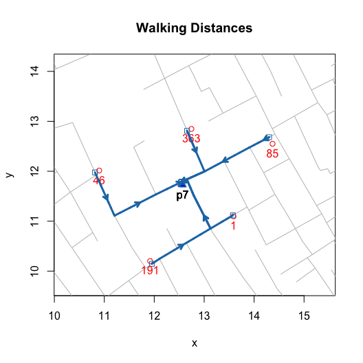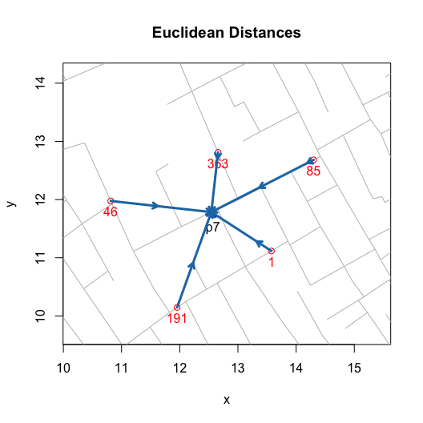

To build a neighborhood, we apply this algorithm to each location or
“address” with at least one observed fatality. This builds the
“observed” neighborhood:

``` r
plot(neighborhoodWalking())
plot(neighborhoodEuclidean())
```

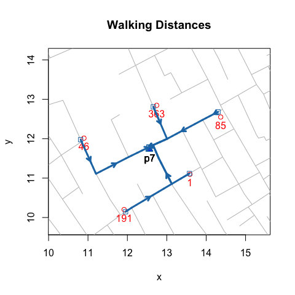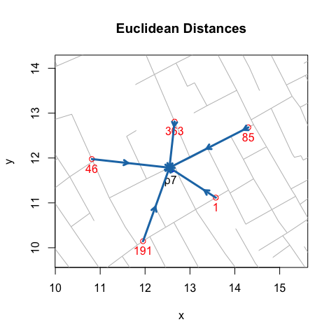

Ultimately, for testing purposes we want the “expected” neighborhoods.
For walking neighborhoods, I use the same approach but use simulated
data. Using `sp::spsample()` and `sp::Polygon()`, I place 20,000
regularly spaced points, which lie approximately 6 meters apart,
`unitMeter(dist(regular.cases[1:2, ]))`, across the face of the map and
then compute the shortest path to the nearest pump.

``` r
plot(neighborhoodWalking(case.set = "expected"), "area.polygons")
```

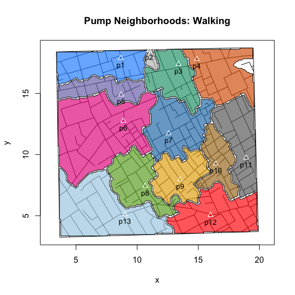

For Euclidean distance based neighborhoods, we can use the same
simulated data and compute the as-the-crow-flies distance to the nearest
pump. Or, we can leverage a more computationally efficient approach,
Voronoi tessellation, which will produce the same neighborhoods.

``` r
plot(neighborhoodEuclidean(case.set = "expected"))
plot(neighborhoodVoronoi())
```

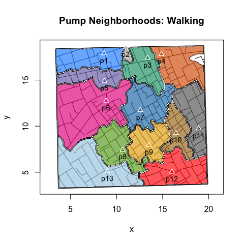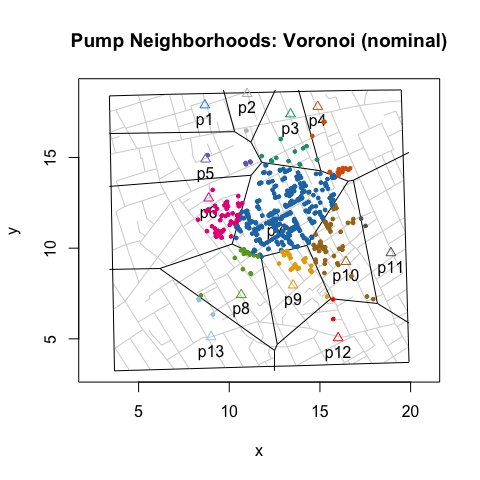

#### exploring walking neighborhoods

To explore “observed” walking neighborhoods, use `neighborhoodWalking()`
with the `pump.select` argument:

``` r
plot(neighborhoodWalking(pump.select = 6:7))
plot(neighborhoodWalking(pump.select = -7))
```

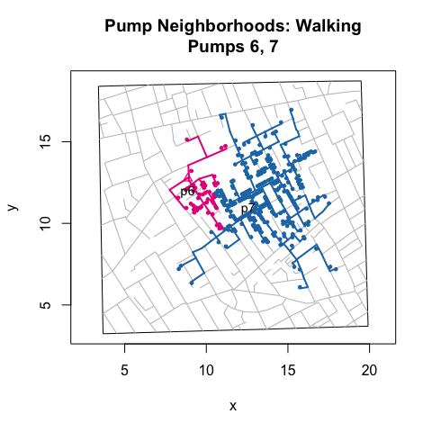

To explore “expected” walking neighborhoods, add the case.set =
“expected” argument:

``` r
plot(neighborhoodWalking(pump.select =  6:7, case.set = "expected"), type = "area.polygons")
plot(neighborhoodWalking(pump.select = -7, case.set = "expected"), type = "area.polygons")
```

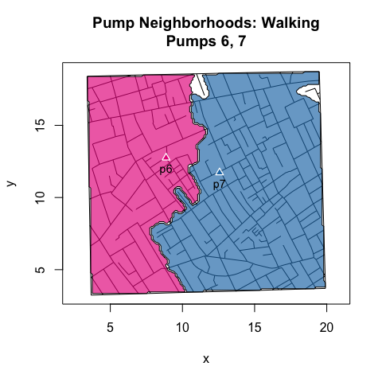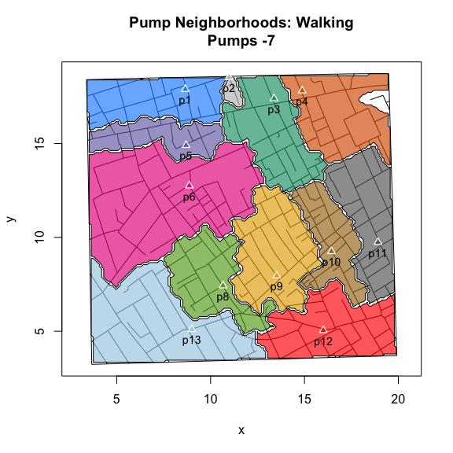

#### exploring Euclidean neighborhoods

To explore “observed” Euclidean neighborhoods, use
`neighborhoodEuclidean()` with the `pump.select` argument:

``` r
plot(neighborhoodEuclidean(pump.select = 6:7))
plot(neighborhoodEuclidean(pump.select = -7))
```

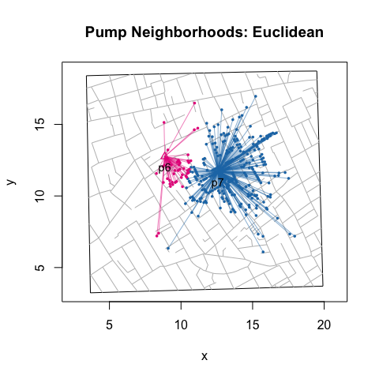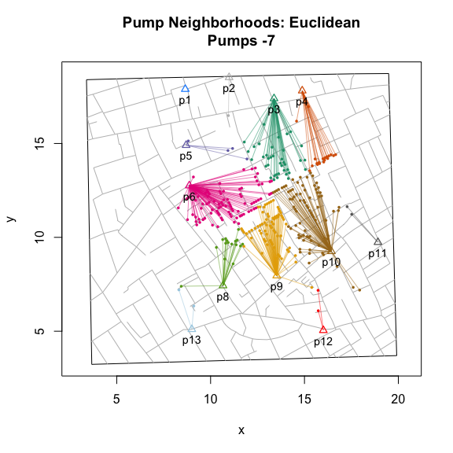

To explore “expected” Euclidean neighborhoods, use
`neighborhoodVoronoi()` with the `pump.select` argument:

``` r
plot(neighborhoodVoronoi(pump.select = 6:7))
plot(neighborhoodVoronoi(pump.select = -7))
```

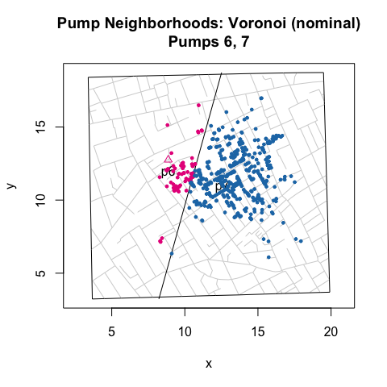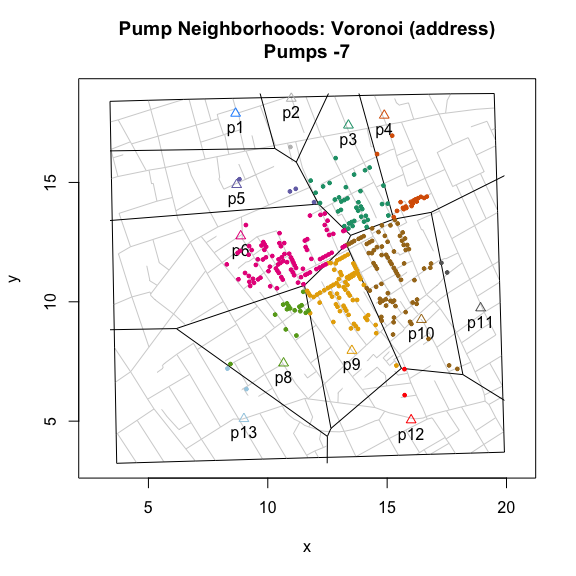

#### note on computational performance

Parallel computation is implemented using the ‘parallel’ package, which
is part of the base R distribution. To enable parallelization, set
`multi.core = TRUE` where available. Note that although some precautions
are taken in R.app on macOS, the developers of the ‘parallel’ package
strongly discourage against using parallelization within a GUI or
embedded environment. See `vignette("Parallelization")` for details.

#### vignettes

The vignettes are available in the package as well as online at the
links below.

[Duplicate and Missing
Cases](https://github.com/lindbrook/cholera/blob/master/docs/vignettes/duplicate.missing.cases.md)
describes the two coding errors and the three misplaced cases that I
argue are present in Dodson and Tobler’s (1992) digitization of Snow’s
map.

[“Unstacking”
Bars](https://github.com/lindbrook/cholera/blob/master/docs/vignettes/unstacking.bars.md)
discusses the inferential and visual reasons to “unstack” bars. Then, it
describes the two “unstacked” data sets: one using “fatalities” and one
using “addresses” as the unit of observation.

[Roads](https://github.com/lindbrook/cholera/blob/master/docs/vignettes/roads.md)
covers issues related to roads. This includes discussion of how and why
I move pump #5 from Queen Street (I) to Marlborough Mews, the overall
structure of the `roads` data set, “valid” road names, and my
back-of-the-envelope translation from the map’s nominal scale to meters
(and yards).

[voronoiPolygons(): Tiles, Triangles and
Polygons](https://github.com/lindbrook/cholera/blob/master/docs/vignettes/tiles.polygons.md)
focuses on the `voronoiPolygons()` function, which extracts the vertices
of triangles (Delaunay triangulation) and tiles (Dirichelet or Voronoi
tessellation) from `deldir::deldir()` for use with polygon() and other
functions.

[Kernel Density
Plot](https://github.com/lindbrook/cholera/blob/master/docs/vignettes/kernel.density.md)
discusses the the syntax of `addKernelDensity()`, which allows you to
define “populations” and subsets of pumps. This syntax is used in many
of the functions in ‘cholera’.

[Time
Series](https://github.com/lindbrook/cholera/blob/master/docs/vignettes/time.series.md)
discusses functions and data related to the aggregate time series
fatalities data and the questions surrounding the effect of the removal
of the handle from the Broad Street pump.

[Parallelization](https://github.com/lindbrook/cholera/blob/master/docs/vignettes/parallelization.md)
discusses the parallelization of selected functions and provides
benchmark timings.

#### lab notes

The lab notes, which are only available online, go into detail about
certain issues and topics discussed in the vignettes:

[note on duplicate and missing
cases](https://github.com/lindbrook/cholera/blob/master/docs/notes/duplicate.missing.cases.notes.md)
documents the specifics of how I fixed the two apparent coding errors
and three apparently misplaced case in Dodson and Tobler’s data.

[computing street
addresses](https://github.com/lindbrook/cholera/blob/master/docs/notes/unstacking.bars.notes.md)
discusses how I use orthogonal projection and hierarchical cluster
analysis to “unstack” bars and compute a stack’s “address”.

[Euclidean v. Voronoi
neighborhoods](https://github.com/lindbrook/cholera/blob/master/docs/notes/euclidean.voronoi.md)
discusses why there are separate functions, `neighborhoodEuclidean()`
and `neighborhoodVoronoi()`, for Euclidean distance based neighborhoods.

[points v.
polygons](https://github.com/lindbrook/cholera/blob/master/docs/notes/pump.neighborhoods.notes.md)
discusses the tradeoff between using points() and polygon() to plot
“expected” neighborhood using area plots and the computation of polygon
vertices.

[references](https://github.com/lindbrook/cholera/blob/master/docs/notes/references.md)
is an informal list of articles and books about cholera, John Snow and
the 1854 outbreak.
