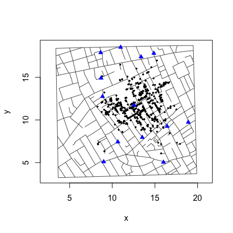
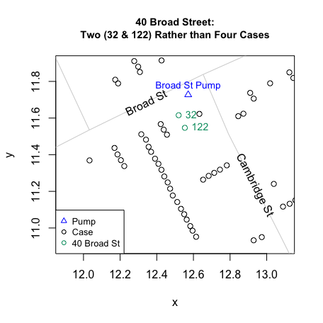
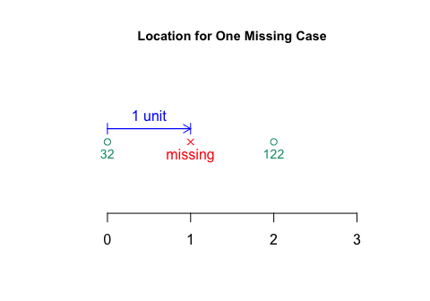
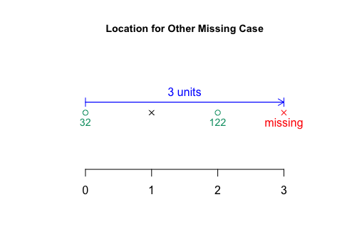
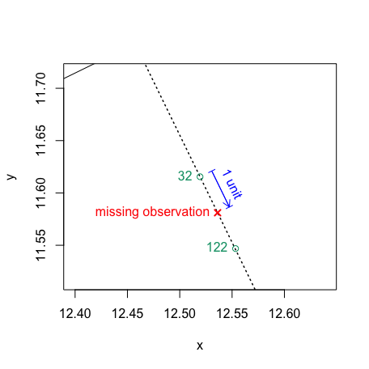
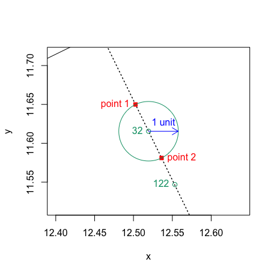
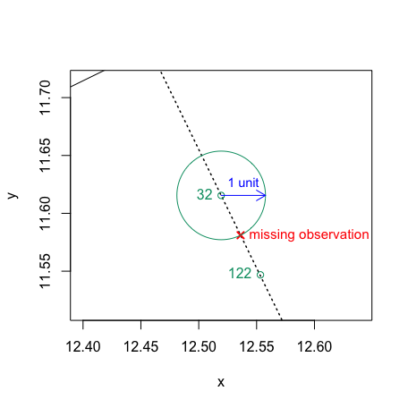
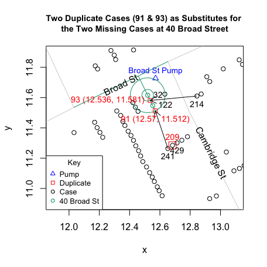

Duplicate and Missing Cases
================
lindbrook
2018-06-20

Overview
--------

John Snow's map of the 1854 cholera outbreak in London is a canonical example of data visualization:[1]

In 1992, Rusty Dodson and Waldo Tobler digitized the map. While the original data are no longer available,[2] they are preserved in Michael Friendly's 'HistData' package. Those data are plotted below:



However, I would argue that there are two apparent coding errors. They stem from three misplaced cases.

While the data record 578 bars, only 575 of them have a unique x-y coordinate.[3] Three pairs have identical coordinates: 1) 93 and 214; 2) 91 and 241; and 3) 209 and 429. Within the scheme of stacking bars to represent the fatality count, this cannot occur. All bars should have a unique x-y coordinate. For this reason, duplicates are likely to be coding errors.

``` r
duplicates <- HistData::Snow.deaths[(duplicated(HistData::Snow.deaths[,
  c("x", "y")])), ]

duplicates.id <- lapply(duplicates$x, function(i) {
  HistData::Snow.deaths[HistData::Snow.deaths$x == i, "case"]
})

HistData::Snow.deaths[unlist(duplicates.id), ]
#>     case        x        y
#> 93    93 12.84460 11.61027
#> 214  214 12.84460 11.61027
#> 91    91 12.65285 11.26382
#> 241  241 12.65285 11.26382
#> 209  209 12.68321 11.28437
#> 429  429 12.68321 11.28437
```

Fortunately, a careful comparison of Snow's map and the map generated by Dodson and Tobler's data reveals that there are also three "missing" bars in Dodson and Tobler's data. An expedient "fix" would be to simply use the duplicate observations to fill in for the "missing" bars:

``` r
fatalities <- HistData::Snow.deaths

fix <- data.frame(x = c(12.56974, 12.53617, 12.33145), y = c(11.51226, 11.58107, 14.80316))

fatalities[c(91, 93, 209), c("x", "y")] <- fix
```

This fixed data set is available as *fatalities* in this package and as *Snow.deaths2* in 'HistData' (&gt;= ver. 0.7-8). For those interested, an explanation of how I arrived at these values follows.

Duplicate Cases: Cambridge Street
---------------------------------

The three pairs of duplicates lie at two different locations on opposite sides of Cambridge Street:


Missing Cases: Broad Street
---------------------------

40 Broad Street, which lies just southwest (below and left) of the Broad Street Pump, is the location of two of the "missing" cases.

Snow's map shows four "bars" or cases:

<!--  -->
But Dodson and Tobler's data show only two, cases 32 and 122. Furthermore, the two cases also appear to be farther apart than what we see in neighboring stacks:



Missing Cases: Noel Street
--------------------------

15 Noel Street, which lies north of Broad Street one block south of Oxford Street at the intersection with Berwick Street, is the location of the third "missing" case.

Snow's map shows three cases at the end of Noel Street:

<!--  -->
But Dodson and Tobler's data shows only two cases: 282 and 422. They also appear to be farther apart than what we see in neighboring stacks:


A Solution
----------

One solution to these problems is to use the three duplicate observations from Cambridge Street to fill in for the three "missing" observations on Broad and Noel Streets. This is both plausible and reasonable.

What makes it plausible is that with the exception of the x-y coordinate of the case at the base of a stack, the remaining coordinates, which make up 44% (257/578) of all bars and which include the proposed locations for the three "missing" observations, do not represent the location of a case. They only serve to align bars within a stack. For this reason, there should be no objections to moving this category of bars.

What makes it reasonable is that I do not relocate bars by hand. Instead, I use simple geometric interpolation. I use existing observations in a stack to determine the "standard" *unit* distance between bars and then use multiples of that *unit* distance to position "missing" observations.

Consider 40 Broad Street. On Snow's map, there are four cases but in Dodson and Tobler there are just two. Visual inspection leads me to three claims: 1) the distance between the two observed cases, 32 and 122, is greater than that at neighboring stacks; 2) there appears to be room for one "missing" case between 32 and 122; and 3) the other "missing" case should be located just beyond case 122.

The proposed coordinates are illustrated below:


Geometric interpolation: *unit* distance
----------------------------------------

To explain how I got these coordinates, I illustrate the computation of the *unit* distance in one dimension and then move to the two dimensional case.

I use 40 Broad Street as the example. I rotate the data so that the stack lies along a single (horizontal) dimension. To fit one "missing" case between cases 32 and 122, I set the *unit* distance between the two observed cases to 2:


I then place one "missing" case 1 *unit* away from 32:



And place the other "missing" case three *units* away:



Geometric interpolation: in 2 dimensions
----------------------------------------

Because stacks lie in two dimensional space and because we need to respect geographical features like roads, the actual interpolation is a bit more complicated.

Consider the example of the "missing" observation that lies between cases 32 and 122. Just as with the one dimensional example, the "missing" observation should be located one *unit* away from case 32. The difference in two dimensions is that it needs to be located one *unit* away from case 32 (at the red "x") as measured along the line that runs through the stack's axis (black dotted line).



To compute the coordinates for the "missing" case, I find the points of intersection between a circle and line. The circle is simple: its center is the case or reference point (case 32), and its radius is the desired multiple of the *unit* distance, which is 1 in this example. The line is more complicated: it's the line that runs through the stack's axis.

What makes the line complicated is that the bars in the stacks in Dodson and Tobler are generally *not* perfectly aligned. To ensure that there is only one unique axis for any stack, I impose two constraints: 1) a stack must lie along an axis that is orthogonal to the road (line segment) where the stack is located[4]; and 2) the axis must pass through the reference point, the bar at the base of the stack (i.e., the bar closest to the stack's home road segment).

As a consequence, the line drawn through the stack's axis will pass through the circle's center:


There will always be two points of intersection (red squares):



So, finding the coordinates of the "missing" observations boils down to solving a quadratic equation and picking the appropriate solution.



I do so using with the formulas below:

``` r
# Equation of line for the "home" road segment
# "segment" is the numeric ID of one of the 528 sets of line segments in Dodson and Tobler
segmentOLS <- function(segment) {
  lm(y ~ x, data = street.list[[segment]])
}

# Slope for orthogonal stack axis
orthogonalSlope <- function(segment) {
  ols <- segmentOLS(segment)
  -1 / coef(ols)[2]
}

# Intercept for orthogonal stack axis
# "case" if the reference point of a stack
orthogonalIntercept <- function(case, segment) {
  Snow.deaths[case, "y"] - orthogonalSlope(segment) * Snow.deaths[case, "x"]
}

# unit distance is a function of the Euclidean distance between "case1" and "case2"
unitDistance <- function(case1, case2) {
  dist(Snow.deaths[c(case1, case2), c("x", "y")])
}

# Quadratic equation
quadratic <- function(a, b, c) {
  root1 <- (-b + sqrt(b^2 - 4 * a * c)) / (2 * a)
  root2 <- (-b - sqrt(b^2 - 4 * a * c)) / (2 * a)
  c(root1, root2)
}

# Geometric interpolation
# "multiplier" scales and defines the unit distance
interpolatedPoints <- function(case1, case2, segment, multiplier = 0.5) {
  p <- Snow.deaths[case1, "x"]
  q <- Snow.deaths[case1, "y"]
  radius <- multiplier * unitDistance(case1, case2)
  m <- orthogonalSlope(segment)
  b <- orthogonalIntercept(case1)
  A <- (m^2 + 1)
  B <- 2 * (m * b - m * q - p)
  C <- (q^2 - radius^2 + p^2 - 2 * b * q + b^2)
  quadratic(A, B, C)
}
```

Proposed coordinates
--------------------

Using this approach, I get the following results. For the two "missing" cases at 40 Broad Street, I move two duplicates, cases 91 and 93, from Cambridge Street:



For the missing case at 15 Noel Street, I move the remaining duplicate, case 209, from Cambridge Street:


Notes
-----

[1] The map was originally published in Snow's 1855 book, "On The Mode Of Communication Of Cholera", and was reprinted as John Snow et. al., 1936. *Snow on Cholera: Being a Reprint of Two Papers*. New York: The Common Wealth Fund. You can also find the map online (a high resolution version is available at <http://www.ph.ucla.edu/epi/snow/highressnowmap.html>) and in many books, including Edward Tufte's 1997 "Visual Explanations: Images and Quantities, Evidence and Narrative".

[2] <http://www.ncgia.ucsb.edu/pubs/snow/snow.html>

[3] There is a lack of consensus about the actual number of cases represented in Snow's map. For what it's worth, I manually recounted the data on Snow's map and the result I got matches Dodson and Tobler's count.

[4] For an explanation on how the home road segment is identified, see the "'Unstacking' Bars" vignette.
