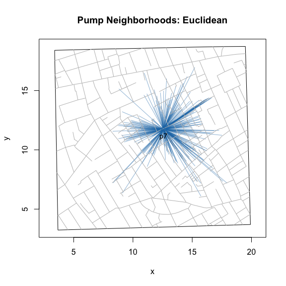
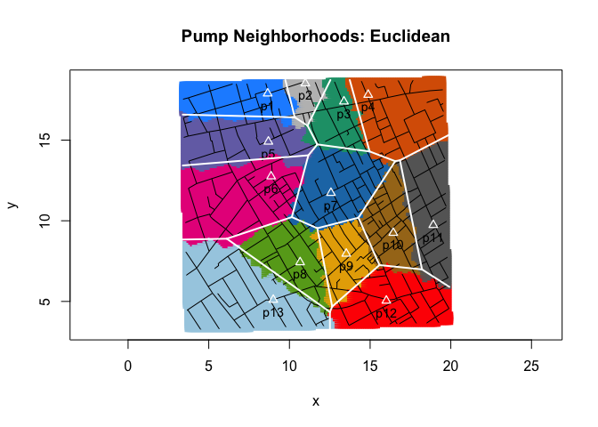

Lab Notes: Euclidean v. Voronoi neighborhoods
================
lindbrook
2018-12-21

overview
--------

"The Voronoi region of a site ***s*** is the set of points in the plane for which ***s*** is the closest site among all the sites."[1] Given this definition, you might wonder why there's both a neighborhoodEuclidean() and a neighborhoodVoronoi() function. First, by definition, you need at least two sites to create a Voronoi diagram so neighborhoodVoronoi(7) will return an error but neighorhoodEuclidean() will not. This also means that you can create a star plots that are centered on a single pump.

``` r
plot(neighborhoodEuclidean(7))
```



Second, neighborhoodEuclidean() allows you to add a small dose of "realism". With Voronoi tessellation, all that matters is the location of the pumps. All other data, be it buildings, roads or the location of fatalities, simply do not matter.

But with neighborhoodEuclidean(), when case.set = "expected" we can use case.location = "nominal" or case.location = "address". The former uses nominal coordinates of the expected or simulated cases in regular.cases and effectively replicates the Voronoi diagram:

``` r
plot(cholera::neighborhoodEuclidean(case.set = "expected",
  case.location = "nominal"), type = "area.points")
cholera::addVoronoi(case.location = "nominal", color = "white", lwd = 2)
```


The latter impose a constraint that the starting point must be a street address (i.e., people must leave their homes from the front door).[2] This produces an alternate picture of pump neighborhoods:

``` r
plot(cholera::neighborhoodEuclidean(case.set = "expected",
  case.location = "address"), type = "area.points")
cholera::addVoronoi(case.location = "address", color = "white", lwd = 2)
```



notes
-----

[1] Steven Fortune. 1987. "A Sweepline Algorithm for Voronoi Diagrams". *Algorithmica*. 2:153-174.

[2] These "addresses" are based on orthogonal projection from the case's nominal location to the nearest street segment. See simulateFatalities() for details.
