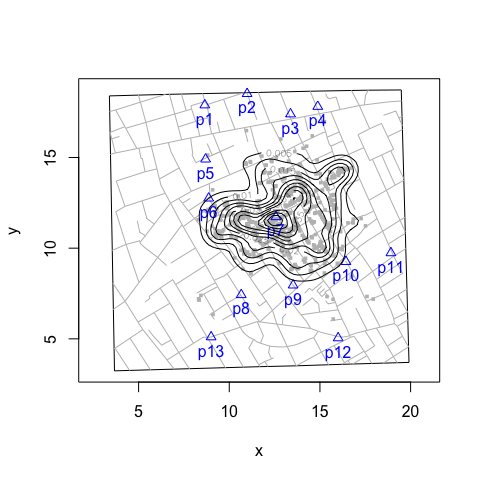
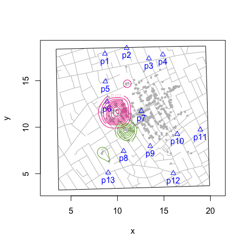
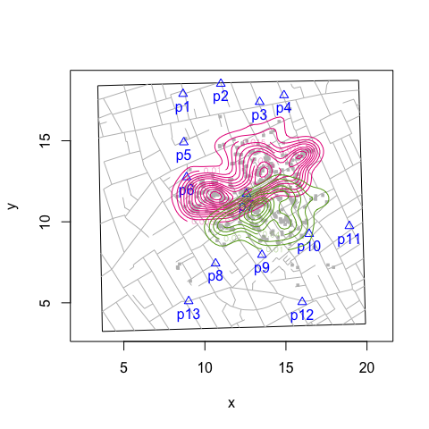

Kernel Density Plot
================
lindbrook
2018-08-10

Overview
--------

By default, the addKernelDensity() function pools all observations:

``` r
snowMap(add.title = FALSE)
addKernelDensity()
```



However, with this function you can also specify which pumps should be considered (i.e., define the "population" of pump neighborhoods) by using the `pump.select` argument and which subset of selected neighborhoods should be plotted by using the `pump.subset` argument.

Selecting a subset of observed neighborhoods:
---------------------------------------------

``` r
snowMap(add.title = FALSE)
addKernelDensity(pump.subset = c(6, 8))
```



Defining the set of observed pump neighborhoods:
------------------------------------------------

``` r
snowMap(add.title = FALSE)
addKernelDensity(pump.select = c(6, 8))
```


