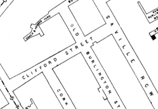
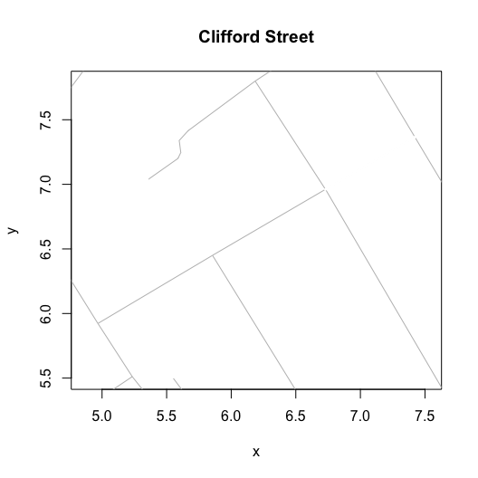
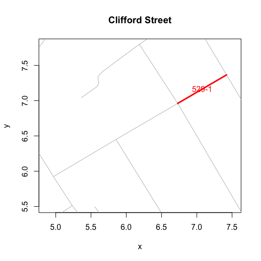

Clifford Street missing segment
================
Peter Li
2023-05-08

With ‘cholera’ v.0.8.0.9017, there is a provisional support for an
amendment to Clifford Street. I believe that the far West segment
between Old Marlborough Street and Saville Row is missing from Dodson
and Tobler’s digitization.

The graphic below shows Clifford Street from the map Snow used in his
work (Cheffin’s):

This next graph shows the original Dodson and Tobler version:

The final graph shows the amended version:

This segments numerical “street” number is 529 and its “id” is “529-1”.
