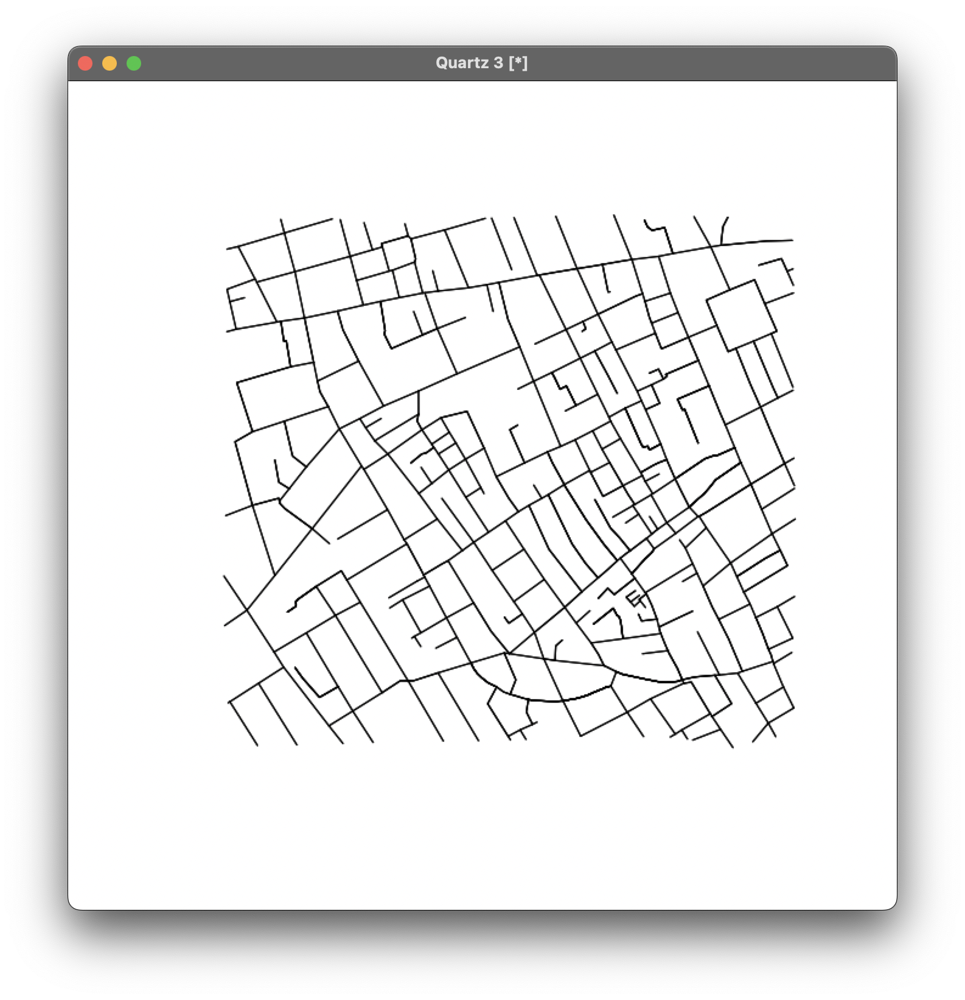
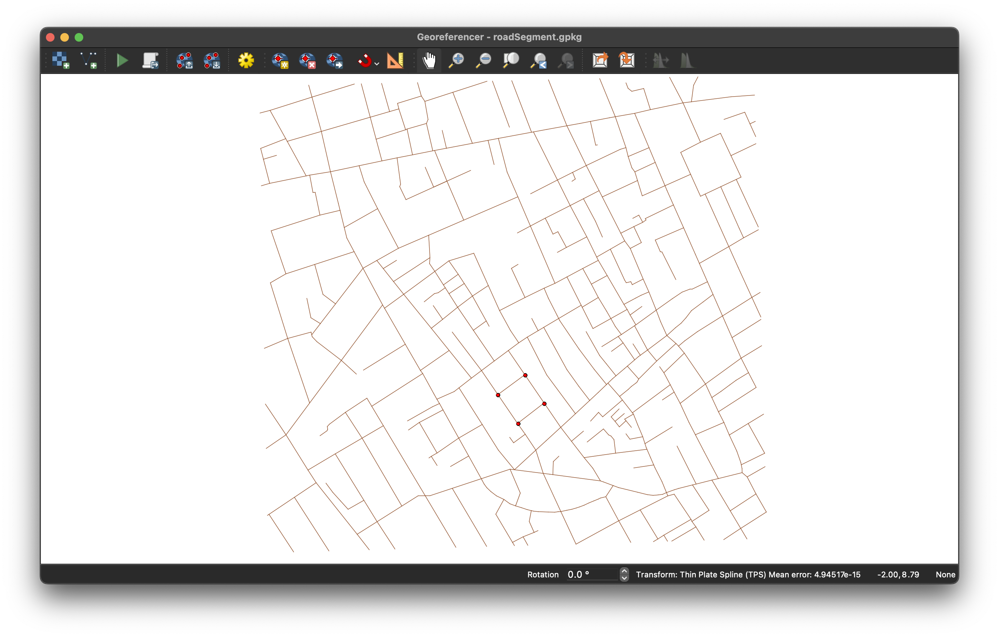
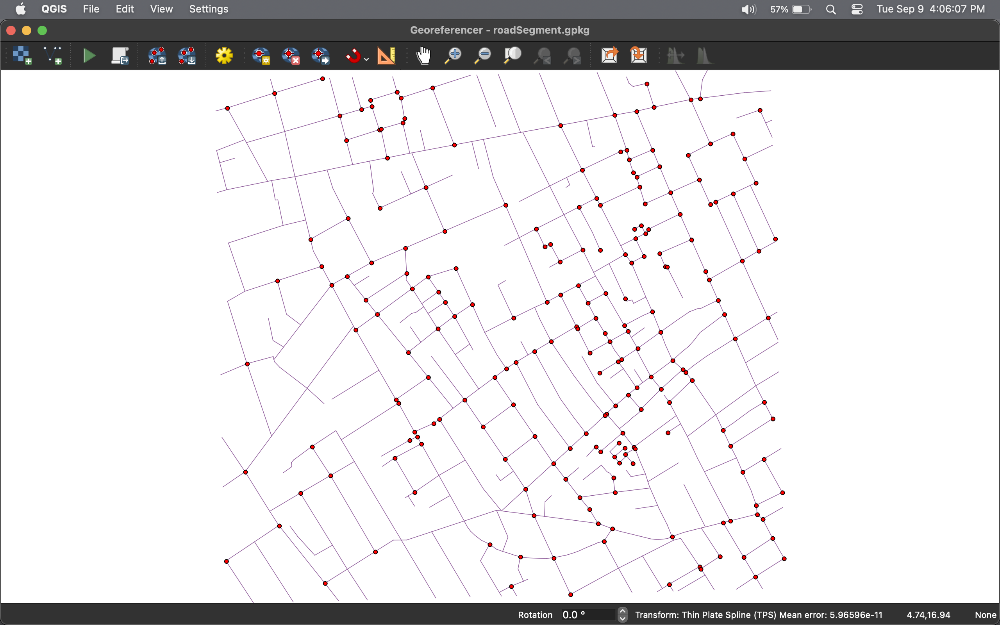

```{r setup, include = FALSE}
knitr::opts_chunk$set(echo = TRUE)
library(cholera)
```

The 'cholera' package includes estimates of longitude and latitude for two reasons. First, doing so provides a way to assess or "validate" the accuracy of Snow's and Dodson and Tobler's map. Second, geographic coordinates are a standard format for spatial data that many prefer, if not expect. 

To estimate these coordinates, I use georeferencing. This is the process of matching a subset of points on _your_ map with the corresponding ones on an _authoritative_ map (e.g., OpenStreetMap) and applying an algorithm to those points to align your map so that it "fits" onto the authoritative map. By doing so, your map's nominal scale, whatever it may be, is transformed to the authoritative map's scale (e.g, longitude and latitude, British National Grid, etc.).

I use [QGIS](https://qgis.org/) to do the georeferencing. Specifically, I use its _Georeferencer_ application and its integration of [OpenStreetMap](https://www.openstreetmap.org). 

While not a complete, step-by-step description, this note provides an overview of my approach (a detailed tutorial on georeferencing in QGIS is available [here](https://docs.qgis.org/3.40/en/docs/user_manual/managing_data_source/georeferencer.html)). It's hopefully sufficient to replicate what I did.

There are two tasks to do. 

The first is to choose a transformation algorithm. This is guided by the amount of distortion in your map. If it's more _globally_ nonlinear, you might use something like a polynomial transformation. If it's more _locally_ nonlinear, you might use something like thin plate spline transformation, which is often referred to as "rubbersheeting". 

The key consequence of the choice of algorithm is that it affects the number of matching points, or ground control points (GCPs), that you'll need to set. As you might expect, global approaches require fewer points while local approaches require more. For this version of the data, I use the following settings:

Transformation type -- Thin Plate Spline  
Target CRS -- EPSG:4326 - WGS 84  
Resampling method -- nearest neighbor

The second task is to select GCPs. Here, I primarily use road intersections. This is because they makes finding corresponding points easier (they're easier to "see" and hence to replicate). To facilitate this, I use a graph of Dodson and Tobler's Soho road network, which is a plot of the cholera::road.segments data frame, as a vehicle to locate and position GCPs:



I import this graph into the QGIS Georeferencer application via a GeoPackage file (details below in Appendix: GeoPackage). You select a point (intersection) on the graphic using the crosshairs cursor. You'll then be prompted to switch over to reference map via the highlighted "From Map Canvas" button. There, you drop a pin on the corresponding location on the reference map. Here's what you see in Georeferencer after selecting the four corners of Golden Square:



Each time you add a point, you _can_ georeference your map by selecting the <File:Start Geoferencing> menu item. Doing so adds a "fitted" or aligned version of the road network graphic as a new layer on top of the OpenStreetMap map. Here's the overall fit in QGIS using just the four ground control points for Golden Square:


Repeat this process until the visual fit looks "good". Pan and zoom as needed. Getting this estimation "right" is worthy of our attention. Remember that good estimates of road length helps us to get the best estimate of a location's nearest water pump, which is key to Snow's argument and to the notion of pump neighborhoods.

As a final step, I look for outliers in R by doing a numerical analysis that compares the length of line segments (road length in meters) using geoAudit(), which has starting points of differences of 10 meters or 50%. I use this to make fine grained adjustments.

Once you're happy with the fit, save the GCPs and use them as a master set to georeference the datasets of interest (e.g., fatalities, pumps, etc.). Here's my final working fit in Georeferencer:



And my final working fit with OpenStreetMap:


## Appendix: GeoPackage

Since 'cholera' v0.9.1.9012, GeoPackage files have been the conduit between R and QGIS (prior versions used PDF). While this may not necessarily be the more accurate, I made the change because in QGIS GeoPackage is a vector format while PDF is a raster format. For me, this meant less post-processing, clearer code and a more straightforward workflow.

Coversion of R data frames to and from GeoPackage was done using the st_coordinates() and st_as_sf() functions from the ['sf'](https://cran.r-project.org/web/packages/sf/index.html) R package. This is documented in functions with GPKG postfix in their names, e.g., cholera:::roadSegmentGPKG() - note the use of the triple colon operator to reflect the fact that these functions are internal and not exported (not in NAMESPACE).

After georeferencing, QGIS by default adds "_modified" to the GeoPackage's name (e.g., frameSegment_modified.gpkg). These are the georeferenced files, with longitude and latitude. They are read back into R using cholera:::writeGPKG() or the convenience cholera:::latlongGPKG() function.
