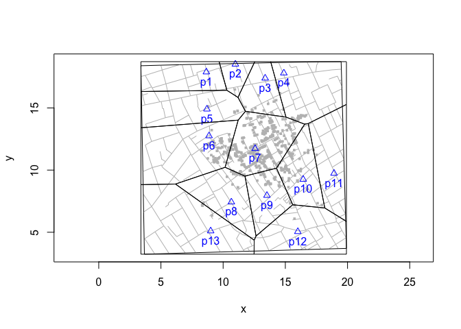
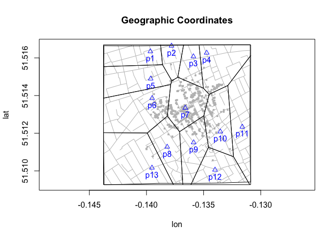
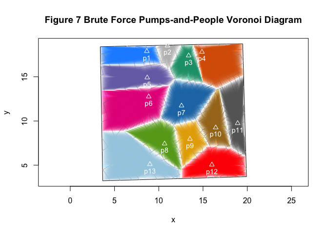
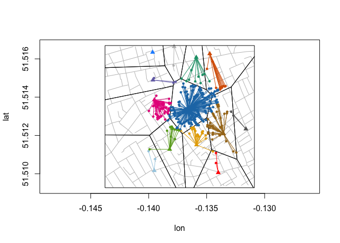
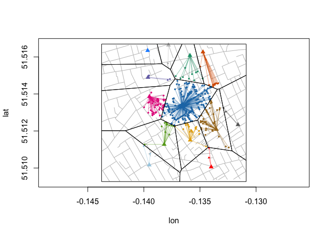

Voronoi Diagrams with Longitude and Latitude Data
================

## Voronoi diagram with nominal coordinates

``` r
snowMap(latlong = FALSE)
pmp <- cholera::pumps
vars <- c("x", "y")
cells <- cholera::voronoiPolygons(pmp[, vars], rw.data = cholera::roads[, vars],
  latlong = FALSE )
invisible(lapply(cells, polygon))
```

<!-- -->

## Voronoi diagram with geographic coordinates

``` r
snowMap(latlong = TRUE)
pmp <- cholera::pumps
vars <- c("lon", "lat")
cells <- cholera::voronoiPolygons(pmp[, vars], rw.data = cholera::roads[, vars],
  latlong = TRUE )
invisible(lapply(cells, polygon))
```

<!-- -->

## “brute force” Voronoi diagram

``` r
plot(neighborhoodEuclidean(case.set = "expected"), type = "star")
```

<!-- -->

## graph variables

``` r
vars <- c("lon", "lat")
asp <- 1.65
cases <- cholera::fatalities.address
rng <- mapRange(latlong = TRUE)
snow.colors <- snowColors(vestry = FALSE)
```

## geodesic or great circle distances (WGS 84 ellipsoid)

``` r
nearest.pump <- do.call(rbind, lapply(cases$anchor, function(x) {
  p1 <- cases[cases$anchor == x, vars]
  d <- vapply(pumps$id, function(p) {
    p2 <- pumps[pumps$id == p, vars]
    geosphere::distGeo(p1, p2)
  }, numeric(1L))
  nearest <- which.min(d)
  data.frame(case = x, pump = pumps$id[pumps$id == nearest],
    meters = d[nearest])
}))
```

## classification error

``` r
plot(cases[, vars], xlim = rng$x, ylim = rng$y, pch = NA, asp = asp)
addRoads(vars)

points(pumps[, vars], pch = 17, col = snow.colors, cex = 1)

invisible(lapply(nearest.pump$case, function(x) {
  ego <- cases[cases$anchor == x, vars]
  p <- nearest.pump[nearest.pump$case == x, "pump"]
  alter <- pumps[pumps$id == p, vars]
  segments(ego$lon, ego$lat, alter$lon, alter$lat,
    col = snow.colors[paste0("p", p)])
}))

invisible(lapply(nearest.pump$case, function(x) {
  ego <- cases[cases$anchor == x, vars]
  p <- nearest.pump[nearest.pump$case == x, "pump"]
  points(ego, pch = 16, col = snow.colors[paste0("p", p)], cex = 2/3)
}))

cells <- cholera::voronoiPolygons(cholera::pumps[, vars],
  rw.data = cholera::roads[, vars], latlong = TRUE)

invisible(lapply(cells, polygon))
```

<!-- -->

## “correct” diagram

``` r
plot(cases[, vars], xlim = rng$x, ylim = rng$y, pch = NA, asp = asp)
addRoads(vars)
points(pumps[, vars], pch = 17, col = snow.colors, cex = 1)

invisible(lapply(nearest.pump$case, function(x) {
  ego <- cases[cases$anchor == x, vars]
  p <- nearest.pump[nearest.pump$case == x, "pump"]
  alter <- pumps[pumps$id == p, vars]
  segments(ego$lon, ego$lat, alter$lon, alter$lat, lwd = 0.5,
    col = snow.colors[paste0("p", p)])
}))

invisible(lapply(nearest.pump$case, function(x) {
  ego <- cases[cases$anchor == x, vars]
  p <- nearest.pump[nearest.pump$case == x, "pump"]
  points(ego, pch = 16, col = snow.colors[paste0("p", p)], cex = 0.5)
}))

cells <- cholera::latlongVoronoiC()
invisible(lapply(cells, function(dat) polygon(dat[, vars])))
```

<!-- -->

# latlongVoronoiC()

## four corners

Origin is bottom left; graph in quadrant I

``` r
origin <- data.frame(lon = min(cholera::roads$lon),
                     lat = min(cholera::roads$lat))
topleft <- data.frame(lon = min(cholera::roads$lon),
                      lat = max(cholera::roads$lat))
bottomright <- data.frame(lon = max(cholera::roads$lon),
                          lat = min(cholera::roads$lat))
topright <- data.frame(lon = max(cholera::roads$lon),
                       lat = max(cholera::roads$lat))
```

## decompose geodesic distance into horizontal and vertical

Compute geodesic distance from origin to points and decompose

``` r
pump.data <- cholera::pumps

pump.meters <- do.call(rbind, lapply(pump.data$id, function(p) {
  pmp <- pump.data[pump.data$id == p, c("lon", "lat")]
  x.proj <- c(pmp$lon, origin$lat)
  y.proj <- c(origin$lon, pmp$lat)
  m.lon <- geosphere::distGeo(y.proj, pmp)
  m.lat <- geosphere::distGeo(x.proj, pmp)
  data.frame(pump = p, x = m.lon, y = m.lat)
}))
```

## bounding box of Voronoi diagram

``` r
height <- geosphere::distGeo(origin, topleft)
width <- geosphere::distGeo(origin, bottomright)
bounding.box <- c(0, width, 0, height)
```

## cell coordinates

Apply deldir::deldir() and extract coordinates of cells, with an eye to
using polygon().

``` r
cells <- voronoiPolygons(pump.meters[, c("x", "y")], rw = bounding.box)
```

## reshape and reformat into data frame

``` r
cells.df <- do.call(rbind, cells)
cells.lat <- sort(unique(cells.df$y), decreasing = TRUE) # unique latitudes
tmp <- row.names(cells.df)
ids <- do.call(rbind, strsplit(tmp, "[.]"))
cells.df$cell <- as.numeric(ids[, 2])
cells.df$vertex <- as.numeric(ids[, 3])
row.names(cells.df) <- NULL
```

## meterLatitude()

``` r
meterLatitude <- function(cells.df, origin, topleft, delta = 0.000025) {
  lat <- seq(origin$lat, topleft$lat, delta)

  meters.north <- vapply(lat, function(y) {
    geosphere::distGeo(origin, cbind(origin$lon, y))
  }, numeric(1L))

  loess.lat <- stats::loess(lat ~ meters.north,
    control = stats::loess.control(surface = "direct"))

  y.unique <- sort(unique(cells.df$y))

  est.lat <- vapply(y.unique, function(m) {
    stats::predict(loess.lat, newdata = data.frame(meters.north = m))
  }, numeric(1L))

  data.frame(m = y.unique, lat = est.lat)
}
```

## meterLatLong()

``` r
meterLatLong <- function(cells.df, origin, topleft, bottomright,
  delta = 0.000025) {

  est.lat <- meterLatitude(cells.df, origin, topleft)

  # uniformly spaced points along x-axis (longitude)
  lon <- seq(origin$lon, bottomright$lon, delta)

  # a set of horizontal distances (East-West) for each estimated latitude
  meters.east <- lapply(est.lat$lat, function(y) {
    y.axis.origin <- cbind(origin$lon, y)
    vapply(lon, function(x) {
      geosphere::distGeo(y.axis.origin, cbind(x, y))
    }, numeric(1L))
  })

  loess.lon <- lapply(meters.east, function(m) {
    dat <- data.frame(lon = lon, m)
    stats::loess(lon ~ m, data = dat,
      control = stats::loess.control(surface = "direct"))
  })

  y.unique <- sort(unique(cells.df$y))

  # estimate longitudes, append estimated latitudes
  est.lonlat <- do.call(rbind, lapply(seq_along(y.unique), function(i) {
    dat <- cells.df[cells.df$y == y.unique[i], ]
    loess.fit <- loess.lon[[i]]
    dat$lon <- vapply(dat$x, function(x) {
      stats::predict(loess.fit, newdata = data.frame(m = x))
    }, numeric(1L))
    dat$lat <- est.lat[est.lat$m == y.unique[i], "lat"]
    dat
  }))

  est.lonlat[order(est.lonlat$cell, est.lonlat$vertex), ]
}
```

## translate back to longitude and latitude

``` r
est.lonlat <- meterLatLong(cells.df, origin, topleft, bottomright)
longlat <- split(est.lonlat, est.lonlat$cell)
```

``` r
longlat[[1]]
```

    ##          x        y cell vertex        lon      lat
    ## 1 343.3471 826.3265    1      1 -0.1388176 51.51670
    ## 2   0.0000 826.3265    1      2 -0.1437639 51.51670
    ## 3   0.0000 703.0100    1      3 -0.1437639 51.51559
    ## 4 373.7472 707.5590    1      4 -0.1383798 51.51563
