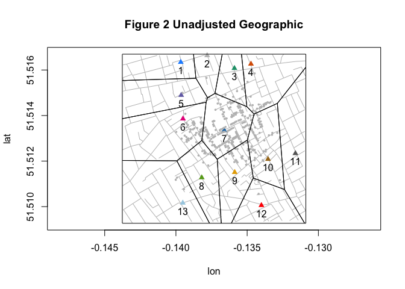
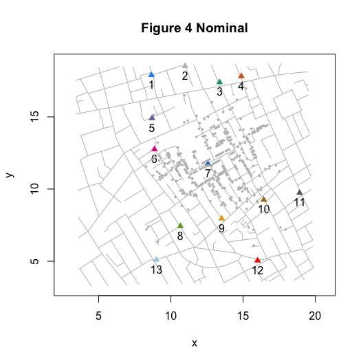
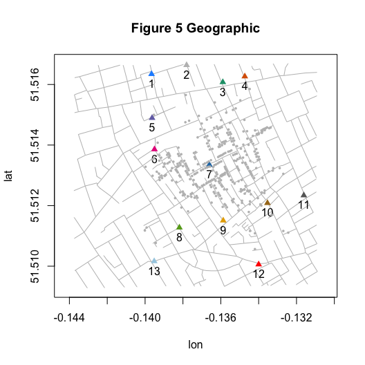
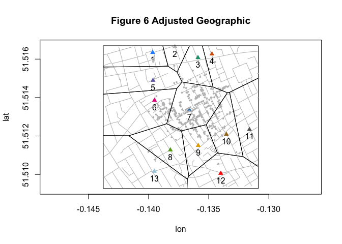
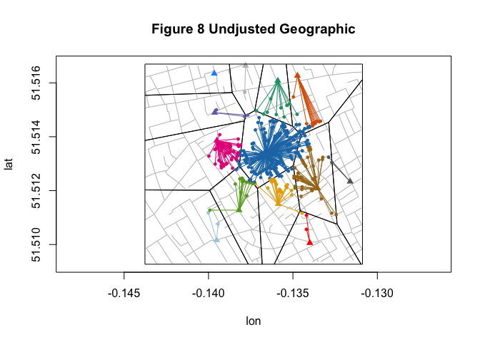
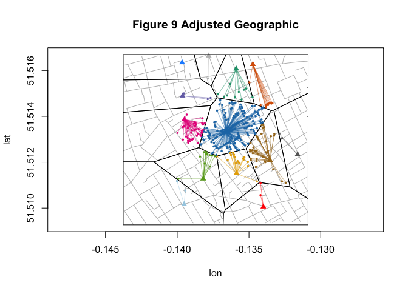
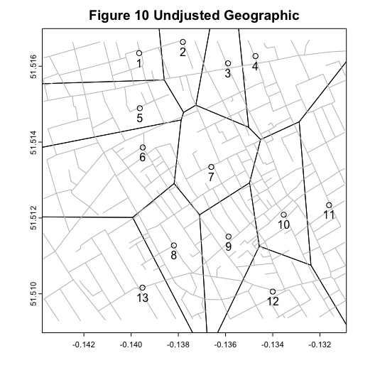
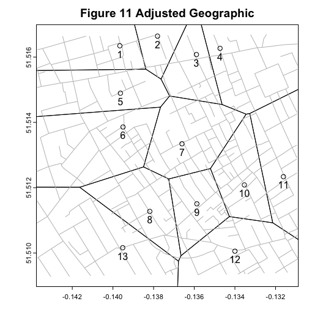

Computing Voronoi Diagrams with Geographic Data
================

## introduction

This is a work-in-progress note about how I compute Voronoi diagrams
with geographic data (data with longitude and latitude). The problem is
that you can’t directly apply the standard Voronoi algorithm, e.g.,
deldir::deldir(), to such data. Doing so will give you the “wrong”
answer.

Part of the reason why is that even though the Earth is a 3D object and
its surface is curved, the standard algorithm expects the “world” to be
2D flat. While there are [spatial](https://rspatial.org/) and GIS-style
tools and methods that one can use to address this, I’m currently
hesitant to adopt them. While doing so may be the wiser long term
strategy, right now I’m simply going to try to extend the functionality
of [‘cholera’](https://github.com/lindbrook/cholera) to include
georeferenced versions of the package’s data. My strategy for addressing
this problem is a familiar one: transform the data so that you *can* use
the algorithm; translate the results back to the original form
(longitude and latitude).

If any of the below seems wrong (be it obvious or subtle, technical or
conceptual), feel free to share your comments and insights.

## what are Voronoi diagrams?

The best way to understand what a Voronoi diagram is and how it works is
through an example. Consider the coffee shops in your town. Let’s assume
that “all else being equal” (price, quality, banter, etc.) and that the
only thing that affects your choice is proximity. If you were an
algorithm, you’d compute the distance to each coffee shop and adopt the
closest one as your preferred choice. Now, if everyone in town were to
do the same, distinct “neighborhoods”, based on people’s proximity to a
shop, will emerge. In this way, the coffee shops would carve up your
town.

Here’s a hypothetical example of a town where 13 coffee shops (blue
triangles) create 13 “neighborhoods” (polygons or cells):


If you lived within the boundaries of a given cell then that cell’s
coffee shop will be the one that’s closest to you If you lived on a
boundary between two neighborhoods (a cell edge) then you’d happily go
to either of those neighborhoods’ shop because they’d be equally distant
to your home.

## the data

The data in Figure 1 actually come from a digitization of John Snow’s
map of the 1854 London cholera outbreak done by Dodson and Tobler
(1992). So instead of coffee houses, we’re looking at water pumps, and
instead of a hypothetical town, we’re looking at the streets of Soho.

Dodson and Tobler applied a set of Cartesian coordinates to the data.
I’ll refer to data that use these coordinate as the *nominal* data. I
estimated longitude and latitude (i.e., georeferenced) of these data by
using [QGIS](https://qgis.org/) and its `Georeferencer` tool and its
[OpenStreetMap](https://www.openstreetmap.org) `XYZ` tiles. I’ll refer
to data that use longitude and latitude as *geographic* data.

## the problem

The problem I’m concerned with is that when you try to compute a Voronoi
diagram by *directly* applying the standard algorithm, e.g.,
deldir::deldir(), to *geographic* data you get the “wrong” result:



While there’s nothing obviously “wrong” with the diagram, I’m going to
argue that there are two problems with it. First, it doesn’t look like
diagram fitted to the nominal data in Figure 1. Second, it actually
places some people in the wrong neighborhood, which is something that,
by definition, shouldn’t happen.

## what should the Voronoi diagram should look like?

The Voronoi diagram should actually look similar to the diagram in
Figure 1 even though they’re fitted to data with different coordinates,
nominal and geographic. To understand why, we need to dig a little
deeper into how Voronoi diagrams work. Above, I actually described the
intuition behind them: find the closest pump for everyone in town and
distinct neighborhoods will emerge. This *pumps-and-people* approach is
the “brute force” way to uncover neighborhoods. However, the
implementation behind the standard algorithm actually uses a
*pumps-only* approach to the problem. This is one of the really neat
things about the algorithm: you only need the location of water pumps to
compute the Voronoi diagram (it’s also makes algorithm efficient).

Because of this, the geographic Voronoi diagram *should* look the
nominal one. After all, as we can see in Figures 4 & 5, which exclude
the Voronoi diagrams, the relative positions of the pumps for the
nominal and geographic data are quite similar:

``` r
cases <- cholera::fatalities.address
snow.colors <- snowColors(vestry = FALSE)

vars <- c("x", "y")
rng <- mapRange()
asp <- 1
plot(cases[, vars], xlim = rng$x, ylim = rng$y, pch = NA, asp = asp)
addRoads()
points(pumps[, vars], pch = 17, col = snow.colors, cex = 1)
text(pumps[, vars], pos = 1, labels = pumps$id)
points(cases[, vars], pch = 16, col = "gray", cex = 0.5)
title(main = "Figure 4 Nominal")

vars <- c("lon", "lat")
rng <- mapRange(latlong = TRUE)
asp <- 1.6
plot(cases[, vars], xlim = rng$x, ylim = rng$y, pch = NA, asp = asp)
addRoads(vars)
points(pumps[, vars], pch = 17, col = snow.colors, cex = 1)
text(pumps[, vars], pos = 1, labels = pumps$id)
points(cases[, vars], pch = 16, col = "gray", cex = 0.5)
title(main = "Figure 5 Geographic")
```



As a result, the graph should look like this:



As we’ll see in the next section, that it looks like Figure 1 is no
coincidence.

### “brute force” pumps-and-people method behind the intuition

While it may not be computationally efficient, the value of the “brute
force” *pumps-and-people* approach goes beyond its ability to illustrate
the underlying intuition. For me, its value lies with the fact that it
provides a separate, independent way to compute and validate a Voronoi
diagram

As “proof” of the equivalence of the *pumps-and-people* (intuition) and
the *pumps-only* (implementation) methods, compare the *pumps-only*
diagram in Figure 1 with the illustration of the “brute force” method in
Figure 6:


I created this graph by placing 20,000 regularly spaced points across
the face of the map. Next, I computed the distance from each point to
the 13 water pumps. Then, I drew a line from each point to its closest
pump (color-coded by pump). What emerges is evidence of equivalence in
the form of a kind of photographic negative or inverse of the pump-only
diagram.

With this tool in hand, I’ll show that the “Unadjusted Geographic” graph
in Figure 2 is “wrong” because it places some people in the wrong
neighborhood, which is something that shouldn’t happen by definition.

## classification error

To show that the diagram in Figure 2 mis-classifies some people, we need
to implement the “brute force” approach for geographic data. To do that
we need a way compute to compute distances between pumps and people
using geographic coordinates. I do so by using the geosphere::distGeo()
function to compute the the geodesic or great circle distance. This is
the distance between geographic coordinates along the curved surface of
the Earth as determined by the WGS84 ellipsoid model.

The key assumption here is that these geodesic distances represent the
“truth on the ground”. As such, they serve as the point of reference to
compare diagrams in Figures 2 and 3. Figures 7 and 8 re-plot those
diagrams and add the independently computed geodesic distances as
color-coded line segments that connect a person to their nearest pump.
Note that in contrast to the “brute force” plot in Figure 6, I’m only
using the 321 unique locations in the data that had at least one
fatality:

``` r
# "brute force" computation of geodesic distance to nearest pump

cases <- cholera::fatalities.address

nearest.pump <- do.call(rbind, lapply(cases$anchor, function(x) {
  p1 <- cases[cases$anchor == x, vars]
  d <- vapply(pumps$id, function(p) {
    p2 <- pumps[pumps$id == p, vars]
    geosphere::distGeo(p1, p2)
  }, numeric(1L))
  nearest <- which.min(d)
  data.frame(case = x, pump = pumps$id[pumps$id == nearest],
    meters = d[nearest])
}))
```





In the “Unadjusted Geographic” graph (Figure 8), you can see
discrepancies between the cells and a person’s closest pump, which by
definition shouidn’t occur. In the “Adjusted Geographic” graph (Figure
9) there are no discrepancies.

## a solution

How does this adjustment in Figure 8 work? I use a familiar strategy: I
transform the data so that I *can* use the standard algorithm; I then
translate the results back to their original form (longitude and
latitude).

First, I transform the geographic coordinates so that they represent
relative rather than absolute positions. I do so by computing the
geodesic distance from an arbitrary point of reference (a “corner of the
map”) to the 13 water pumps. Second, I break down those distances into
its horizontal and vertical components, *meters-North* and *meters-East*
of the reference point. These components, the analogs of latitude and
longitude, serve as our new set of coordinates. The virtues of these new
coordinates is that they are Cartesian coordinates, which the standard
algorithm “expects”, and that they allow us to apply the standard
algorithm and to get the “right” results (Figure 8). Third, I translate
the results, which are the coordinates of the cell vertices, back to
longitude and latitude. To do that, I use data simulation to uncover the
relationship between geodesic distance and longitude, and the
relationship between geodesic distance and latitude. While both
relationships, for Soho at least, could statistically speaking be
summarized with a linear model (OLS), I instead fit both to separate
loess function. I then use those functions to translate the data back to
longitude and latitude.

## spatial data approach via ‘terra’

Finally, as a sanity check and as additional piece of evidence that I
may be on the right track, I replicate the “Unadjusted” and “Adjusted”
diagrams using the [spatial](https://rspatial.org/) approach employed in
the [‘terra’](https://cran.r-project.org/package=terra) package.

``` r
dat <- cholera::pumps[, c("lon", "lat")]
sv.data <- terra::vect(dat, crs = "+proj=longlat")
v1 <- terra::voronoi(sv.data)

pt1 <- "+proj=lcc +lat_1=51.510 +lat_2=51.516"
pt2 <- "+lat_0=51.513 +lon_0=-0.1367 +units=m"
proj <- paste(pt1, pt2)
sv.proj <- terra::project(sv.data, proj)
v2 <- terra::voronoi(sv.proj)

out1 <- terra::project(v1, "+proj=longlat")
out2 <- terra::project(v2, "+proj=longlat")

plot(out1, xlim = range(cholera::roads$lon), ylim = range(cholera::roads$lat))
addRoads(c("lon", "lat"))
points(cholera::pumps[, c("lon", "lat")])
text(cholera::pumps[, c("lon", "lat")], labels = 1:13, pos = 1)
title(main = "Figure 10 Undjusted Geographic")

plot(out2, xlim = range(cholera::roads$lon), ylim = range(cholera::roads$lat))
addRoads(c("lon", "lat"))
points(cholera::pumps[, c("lon", "lat")])
text(cholera::pumps[, c("lon", "lat")], labels = 1:13, pos = 1)
title(main = "Figure 11 Adjusted Geographic")
```


