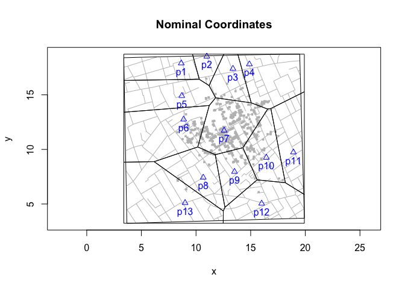
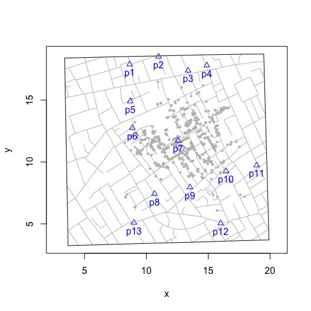
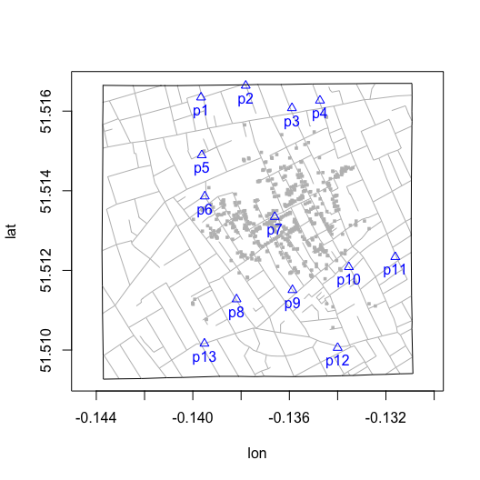
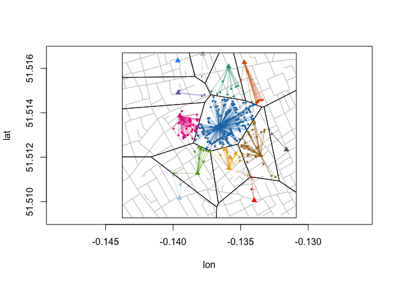
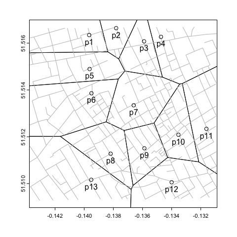
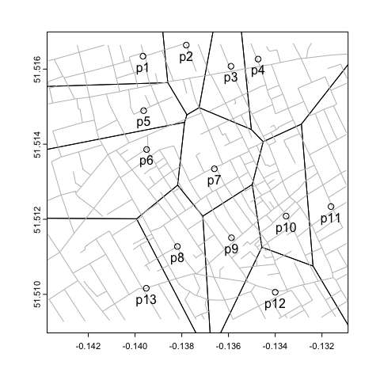

Voronoi Diagrams with Longitude and Latitude Data
================

## introduction

This is a work-in-progress note about how I’m approaching the
computation and visualization of Voronoi diagrams with geographic data
(with longitude and latitude).

The elephant-in-the-room is why not use [spatial](https://rspatial.org/)
or [GIS](https://qgis.org/) tools and approaches? Here’re two answers.
First, right now I’m simply trying to extend the existing functionality
of ‘cholera’ to include geographic data. Second, I’m not sure whether I
can or should port that functionality to those tools and approaches.

If I’m wrong about any of this (be it obvious or subtle, technical or
conceptual), please let me know.

## georeferencing

Dodson and Tobler (1992) digitized John Snow’s map by applying an
arbitrary set of Cartesian coordinates to features on the map (e.g.,
roads, pumps, fatalities). I estimated the longitude and latitude of
those “nominal” coordinates by using the “Georeferencer” tool and the
[OpenStreetMap](https://www.openstreetmap.org) XYZ tiles in
[QGIS](https://qgis.org/).

## Voronoi diagrams

Voronoi diagrams carve up a space into regiions based on the distance
(typically Euclidean) to some set of sites of interest. A good example
is how the coffee shops in your town carve up the clientele creating
exclusive “neighborhoods” (i.e., catchment areas) for each shop. How do
these neighborhoods emerge?

For the sake of illustration, let’s make the usual all else being equal
assumption (e.g., coffee quality, barista banter, etc.) so that the only
thing that affects your choice is the shop’s distance from your home. If
you were thinking algorithmically, you might compute the distance to
each store and pick the closest one. If we were to repeat this for
everyone in town, distinct neighborhoods will emerge. These are the
cells in a Voronoi diagram. The edges of the polygons are the cutpoint
of equal distance between coffee shops with adjacent neighborhoods.

In my case, I’m interested in how the water pumps in 1854 Soho,
Westminster (UK) created distinct neighborhoods that identify who we’d
expect to use one pump rather than another.

Here’s Voronoi diagram when I apply deldir::deldir() to the nominal
coordinates:

``` r
snowMap(latlong = FALSE)
pmp <- cholera::pumps
vars <- c("x", "y")
cells <- cholera::voronoiPolygons(pmp[, vars], rw.data = cholera::roads[, vars],
  latlong = FALSE )
invisible(lapply(cells, polygon))
title(main = "Nominal Coordinates")
```

<!-- -->

## the problem

The problem is that we can’t simply apply deldir::deldir(), a 2D
algorithm, to data with geographic coordinates. You’ll get the “wrong”
answer:

``` r
snowMap(latlong = TRUE)
pmp <- cholera::pumps
vars <- c("lon", "lat")
cells <- cholera::voronoiPolygons(pmp[, vars], rw.data = cholera::roads[, vars],
  latlong = TRUE )
invisible(lapply(cells, polygon))
title(main = "Geographic Coordinates")
```

<!-- -->

While the two diagrams above are different, why do I believe the former
is “right” but the latter is “wrong”? Might this be the result of the
fact that the former uses nominal “xy” coordinates while the latter uses
longitude-latitude?

This is partially true. Put aside the Voronoi diagrame for a moment.
Other than the aspect ratio used to create the graphs (the geographic
plot uses asp = 1.65; the nominal plot uses asp = 1), the underlying
features of graphs (the shape of road network and the locations of the
water pumps) essentially look the same:

``` r
snowMap()
snowMap(latlong = TRUE)
```



In fact, since the relative positions of the pumps are quite similar,
one might expect that the Voronoi diagrams, for reasons discussed in the
previous section, should also look similar.

## “brute force” Voronoi diagram

``` r
plot(neighborhoodEuclidean(case.set = "expected"), type = "star")
```

<!-- -->

## graph variables

``` r
vars <- c("lon", "lat")
asp <- 1.65
cases <- cholera::fatalities.address
rng <- mapRange(latlong = TRUE)
snow.colors <- snowColors(vestry = FALSE)
```

## geodesic or great circle distances (WGS 84 ellipsoid)

``` r
nearest.pump <- do.call(rbind, lapply(cases$anchor, function(x) {
  p1 <- cases[cases$anchor == x, vars]
  d <- vapply(pumps$id, function(p) {
    p2 <- pumps[pumps$id == p, vars]
    geosphere::distGeo(p1, p2)
  }, numeric(1L))
  nearest <- which.min(d)
  data.frame(case = x, pump = pumps$id[pumps$id == nearest],
    meters = d[nearest])
}))
```

## classification error

``` r
plot(cases[, vars], xlim = rng$x, ylim = rng$y, pch = NA, asp = asp)
addRoads(vars)

points(pumps[, vars], pch = 17, col = snow.colors, cex = 1)

invisible(lapply(nearest.pump$case, function(x) {
  ego <- cases[cases$anchor == x, vars]
  p <- nearest.pump[nearest.pump$case == x, "pump"]
  alter <- pumps[pumps$id == p, vars]
  segments(ego$lon, ego$lat, alter$lon, alter$lat,
    col = snow.colors[paste0("p", p)])
}))

invisible(lapply(nearest.pump$case, function(x) {
  ego <- cases[cases$anchor == x, vars]
  p <- nearest.pump[nearest.pump$case == x, "pump"]
  points(ego, pch = 16, col = snow.colors[paste0("p", p)], cex = 2/3)
}))

cells <- cholera::voronoiPolygons(cholera::pumps[, vars],
  rw.data = cholera::roads[, vars], latlong = TRUE)

invisible(lapply(cells, polygon))
```

<!-- -->

## “correct” diagram

``` r
plot(cases[, vars], xlim = rng$x, ylim = rng$y, pch = NA, asp = asp)
addRoads(vars)
points(pumps[, vars], pch = 17, col = snow.colors, cex = 1)

invisible(lapply(nearest.pump$case, function(x) {
  ego <- cases[cases$anchor == x, vars]
  p <- nearest.pump[nearest.pump$case == x, "pump"]
  alter <- pumps[pumps$id == p, vars]
  segments(ego$lon, ego$lat, alter$lon, alter$lat, lwd = 0.5,
    col = snow.colors[paste0("p", p)])
}))

invisible(lapply(nearest.pump$case, function(x) {
  ego <- cases[cases$anchor == x, vars]
  p <- nearest.pump[nearest.pump$case == x, "pump"]
  points(ego, pch = 16, col = snow.colors[paste0("p", p)], cex = 0.5)
}))

cells <- cholera::latlongVoronoiC()
invisible(lapply(cells, function(dat) polygon(dat[, vars])))
```

<!-- -->

# latlongVoronoiC()

## four corners

Origin is bottom left; graph in quadrant I

``` r
origin <- data.frame(lon = min(cholera::roads$lon),
                     lat = min(cholera::roads$lat))
topleft <- data.frame(lon = min(cholera::roads$lon),
                      lat = max(cholera::roads$lat))
bottomright <- data.frame(lon = max(cholera::roads$lon),
                          lat = min(cholera::roads$lat))
topright <- data.frame(lon = max(cholera::roads$lon),
                       lat = max(cholera::roads$lat))
```

## decompose geodesic distance into horizontal and vertical

Compute geodesic distance from origin to points and decompose

``` r
pump.data <- cholera::pumps

pump.meters <- do.call(rbind, lapply(pump.data$id, function(p) {
  pmp <- pump.data[pump.data$id == p, c("lon", "lat")]
  x.proj <- c(pmp$lon, origin$lat)
  y.proj <- c(origin$lon, pmp$lat)
  m.lon <- geosphere::distGeo(y.proj, pmp)
  m.lat <- geosphere::distGeo(x.proj, pmp)
  data.frame(pump = p, x = m.lon, y = m.lat)
}))
```

## bounding box of Voronoi diagram

``` r
height <- geosphere::distGeo(origin, topleft)
width <- geosphere::distGeo(origin, bottomright)
bounding.box <- c(0, width, 0, height)
```

## cell coordinates

Apply deldir::deldir() and extract coordinates of cells, with an eye to
using polygon().

``` r
cells <- voronoiPolygons(pump.meters[, c("x", "y")], rw = bounding.box)
```

## reshape and reformat into data frame

``` r
cells.df <- do.call(rbind, cells)
cells.lat <- sort(unique(cells.df$y), decreasing = TRUE) # unique latitudes
tmp <- row.names(cells.df)
ids <- do.call(rbind, strsplit(tmp, "[.]"))
cells.df$cell <- as.numeric(ids[, 2])
cells.df$vertex <- as.numeric(ids[, 3])
row.names(cells.df) <- NULL
```

## meterLatitude()

``` r
meterLatitude <- function(cells.df, origin, topleft, delta = 0.000025) {
  lat <- seq(origin$lat, topleft$lat, delta)

  meters.north <- vapply(lat, function(y) {
    geosphere::distGeo(origin, cbind(origin$lon, y))
  }, numeric(1L))

  loess.lat <- stats::loess(lat ~ meters.north,
    control = stats::loess.control(surface = "direct"))

  y.unique <- sort(unique(cells.df$y))

  est.lat <- vapply(y.unique, function(m) {
    stats::predict(loess.lat, newdata = data.frame(meters.north = m))
  }, numeric(1L))

  data.frame(m = y.unique, lat = est.lat)
}
```

## meterLatLong()

``` r
meterLatLong <- function(cells.df, origin, topleft, bottomright,
  delta = 0.000025) {

  est.lat <- meterLatitude(cells.df, origin, topleft)

  # uniformly spaced points along x-axis (longitude)
  lon <- seq(origin$lon, bottomright$lon, delta)

  # a set of horizontal distances (East-West) for each estimated latitude
  meters.east <- lapply(est.lat$lat, function(y) {
    y.axis.origin <- cbind(origin$lon, y)
    vapply(lon, function(x) {
      geosphere::distGeo(y.axis.origin, cbind(x, y))
    }, numeric(1L))
  })

  loess.lon <- lapply(meters.east, function(m) {
    dat <- data.frame(lon = lon, m)
    stats::loess(lon ~ m, data = dat,
      control = stats::loess.control(surface = "direct"))
  })

  y.unique <- sort(unique(cells.df$y))

  # estimate longitudes, append estimated latitudes
  est.lonlat <- do.call(rbind, lapply(seq_along(y.unique), function(i) {
    dat <- cells.df[cells.df$y == y.unique[i], ]
    loess.fit <- loess.lon[[i]]
    dat$lon <- vapply(dat$x, function(x) {
      stats::predict(loess.fit, newdata = data.frame(m = x))
    }, numeric(1L))
    dat$lat <- est.lat[est.lat$m == y.unique[i], "lat"]
    dat
  }))

  est.lonlat[order(est.lonlat$cell, est.lonlat$vertex), ]
}
```

## translate back to longitude and latitude

``` r
est.lonlat <- meterLatLong(cells.df, origin, topleft, bottomright)
longlat <- split(est.lonlat, est.lonlat$cell)
```

``` r
longlat[[1]]
```

    ##          x        y cell vertex        lon      lat
    ## 1 343.3471 826.3265    1      1 -0.1388176 51.51670
    ## 2   0.0000 826.3265    1      2 -0.1437639 51.51670
    ## 3   0.0000 703.0100    1      3 -0.1437639 51.51559
    ## 4 373.7472 707.5590    1      4 -0.1383798 51.51563

## ‘terra’ implementation

``` r
dat <- cholera::pumps[, c("lon", "lat")]

sv.data <- terra::vect(dat, crs = "+proj=longlat")
proj <- "+proj=lcc +lat_1=51.510 +lat_2=51.516 +lat_0=51.513 +lon_0=-0.1367 +units=m"
sv.proj <- project(sv.data, proj)

v1 <- terra::voronoi(sv.proj)
v2 <- terra::voronoi(sv.data)
out1 <- terra::project(v1, "+proj=longlat")
out2 <- terra::project(v2, "+proj=longlat")
```

``` r
plot(out1, xlim = range(cholera::roads$lon), ylim = range(cholera::roads$lat))
addRoads(c("lon", "lat"))
points(cholera::pumps[, c("lon", "lat")])
text(cholera::pumps[, c("lon", "lat")], labels = paste0("p", 1:13), pos = 1)
```



``` r
plot(out2, xlim = range(cholera::roads$lon), ylim = range(cholera::roads$lat))
addRoads(c("lon", "lat"))
points(cholera::pumps[, c("lon", "lat")])
text(cholera::pumps[, c("lon", "lat")], labels = paste0("p", 1:13), pos = 1)
```


