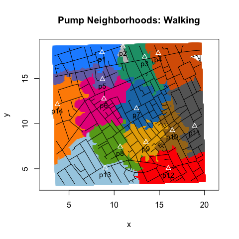
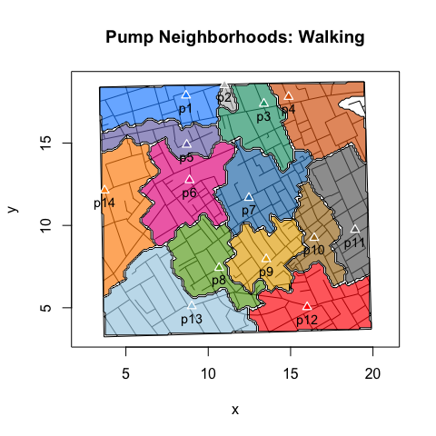
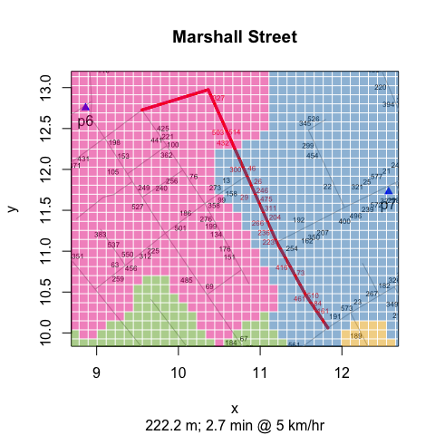
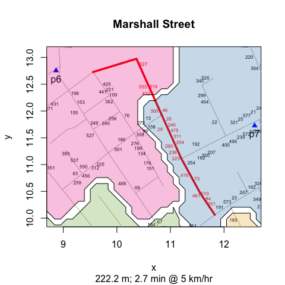
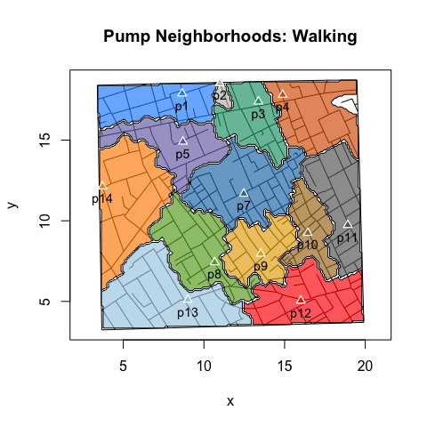

points v. polygons
================
lindbrook
2019-03-03

There are two types of “expected” pump neighborhood area plots. The
first uses `points()`; the second uses `polygon()`.

``` r
plot(neighborhoodWalking(vestry = TRUE, case.set = "expected"),
  type = "area.points")
```



``` r
plot(neighborhoodWalking(vestry = TRUE, case.set = "expected"),
  type = "area.polygons")
```



## why two?

The reason for having two types is that while the `points()` based
approach is computationally faster, the `polygon()` approach has vector
graphics on its side. In certain applications, when you zoom in you’ll
see the granularity of the `points()` based approach:

``` r
streetNameLocator("marshall street", zoom = TRUE)
addNeighborhoodCases(observed = FALSE)
```



``` r
streetNameLocator("marshall street", zoom = TRUE)
addNeighborhoodWalking()
```



## how to compute neighborhood area plots

For both types, I use “expected” data to compute the expected
neighborhood area. Using `sp::spsample()` and `sp::`polygon()\`\`, I
place 20K regularly-spaced points across the face of the map (in the
“real world”, points are approximately 6 meters
apart.).\[1\]

``` r
sp::spsample(sp::Polygon(map.frame[, c("x", "y")]), n = 20000, type = "regular")
```

For each simulated case, I compute the closet water pump using Euclidean
or walking distances. The details are in `simulateFatalities()`, which
is located in
[simulateFatalities.R](https://github.com/lindbrook/cholera/blob/master/R/simulateFatalities.R).

This function classifies the “expected” or simulated cases by their pump
neighborhood. By coloring the points by “their” pump, the different pump
neighborhoods emerge.

## how to compute polygon vertices

To use `polygon()`, we need the vertices. To my knowledge, this is not a
simple, straightforward task.

Using the case of pump the Broad Street pump (\#7) and walking distance
as the measure of proximity, I illustrate how I approach the problem. By
my calculation, 1,709 of the simulated cases fall in the Broad Street
pump neighborhood:


While the convex hull may be the first thing that comes to mind, it’s
not a good general solution. This is because the convex hull creates a
polygon based on the most outlying points. As a result, when there are
concavities, points outside the neighborhood will fall within the
resulting polygon:


To find the vertices of the pump neighborhood polygon, I’d argue that
what we want is to use the points along the perimeter to serve as the
vertices of the neighborhood’s polygon. To identify these points, I
select the point that *do not* have neighbors at all of the four
cardinal directions (i.e., North, South, East and West). See
`peripheryCases()`.


The final task is to connect the dots in the right order (no overlapping
edges). Essentially, we want to add pearls to a string to form the
polygon.


## String of pearls algorithms

I have coded two working solutions.\[2\] The first,
[`pearlString()`](https://github.com/lindbrook/cholera/blob/master/R/pearlString.R),
cycles through the candidate points and uses reverse
[epicycles](https://en.wikipedia.org/wiki/Deferent_and_epicycle) to find
the next point to add to the string of pearls. This is the default for
walking neighborhoods. The second,
[`travelingSalesman()`](https://github.com/lindbrook/cholera/blob/master/R/pearlString.R),
uses the ‘TSP’ package and its implementation of repetitive nearest
neighbors to compute the string of pearls. This is the default for
Euclidean
neighborhoods.

``` r
neighborhood <- neighborhoodWalking(-6, case.set = "expected", vestry = TRUE)
plot(neighborhood, type = "area.polygons", method = "pearl.string")
```



``` r
neighborhood <- neighborhoodWalking(-6, case.set = "expected", vestry = TRUE)
plot(neighborhood, type = "area.polygons", method = "traveling.salesman")
```


## why 20K observations?

Of equal, if not greater importance is the density of simulated cases.
As far as pearlString() is concerned, I found that the algorithm can
fail by getting stuck in dead ends or by skipping over points. As is
often the case, more data helps. As a tradeoff between computational
speed and functional robustness, I ended up using 20K simulated
cases.

## Expected areas v. expected roads.

``` r
plot(neighborhoodWalking(case.set = "expected"))
```


While easier to “read”, the area plots are potentially misleading.
Conceptually, the problem is that they take the focus away from roads
and puts it on regions, which may not be meaningful because they can
represent locations where there are no roads or residences.
Computationally, the problem is that the shape of a neighborhood will be
sensitive to how we determines a case’s street address. Different
implementations can produce different results.

## notes

1.  Because the map frame is not rectangular, the actual number of
    points is 19,993.

2.  Initially, I used the ‘alphahull’ package. But doing so not only
    requires tweaking a parameter, it also has a license, ACM, that
    generates a warning on CRAN Package Check.
