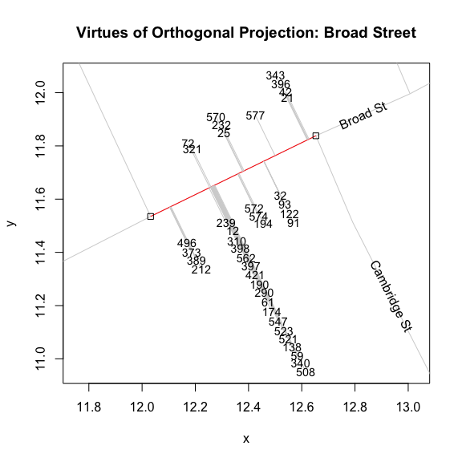

computing street addresses
================
lindbrook
2019-01-05

To match cases to a road and to other cases in stack, I use two methods of classification: orthogonal projection and cluster analysis.

### Orthogonal projection

The first method uses orthogonal projection. For each bar, the algorithm draws a series of lines that pass through the bar and are orthogonal to "nearby" road segment.[1] If the projected line bisects a road segment, it becomes a candidate for the bar's home segment. If there's more than one candidate, the algorithm chooses the segment "closest" to the bar: the segment with the shortest orthogonal projector.

To illustrate, consider this stylized example. For case 12, there are three possible "home" road segments: the solid blue, solid red and the solid green segments. Of the three, only *red* and *green* are candidates. The problem with *blue* is that its orthogonal projector (the blue arrow) does not intersect the solid blue segment. Of the two remaining candidates, *red* is chosen because it is closer to case 12 than *green*: the red arrow is shorter than the green one.

This procedure correctly classifies 508 of 578 cases, an error rate of 12.1%. Errors occur due to ambiguities surrounding a case's "home" segment. Unlike Snow's map where a bar's "horizontal" orientation reflects its "home" road segment, Dodson and Tobler only record a case's x-y coordinate. This can lead to problems at street intersections, where a point may be closer to the "wrong" segment, and at addresses with many cases.[2] The problem with multiple cases is that stacking can push cases away from their "home" segment. Consider the figure below. Even though visual inspection (the alignment of the stack) would lead us to choose *black*, the algorithm chooses *red*. The reason is that stacking pushes the case so far from *black* that it falls outside of the range of consideration. I corrected such errors by manually classifying them.

### Cluster analysis

To link a bar to a stack, I use hierarchical cluster analysis.[3] To make this task easier, I use a bar's orthogonal coordinate rather that its x-y coordinate. That is, I use the point where the the orthogonal projection from the bar intersects its "home" road segment. Doing so reduces the dimensionality of the problem since the algorithm only needs to compare positions of points along a line. This virtually eliminates any classification error.[4]

To illustrate, the graph below plots the cases and their orthogonal projectors along a segment of Broad Street. Linking a bar to a stack and identifying a stack, boils down to identifying distinct clusters of points along the road segment. For the case at hand, visual inspection leads us to expect that we should find 8 different clusters: 4 on the north side, 4 on the south.

One can be confirm the results by examining Snow's map:[5]

The one fly in the ointment is that addresses directly opposite one another will have "identical" orthogonal points and will appear to belong to the same "address". A simple solution to distinguish clusters on opposite sides of the street is to compute the *sign* of the arithmetic difference between a case's x-y coordinate and its orthogonal coordinate.

For example, consider cases 321 and 239. They lie on opposite sides of Broad Street. In the figure below, 321's coordinates are shown in blue while 239's are shown in red. When we take the signs of the differences, we get (-, +) for 321 and (+, -) for 239. This distinguishes cases on the north side from those on the south side.

In general, for roads with positive slopes (e.g., Broad Street), the differences for cases on the north/west side will be (-, +) while those on the south/east side will be (+, -); for roads with negative slopes (e.g., Cambridge Street), the differences for cases on the north/east side will be (-, -) while those on the south/west side will be (+, +).[6]

With this information, I can use cluster analysis to identify stacks, or "addresses", on each side of a candidate road segment. Since we expect the distances between cases in a stack or "address" to be small, I use an arbitrarily low but reasonable cutoff "height" of 0.05. The two dendrograms below represent the North and South sides of Broad Street. We can see that this procedure correctly classifies the 8 different groups or stacks that can be seen in the figure above and that can be verified by looking at Snow's map.

### Notes

[1] To reduce computation, I only consider road segments with at least one endpoint within approximately 27 meters of the bar (i.e., a distance of 0.5 on the map's scale).

[2] This is further exacerbated by the fact that the width of roads is not always taken into consideration. This creates instances where cases on one side of the street appear to be closer to the road than those on the other. One particular case of note is Portland Mews. On the map, Portland Mews is a large yard or square. But in Dodson and Tobler's data, it is simply a set of line segments, which possibly corresponds to a roadway through the location. As a result, the three cases there appear to belong to a single cluster instead of two separate ones. I manually chose the more distant road segment on Portland Mews that better reflects the orientation of bars on Snow's map.

[3] Specifically, I use `stats::hclust()`, which by default employs a "complete" method of agglomerative hierarchical clustering.

[4] What makes this possible is that, by design, "vertical" dispersion, the spread of x-y points along the orthogonal axis, is much greater than the "horizontal" dispersion, the spread of orthogonal points along the road's line segment. In an ideal world, the "horizontal" dispersion would be zero and all points in a stack would be perfectly aligned. In practice, this is not the case.

[5] In Snow's map, one can see 5 addresses on the north side of the block of Broad Street between Dufours Place and Poland Street (the road running north-south just visible on the east or left side of the graph) but only 4 of those addresses fall on the street segment in Dodson and Tobler. The reason for the discrepancy is that intersections with other streets, regardless of which side of the road they may fall, define the end points of road segments. This is why the south side of this segment of Broad Street only includes 4 addresses: the endpoints are defined by Dufours Place on the left (west) and Cambridge Street on the right (east).

[6] The two limiting cases occur when roads run either along the East-West axis (i.e., 0 degrees) or the North-South axis (i.e., 90 degrees). For the former, cases on the north side will be (0, +) while those on the south side will be (0, -); for the latter, cases on the east side will be (+, 0) while those on the west side will be (-, 0).
