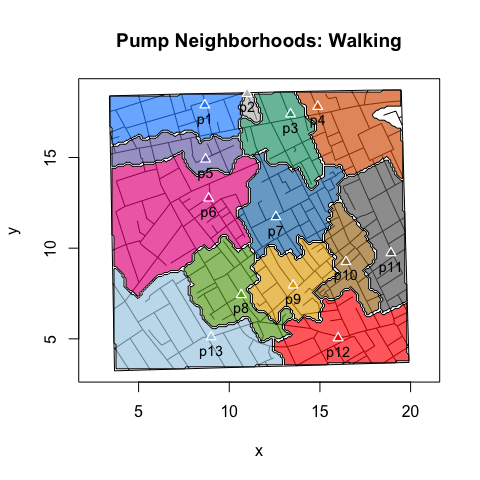
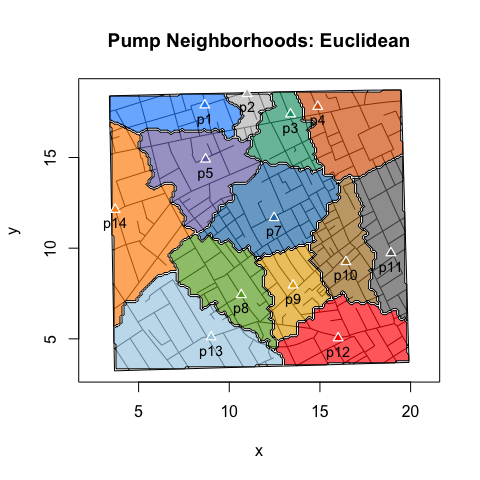

Lab Notes: Pearl Strings to Polygons
================
lindbrook
2018-12-15

Overview
--------

Two flavors of "expected" area plots: points and polygons

``` r
plot(neighborhoodWalking(case.set = "expected"), type = "area.points")
```


``` r
plot(neighborhoodWalking(case.set = "expected"), type = "area.polygons")
```



why polygons?
-------------

The virtues of vector graphics.

``` r
streetNameLocator("marshall street", zoom = TRUE)
addNeighborhoodCases(type = "expected")
```


``` r
streetNameLocator("marshall street", zoom = TRUE)
addNeighborhoodWalking()
```


computing polygons
------------------

These are the simulated cases within the Broad Street pump neighborhood:


The convex hull of those cases:


To find the points on the perimeter, the candidate points for the vertices of the polygon, I select the point that *do not* have neighbors at each of the four cardinal directions. See peripheryCases().


To connect the dots, we add pearls to a string to form polygon


two algorithms
--------------

pearlString() cycles through the candidate points and uses reverse epicycles to find the next point to add to the string of pearls. This is the default for walking neighborhoods.

travelingSalesman() uses the 'TSP' package and its implementation of repetitive nearest neighbors to compute the string of pearls. This is the defaul for euclidean neighbors.

``` r
neighborhood <- neighborhoodEuclidean(-6, case.set = "expected", vestry = TRUE)

plot(neighborhood, type = "area.polygons", method = "pearl.string")
```


``` r
neighborhood <- neighborhoodEuclidean(-6, case.set = "expected", vestry = TRUE)

plot(neighborhood, type = "area.polygons", method = "traveling.salesman")
```


