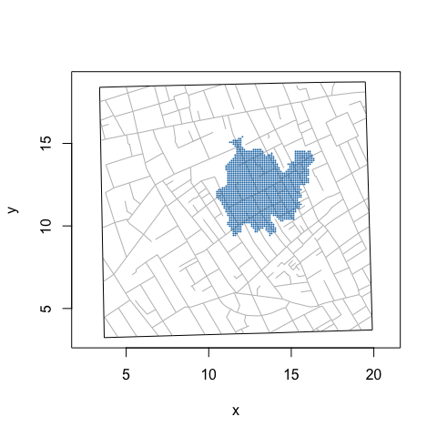
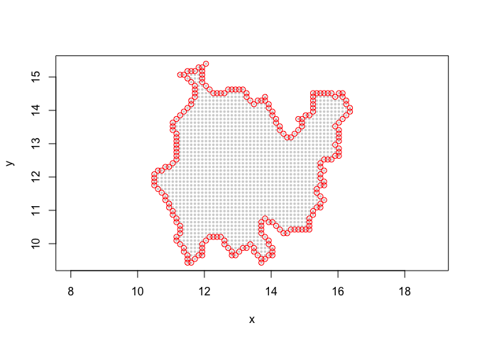
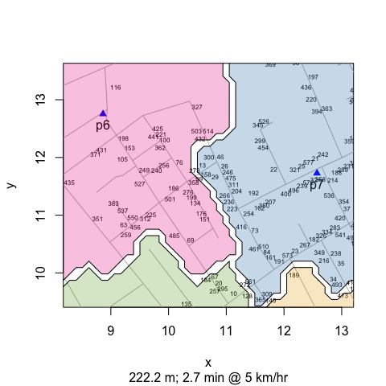

Lab Notes: Pump Neighborhoods
================
lindbrook
2018-07-23

Area polygons
-------------

To draw the area polygons for pump neighborhoods, I did the following.

First, using sp::spsample() and sp::Polygon(), I place approximately 20K regularly-spaced points across the face of the map:

``` r
sp::spsample(sp::Polygon(map.frame[, c("x", "y")]), n = 20000, type = "regular")
```

For each simulated cases, I compute the closet water pump. This partitions the simulated cases into clusters that reflect the selected pump neighborhoods. The details are in cholera::simulateFatalities(), located in [simulateFatalities.R](https://github.com/lindbrook/cholera/blob/master/R/simulateFatalities.R)

The figure below plots the 1,709 simulated cases for the Broad Street pump neighborhood (pump \#7).



Second, I find the points that fall along the periphery of the cluster.



This is what allow me to use graphics::polygon() to create plots like the Marshall Street example in the vignette:



Doing this, however, is easier said than done. While the convex hull of neighborhood's points gets us close, it's not a good general solution. This is because the convex hull will create a polygon based on the most outlying points. As a result, when there are concavities, points outside the neighborhood will fall within the resulting polygon.


Another possibility, which I used in an earlier version of 'cholera', is to use the 'alphahull' package. But that not only requires tweaking a parameter, it also has an ACM license that generates a warning on CRAN Package Check.

String of pearls
----------------

My workable but mechanical solution does the following. First, I identify points along the periphery by eliminating simulated cases that have immediate neighbors at each of the 4 cardinal directions (i.e., North, South, East and West). I then try to connect the dots in the "right" order by using [epicycles](https://en.wikipedia.org/wiki/Deferent_and_epicycle). This works as a double loop. The outer loop, which moves around the perimeter in clockwise fashion, assembles the vertices of the polygon (i.e., add the pearls on the string). The inner loop, which finds the next vertex, moves counterclockwise epicycles. Doing so capture concavities in the polygon.

Of equal if not greater importance is the density of simulated cases. The algorithm can fail by getting stuck in dead ends or by skipping over points. As is often the case, more data can help. As a tradeoff between computational speed and functional robustness, I use 20K simulated cases.


