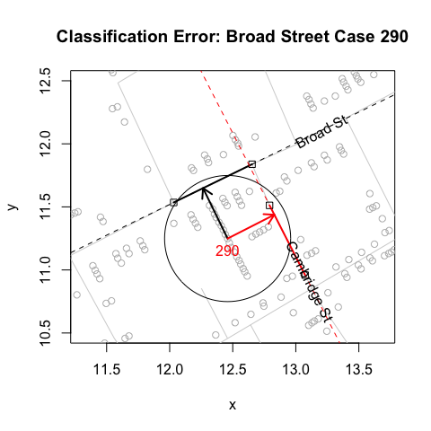
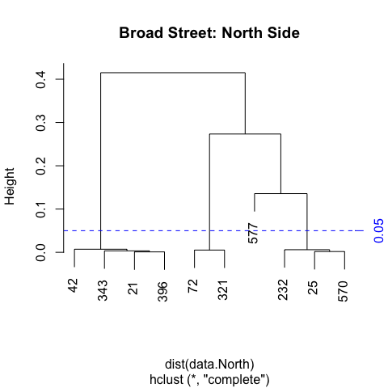

"Unstacking" Bars
================
lindbrook
2018-06-22

Overview
--------

In his map of the 1854 cholera outbreak in London, John Snow uses stacks of bars to represent the number of fatalities at a given address. A location with one fatality is represented by a single, horizontal bar that lies parallel to road where the fatality occurred. A location with five fatalities is represented by five horizontally stacked bars:[1]


In 1992, Rusty Dodson and Waldo Tobler digitized the map. Each bar and pump is assigned a unique x-y coordinate. Each road is translated into a series of straight line segments, each of which is defined by the segment's endpoints. While the original data are no longer available,[2] they are preserved in Michael Friendly's 'HistData' package. The data are plotted below:


Despite its appeal, I would argue that stacked bars are visually and computationally problematic. The reason, simply put, is that not all bars are created equal. Even though they are identical in terms of their appearance and the only thing that appears to distinguish them is their position on the map, bars can actually play different roles.

Sometimes a bar represents the location of a fatality, sometimes it doesn't. Standalone bars, a stack with a single bar (i.e., an addresses with one fatality), or the bar at the base of a stack represent a location. Bars above the base case do not. Their only purpose is to create the stacking effect to visually represent the number of fatalities at an address.

This duality can be problematic. Because a map is a visual device that illustrates spatial relationships, it's natural to assume that the position of each element (e.g., a bar) reflects an actual, physical location. When we violate this assumption, we undermine the visual integrity of the map. This can handicap our analysis. This is particularly true given that 44% (257/578) of the bars in Snow's map fall into the second, geographically uninformative category.

To address these problems, I "unstack" Dodson and Tobler's data. I do so in two ways. In the first, I give all all cases in a stack (i.e., at the same "address") the same x-y coordinate. These data are available in *fatalities.unstacked*. In the second, I make the address rather than the the case the unit of observation: each address is a single observation with a single x-y coordinate, and the number of cases observed at that location is an attribute of that address. These data are available in *fatalities.address*.

Data details
------------

To illustrate the differences between the two data sets, consider they deal with the largest outlier on Snow's map: the eighteen cases at 38 Broad Street.

With *fatalities*, all members of the stack have different coordinates:

``` r
## The 18 cases at 38 Broad Street ##

broad38 <- c(239, 12, 310, 398, 562, 397, 421, 190, 290, 61, 174, 547, 523,
             521, 138, 59, 340, 508)

fatalities[fatalities$case %in% broad38, ]
#>     case        x        y
#> 12    12 12.34107 11.48214
#> 59    59 12.58271 11.01057
#> 61    61 12.47289 11.21463
#> 138  138 12.56326 11.04593
#> 174  174 12.48731 11.17735
#> 190  190 12.44094 11.28124
#> 239  239 12.31552 11.51159
#> 290  290 12.45943 11.24890
#> 310  310 12.35546 11.44285
#> 340  340 12.59532 10.98533
#> 397  397 12.40901 11.34986
#> 398  398 12.36903 11.41560
#> 421  421 12.42551 11.31754
#> 508  508 12.61480 10.95197
#> 521  521 12.54972 11.07519
#> 523  523 12.53218 11.10452
#> 547  547 12.51176 11.14190
#> 562  562 12.39045 11.37820
```

With *fatalities.unstacked*, all members of the stack have the same coordinate:

``` r
fatalities.unstacked[fatalities.unstacked$case %in% broad38, ]
#>     case        x        y
#> 12    12 12.31552 11.51159
#> 59    59 12.31552 11.51159
#> 61    61 12.31552 11.51159
#> 138  138 12.31552 11.51159
#> 174  174 12.31552 11.51159
#> 190  190 12.31552 11.51159
#> 239  239 12.31552 11.51159
#> 290  290 12.31552 11.51159
#> 310  310 12.31552 11.51159
#> 340  340 12.31552 11.51159
#> 397  397 12.31552 11.51159
#> 398  398 12.31552 11.51159
#> 421  421 12.31552 11.51159
#> 508  508 12.31552 11.51159
#> 521  521 12.31552 11.51159
#> 523  523 12.31552 11.51159
#> 547  547 12.31552 11.51159
#> 562  562 12.31552 11.51159
```

With *fatalities.address*, the 18 cases are represented by a single observation, case 239, which serves as the "address":

``` r
fatalities.address[136:140, ]
#>     anchor.case         x        y case.count
#> 236         237 15.775540 13.98787          2
#> 238         238 12.900190 10.33882          1
#> 239         239 12.315520 11.51159         18
#> 257         240  9.794394 11.77236          1
#> 258         242 12.677590 12.05460          1
```

Virtues of "unstacking"
-----------------------

To illustrate the virtues of "unstacked" data, consider the following.

### Kernel density contours

The graphs below plot the bivariate kernel density contours, of varying bandwidths, on the "stacked" and "unstacked" data. The contours help illustrate the spatial distribution or topography of fatalities, and provide an estimate of the epicenter of the outbreak.

With the "stacked" data, *fatalities*, the contours are looser (reflecting greater uncertainty) and the epicenter is further south than what we might expect given that the Broad Street pump (blue triangle)[3] is the accepted source of the outbreak. The problem is that the "vertical" stack of 18 cases (west of the pump at 38 Broad Street) and the "horizontal" stack of 5 cases (south of the pump at 10 Cambridge Street) pull the fit downward in a southerly direction.


With *fatalities.unstacked*, the contours are "tighter" (reflecting lesser uncertainty) and the epicenter are located further north, nearer to the roads, the pump and to Broad Street:


"Unstacking" via classification
-------------------------------

The main roadblock to "unstacking" is that there is no notion of an "address" in the data: bars are merely points and streets are merely line segments.[4] Nothing links a point to a segments. And nothing connects one bar in a stack to another bar. All elements exist independently of one another. The only reason why the map "works" is that the fatalities and roads data have overlapping x-y coordinates.

To "unstack" the data, we need to match each bar to a specific road (segment) and to a specific stack. To accomplish these tasks, I employ two different methods of classification.

### Orthogonal projection

The first method works by orthogonal projection. For each bar, the algorithm draws a series of lines that pass through the bar and are orthogonal to "nearby" road segment.[5] If the projected line bisects a road segment, it becomes a candidate for the bar's home segment. If there's more than one candidate, the algorithm chooses the segment "closest" to the bar: the segment with the shortest orthogonal projector.

To illustrate, consider this stylized example. For case 12, there are three possible "home" road segments: the solid blue, solid red and the solid green segments. Of the three, only *red* and *green* are candidates. The problem with *blue* is that its orthogonal projector (the blue arrow) does not intersect the solid blue segment. Of the two remaining candidates, *red* is chosen because it is closer to case 12 than *green*: the red arrow is shorter than the green one.


This procedure correctly classifies 508 of 578 cases, an error rate of 12.1%. Errors occur due to ambiguities surrounding a case's "home" segment. Unlike Snow's map where a bar's "horizontal" orientation reflects its "home" road segment, Dodson and Tobler only record a case's x-y coordinate. This can lead to problems at street intersections, where a point may be closer to the "wrong" segment, and at addresses with many cases.[6] The problem with multiple cases is that stacking can push cases away from their "home" segment. Consider the figure below. Even though visual inspection (the alignment of the stack) would lead us to choose *black*, the algorithm chooses *red*. The reason is that stacking pushes the case so far from *black* that it falls outside of the range of consideration. I corrected such errors by manually classifying them.



### Cluster analysis

To link a bar to a stack, I use hierarchical cluster analysis.[7] To make this task easier, I use a bar's orthogonal coordinate rather that its x-y coordinate. That is, I use the point where the the orthogonal projection from the bar intersects its "home" road segment. Doing so reduces the dimensionality of the problem since the algorithm only needs to compare positions of points along a line. This virtually eliminates any classification error.[8]

To illustrate, the graph below plots the cases and their orthogonal projectors along a segment of Broad Street. Linking a bar to a stack and identifying a stack, boils down to identifying distinct clusters of points along the road segment. For the case at hand, visual inspection leads us to expect that we should find 8 different clusters: 4 on the north side, 4 on the south.


One can be confirm the results by examining Snow's map:[9]


The one fly in the ointment is that addresses directly opposite one another will have "identical" orthogonal points and will appear to belong to the same "address". A simple solution to distinguish clusters on opposite sides of the street is to compute the *sign* of the arithmetic difference between a case's x-y coordinate and its orthogonal coordinate.

For example, consider cases 321 and 239. They lie on opposite sides of Broad Street. In the figure below, 321's coordinates are shown in blue while 239's are shown in red. When we take the signs of the differences, we get (-, +) for 321 and (+, -) for 239. This distinguishes cases on the north side from those on the south side.


In general, for roads with positive slopes (e.g., Broad Street), the differences for cases on the north/west side will be (-, +) while those on the south/east side will be (+, -); for roads with negative slopes (e.g., Cambridge Street), the differences for cases on the north/east side will be (-, -) while those on the south/west side will be (+, +).[10]

With this information, I can use cluster analysis to identify stacks, or "addresses", on each side of a candidate road segment. Since we expect the distances between cases in a stack or "address" to be small, I use an arbitrarily low but reasonable cutoff "height" of 0.05. The two dendrograms below represent the North and South sides of Broad Street. We can see that this procedure correctly classifies the 8 different groups or stacks that can be seen in the figure above and that can be verified by looking at Snow's map.



[1] The map was originally published in Snow's 1855 book "On The Mode Of Communication Of Cholera", which was reprinted as John Snow et. al., 1936. *Snow on Cholera: Being a Reprint of Two Papers*. New York: The Common Wealth Fund. You can also find the map online (a high resolution version is available at <http://www.ph.ucla.edu/epi/snow/highressnowmap.html>) and in many books, including Edward Tufte's 1997 "Visual Explanations: Images and Quantities, Evidence and Narrative".

[2] <http://www.ncgia.ucsb.edu/pubs/snow/snow.html>

[3] The blue triangle is the "correct" location of the pump as included in the amended, second version of the map that appears in the Vestry report. The empty green triangle is the pump's "wrong" location from the original map.

[4] In Friendly's HistData package, these data are called "Snow.deaths" and "Snow.streets".

[5] To reduce computation, I only consider road segments with at least one endpoint within approximately 27 meters of the bar (i.e., a distance of 0.5 on the map's scale).

[6] This is further exacerbated by the fact that the width of roads is not always taken into consideration. This creates instances where cases on one side of the street appear to be closer to the road than those on the other. One particular case of note is Portland Mews. On the map, Portland Mews is a large yard or square. But in Dodson and Tobler's data, it is simply a set of line segments, which possibly corresponds to a roadway through the location. As a result, the three cases there appear to belong to a single cluster instead of two separate ones. I manually chose a more distant road segment on Portland Mews that better reflects the orientation of bars on Snow's map.

[7] Specifically, I use stats::hclust(), which by default employs a "complete" method of agglomerative hierarchical clustering.

[8] What makes this possible is that, by design, "vertical" dispersion, the spread of x-y points along the orthogonal axis, is much greater than the "horizontal" dispersion, the spread of orthogonal points along the road's line segment. In an ideal world, the "horizontal" dispersion would be zero and all points in a stack would be perfectly aligned. In practice, this is not the case.

[9] In Snow's map, one can see 5 addresses on the north side of the block of Broad Street between Dufours Place and Poland Street (the road running north-south just visible on the east or left side of the graph) but only 4 of those addresses fall on the street segment in Dodson and Tobler. The reason for the discrepancy is that intersections with other streets, regardless of which side of the road they may fall, define the end points of road segments. This is why the south side of this segment of Broad Street only includes 4 addresses: the endpoints are defined by Dufours Place on the left (west) and Cambridge Street on the right (east).

[10] The two limiting cases occur when roads run either along the East-West axis (i.e., 0 degrees) or the North-South axis (i.e., 90 degrees). For the former, cases on the north side will be (0, +) while those on the south side will be (0, -); for the latter, cases on the east side will be (+, 0) while those on the west side will be (-, 0).
