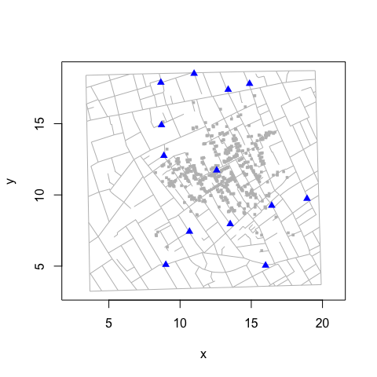
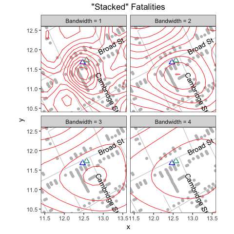
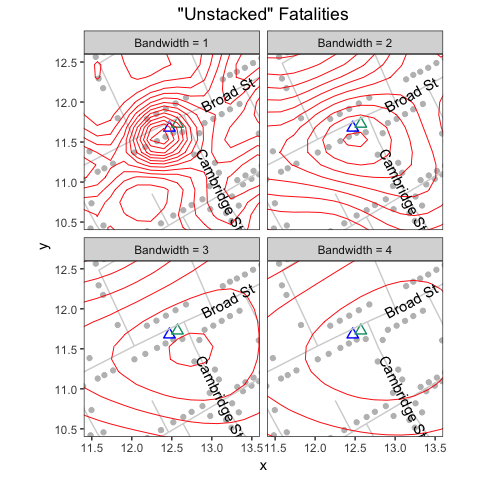

"Unstacking" Bars
================
lindbrook
2018-07-10

Overview
--------

In his map of the 1854 cholera outbreak in London, John Snow uses stacks of bars to represent the number of fatalities at a given address. A location with one fatality is represented by a single, horizontal bar that lies parallel to road where the fatality occurred. A location with five fatalities is represented by five horizontally stacked bars:[1]


In 1992, Rusty Dodson and Waldo Tobler digitized the map. Each bar and pump is assigned a unique x-y coordinate. Each road is translated into a series of straight line segments, defined by the segment's endpoints. While the original data are no longer available,[2] they are preserved in Michael Friendly's 'HistData' package. The data are plotted below:



Despite its appeal, I would argue that stacked bars are visually and computationally problematic. The reason, simply put, is that not all bars are created equal. Even though they are identical in terms of their appearance and the only thing that appears to distinguish them is their location, bars can actually play different roles.

Sometimes a bar represents the location of a fatality, sometimes it doesn't. Standalone bars, a stack with a single bar (i.e., an addresses with one fatality), or the bar at the base of a stack represent a location. Bars above the base case do not. They exist only to create the stacking effect to visually represent the number of fatalities at the address.

This duality is problematic. Because a map is a visual device that illustrates spatial relationships, it's natural to assume that the position of each element (e.g., a bar) reflects an actual, physical location. When we violate this assumption, we undermine the visual integrity of the map. This can handicap our analysis. This is particularly true given that 44% (257/578) of the bars in Snow's map fall into the second, geographically uninformative category.

To address these problems, I "unstack" Dodson and Tobler's data. I do so in two ways. In the first, I give all all cases in a stack (i.e., at the same "address") the same x-y coordinate. These data are available in *fatalities.unstacked*. In the second, I make the address rather than the the case the unit of observation: each address is a single observation with a single x-y coordinate, and the number of cases observed at that location is an attribute of that address. These data are available in *fatalities.address*.

Data details
------------

To illustrate the differences between the two data sets, consider how they handle the largest outlier on Snow's map: the eighteen cases at 38 Broad Street.

With *fatalities*, all members of the stack have different coordinates:

``` r
## The 18 cases at 38 Broad Street ##

broad38 <- c(239, 12, 310, 398, 562, 397, 421, 190, 290, 61, 174, 547, 523,
             521, 138, 59, 340, 508)

fatalities[fatalities$case %in% broad38, ]
#>     case        x        y
#> 12    12 12.34107 11.48214
#> 59    59 12.58271 11.01057
#> 61    61 12.47289 11.21463
#> 138  138 12.56326 11.04593
#> 174  174 12.48731 11.17735
#> 190  190 12.44094 11.28124
#> 239  239 12.31552 11.51159
#> 290  290 12.45943 11.24890
#> 310  310 12.35546 11.44285
#> 340  340 12.59532 10.98533
#> 397  397 12.40901 11.34986
#> 398  398 12.36903 11.41560
#> 421  421 12.42551 11.31754
#> 508  508 12.61480 10.95197
#> 521  521 12.54972 11.07519
#> 523  523 12.53218 11.10452
#> 547  547 12.51176 11.14190
#> 562  562 12.39045 11.37820
```

With *fatalities.unstacked*, all members of the stack have the same coordinate:

``` r
fatalities.unstacked[fatalities.unstacked$case %in% broad38, ]
#>     case        x        y
#> 12    12 12.31552 11.51159
#> 59    59 12.31552 11.51159
#> 61    61 12.31552 11.51159
#> 138  138 12.31552 11.51159
#> 174  174 12.31552 11.51159
#> 190  190 12.31552 11.51159
#> 239  239 12.31552 11.51159
#> 290  290 12.31552 11.51159
#> 310  310 12.31552 11.51159
#> 340  340 12.31552 11.51159
#> 397  397 12.31552 11.51159
#> 398  398 12.31552 11.51159
#> 421  421 12.31552 11.51159
#> 508  508 12.31552 11.51159
#> 521  521 12.31552 11.51159
#> 523  523 12.31552 11.51159
#> 547  547 12.31552 11.51159
#> 562  562 12.31552 11.51159
```

With *fatalities.address*, the 18 cases are represented by a single observation, case 239, which serves as the "address":

``` r
fatalities.address[136:140, ]
#>     anchor.case         x        y case.count
#> 236         237 15.775540 13.98787          2
#> 238         238 12.900190 10.33882          1
#> 239         239 12.315520 11.51159         18
#> 257         240  9.794394 11.77236          1
#> 258         242 12.677590 12.05460          1
```

Virtues of "unstacking"
-----------------------

To illustrate the virtues of "unstacked" data, consider the following.

### Kernel density contours

The graphs below plot the bivariate kernel density contours, of varying bandwidths, on the "stacked" and "unstacked" data. The contours help illustrate the spatial distribution or topography of fatalities, and provide an estimate of the epicenter of the outbreak.

With the "stacked" data, *fatalities*, the contours are looser (reflecting greater uncertainty) and the epicenter is further south than what we might expect given that the Broad Street pump (blue triangle)[3] is the accepted source of the outbreak. The problem is that the "vertical" stack of 18 cases (west of the pump at 38 Broad Street) and the "horizontal" stack of 5 cases (south of the pump at 10 Cambridge Street) pull the fit downward in a southerly direction.



With *fatalities.unstacked*, the contours are "tighter" (reflecting lesser uncertainty) and the epicenter is located further north, nearer to the pump and to Broad Street:



"Unstacking" via classification
-------------------------------

The main roadblock to "unstacking" is that there is no notion of an "address" in the data: bars are merely points and streets are merely line segments.[4] Nothing links a point to a segments. And nothing connects one bar in a stack to another bar. All elements exist independently of one another. The only reason why the map "works" is that the fatalities and roads data have overlapping x-y coordinates.

To "unstack" the data, we need to match each bar to a specific road (segment) and to a specific stack. To accomplish these tasks, I use two types of classification. For those interested, the details are found in this vignette's lab notes, which are available [online](https://github.com/lindbrook/cholera/blob/master/docs/unstacking.bars.notes.md) and in the package's GitHub repository.

[1] The map was originally published in Snow's 1855 book "On The Mode Of Communication Of Cholera", which was reprinted as John Snow et. al., 1936. *Snow on Cholera: Being a Reprint of Two Papers*. New York: The Common Wealth Fund. You can also find the map online (a high resolution version is available at <http://www.ph.ucla.edu/epi/snow/highressnowmap.html>) and in many books, including Edward Tufte's 1997 "Visual Explanations: Images and Quantities, Evidence and Narrative".

[2] <http://www.ncgia.ucsb.edu/pubs/snow/snow.html>

[3] The blue triangle is the "correct" location of the pump as included in the amended, second version of the map that appears in the Vestry report. The empty green triangle is the pump's "wrong" location from the original map.

[4] In Friendly's HistData package, these data are called "Snow.deaths" and "Snow.streets".
