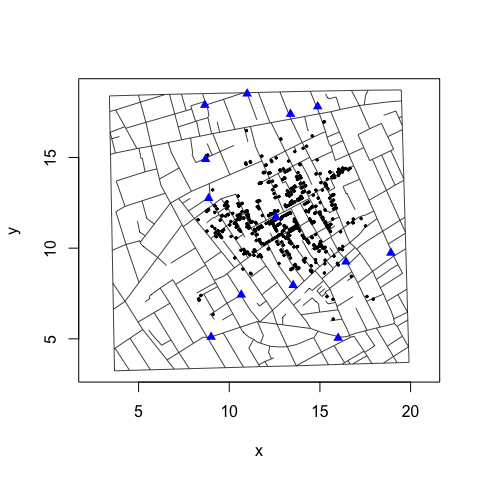

Duplicate and Missing Cases
================
lindbrook
2019-01-05

John Snow's map of the 1854 cholera outbreak in London is a canonical example of data visualization:[1]


In 1992, Rusty Dodson and Waldo Tobler digitized the map. While the original data are no longer available,[2] they are preserved in Michael Friendly's 'HistData' package. These data are plotted below:



### Data problem

I would argue that there are two apparent coding errors in these data that stem from three misplaced cases.

While the data record 578 bars, only 575 of them have a unique x-y coordinate.[3] Three pairs have identical coordinates: 1) 93 and 214; 2) 91 and 241; and 3) 209 and 429. Within the scheme of stacking bars to represent the fatality count, this cannot occur. Each bar should have a unique x-y coordinate. For this reason, duplicates are likely to be coding errors.

``` r
duplicates <- HistData::Snow.deaths[(duplicated(HistData::Snow.deaths[,
  c("x", "y")])), ]

duplicates.id <- lapply(duplicates$x, function(i) {
  HistData::Snow.deaths[HistData::Snow.deaths$x == i, "case"]
})

HistData::Snow.deaths[unlist(duplicates.id), ]
#>     case        x        y
#> 93    93 12.84460 11.61027
#> 214  214 12.84460 11.61027
#> 91    91 12.65285 11.26382
#> 241  241 12.65285 11.26382
#> 209  209 12.68321 11.28437
#> 429  429 12.68321 11.28437
```

Fortunately, a careful comparison of Snow's map and the map generated by Dodson and Tobler's data reveals that there are also three "missing" bars in the latter. An expedient "fix" would be to simply use the duplicate observations to fill in for the "missing" bars:

``` r
fatalities <- HistData::Snow.deaths

fix <- data.frame(x = c(12.56974, 12.53617, 12.33145), y = c(11.51226, 11.58107, 14.80316))

fatalities[c(91, 93, 209), c("x", "y")] <- fix
```

This fixed data set is available as `fatalities` in this package and as `Snow.deaths2` in 'HistData' (&gt;= ver. 0.7-8). For those interested, detail about how I arrived at these values can be found in `fixFatalities()` and in the "Note on Duplicate and Missing Cases", which is available [online](https://github.com/lindbrook/cholera/blob/master/docs/duplicate.missing.cases.notes.md) in this package's GitHub repository.

Notes
-----

[1] The map was originally published in Snow's 1855 book, "On The Mode Of Communication Of Cholera", and was reprinted in John Snow et. al., 1936. *Snow on Cholera: Being a Reprint of Two Papers*. New York: The Common Wealth Fund. You can also find the map online (a high resolution version is available at <http://www.ph.ucla.edu/epi/snow/highressnowmap.html>) and in many books, including Edward Tufte's 1997 "Visual Explanations: Images and Quantities, Evidence and Narrative".

[2] <http://www.ncgia.ucsb.edu/pubs/snow/snow.html>

[3] There is a lack of consensus about the actual number of cases represented in Snow's map. For what it's worth, I manually recounted the data on Snow's map and the result I got matches Dodson and Tobler's.
