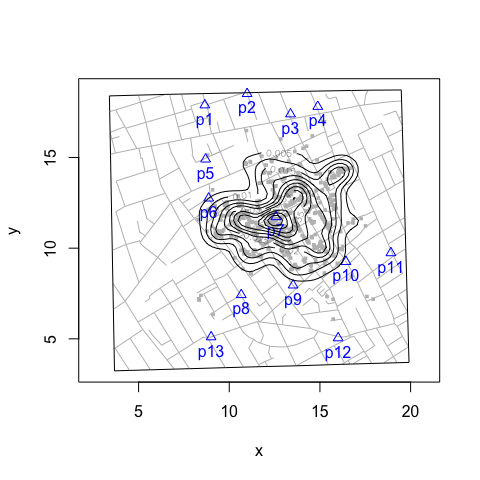
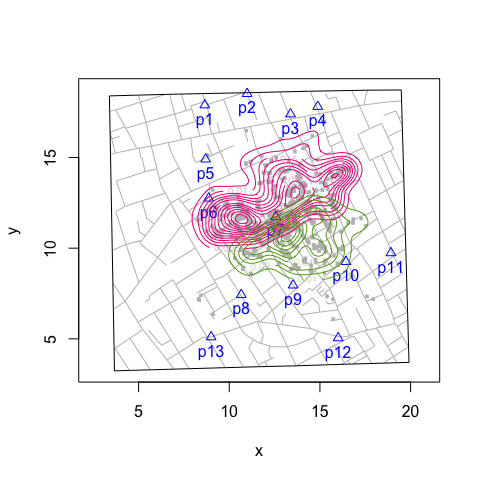
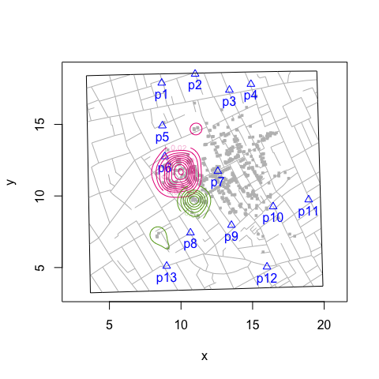

Kernel Density Plot
================
lindbrook
2024-09-27

By default, `addKernelDensity()` pools all observations into a single
neighborhood:

``` r
snowMap()
addKernelDensity()
```



To consider the possibility of multiple pump neighborhoods, you can do
the following.

To define a set of neighborhoods based on a selection of pumps (i.e.,
distribute cases across the selection), use the `pump.select` argument :

``` r
snowMap()
addKernelDensity(pump.select = c(6, 8))
```



To view the subset of “local” neighborhoods you’re interested in, use
the `pump.subset` argument.

``` r
snowMap()
addKernelDensity(pump.subset = c(6, 8))
```


