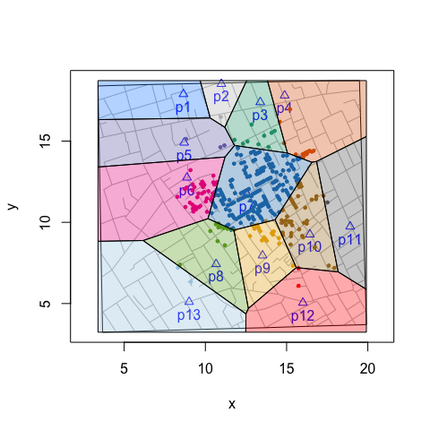

deldirPolygons(): Tiles, Triangles and Polygons
================
lindbrook
2019-01-05

`deldirPolygons()` is a wrapper function that extracts the vertices of 'deldir' Delauny triangles and Dirichelet (Voronoi) tiles for use with functions that rely on polygons. The function returns a list of data frames of vertices. This makes tasks like coloring tiles or triangles or counting cases within tiles or triangles easier.

``` r
deldirPolygons(sites, rw.data = NULL, rw = NULL, type = "tiles")
```

The functions has four arguments. `sites` is the data frame of the sites or focal points used to do the triangulation or tessellation. `rw.data` (rw = 'rectangular window')is the data frame of secondary data (e.g., fatalities, customers, etc.). It is useful when the range of secondary data exceeds that of the site data. `rw` is a vector of the corners of the rectangular window: xmin, xmax, ymin, ymax. `type` is "tiles" or "triangles".

Coloring Tiles
--------------

``` r
# compute vertices of Voronoi tiles
vertices <- deldirPolygons(sites = cholera::pumps, rw.data = cholera::roads)

# define colors, plot map, and color code fatalities
snow.colors <- grDevices::adjustcolor(cholera::snowColors(), alpha.f = 1/3)
cholera::snowMap(add.cases = FALSE)
cholera::addNeighborhoodCases(metric = "euclidean")

# plot color coded polygons
invisible(lapply(seq_along(vertices), function(i) {
  polygon(vertices[[i]], col = snow.colors[[i]])
}))
```



Counting Observations in Tiles
------------------------------

To count the number of cases within each neighborhood, we can use sp::point.in.polygon().

``` r
# compute vertices of Voronoi tiles
vertices <- deldirPolygons(sites = cholera::pumps, rw.data = cholera::roads)

# locations of the 578 fatalities in Soho
cases <- cholera::fatalities.unstacked

# count fatalities within each polygon (neigborhood)
census <- lapply(vertices, function(tile) {
  sp::point.in.polygon(cases$x, cases$y, tile$x, tile$y)
})

# ID the 13 water pumps
names(census) <- paste0("p", cholera::pumps$id)

# count of fatalities by neighborhood
vapply(census, sum, integer(1L))
>  p1  p2  p3  p4  p5  p6  p7  p8  p9 p10 p11 p12 p13 
>   0   1  13  23   6  61 361  16  27  62   2   2   4
```

Counting Observations in Triangles
----------------------------------

To count the number of cases within each triangle:

``` r
# compute vertices of Delauny triangles
vertices <- deldirPolygons(sites = cholera::pumps,
  rw.data = cholera::roads, type = "triangles")

# locations of the 578 fatalities in Soho
cases <- cholera::fatalities.unstacked

# count fatalities within each triangle
census <- lapply(vertices, function(tile) {
  sp::point.in.polygon(cases$x, cases$y, tile$x, tile$y)
})

# ID triangles
names(census) <- paste0("t", seq_along(vertices))

# count of fatalities by triangle
vapply(census, sum, integer(1L))
>  t1  t2  t3  t4  t5  t6  t7  t8  t9 t10 t11 t12 t13 t14 t15 t16 t17 
>   1   0   1  11  43 179  35   2  18 138  15  22  97   0   0   4   1
```
