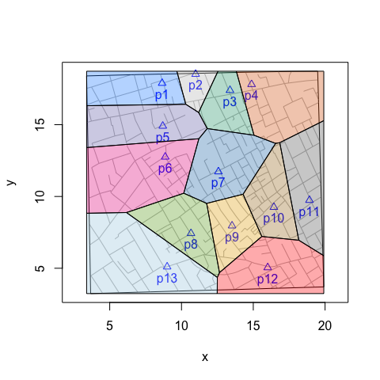
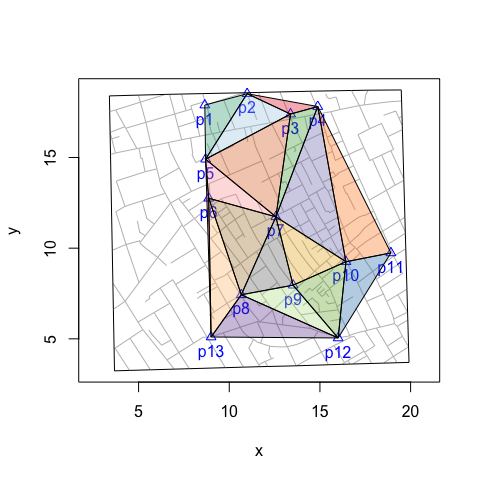

voronoiPolygons(): Tiles, Triangles and Polygons
================
lindbrook
2021-10-06

`voronoiPolygons()` is a wrapper function that extracts the vertices of
‘deldir’ Delaunay triangles and Dirichelet (Voronoi) tiles for use with
functions like graphics::polygon(). The function returns a list of data
frames of vertices. This makes tasks like coloring tiles or triangles or
counting cases within those tiles or triangles easier.

``` r
voronoiPolygons(sites, rw.data = NULL, rw = NULL, type = "tiles")
```

The functions has four arguments. `sites` is the data frame of the sites
or focal points used to do the tessellation or triangulation. `rw.data`
(rw = ‘rectangular window’) is the data frame of a secondary source data
(e.g., fatalities, customers, etc.). This argument is useful when the
range of secondary data exceeds that of the sites data. `rw` is the
`deldir` way to specify the range of data. It uses a vector of the
corners of the rectangular window: xmin, xmax, ymin, ymax. `type` is
“tiles” or “triangles”.

To color tiles and triangles or to count the number of points (e.g.,
fatalities) within each tile or triangle, we can apply
`sp::point.in.polygon()` to the results of `voronoiPolygons()`.

## Count points within tiles

``` r
# compute vertices of Voronoi tiles
vertices <- voronoiPolygons(sites = cholera::pumps, rw.data = cholera::roads)

# locations of the 578 fatalities in Soho
cases <- cholera::fatalities.unstacked

# count fatalities within each tile
census <- lapply(vertices, function(tile) {
  sp::point.in.polygon(cases$x, cases$y, tile$x, tile$y)
})

# ID the 13 water pumps
names(census) <- paste0("p", cholera::pumps$id)

# count of fatalities by neighborhood
vapply(census, sum, integer(1L))
>  p1  p2  p3  p4  p5  p6  p7  p8  p9 p10 p11 p12 p13 
>   0   1  13  23   6  61 361  16  27  62   2   2   4
```

## Count points within triangles

``` r
# compute vertices of Delaunay triangles
vertices <- voronoiPolygons(sites = cholera::pumps,
  rw.data = cholera::roads, type = "triangles")

# locations of the 578 fatalities in Soho
cases <- cholera::fatalities.unstacked

# count fatalities within each triangle
census <- lapply(vertices, function(tile) {
  sp::point.in.polygon(cases$x, cases$y, tile$x, tile$y)
})

# ID triangles
names(census) <- paste0("t", seq_along(vertices))

# count of fatalities by triangle
vapply(census, sum, integer(1L))
>  t1  t2  t3  t4  t5  t6  t7  t8  t9 t10 t11 t12 t13 t14 t15 t16 t17 
>   1   0   1  11  43 179  35   2  18 138  15  22  97   0   0   4   1
```

## Color tiles

``` r
# compute vertices of Voronoi tiles
vertices <- voronoiPolygons(sites = cholera::pumps, rw.data = cholera::roads)

# define colors
snow.colors <- grDevices::adjustcolor(snowColors(), alpha.f = 1/3)

# plot map and color coded tiles
snowMap(add.cases = FALSE)
invisible(lapply(seq_along(vertices), function(i) {
  polygon(vertices[[i]], col = snow.colors[[i]])
}))
```



## Color triangles

``` r
# compute vertices of Delaunay triangles
vertices <- voronoiPolygons(sites = cholera::pumps,
  rw.data = cholera::roads, type = "triangles")

# define colors
colors.pair <- RColorBrewer::brewer.pal(10, "Paired")
colors.dark <- RColorBrewer::brewer.pal(8, "Dark2")
brewer.colors <- sample(c(colors.pair, colors.dark))
colors <- grDevices::adjustcolor(brewer.colors, alpha.f = 1/3)

# plot map and color coded triangles
snowMap(add.cases = FALSE)
invisible(lapply(seq_along(vertices), function(i) {
  polygon(vertices[[i]], col = colors[[i]])
}))
```


