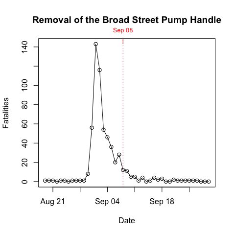

Time Series
================
lindbrook
2019-01-05

Overview
--------

The standard "textbook" story is that John Snow helped stem the tide of the cholera outbreak by getting local officials to remove the handle of the Broad Street pump.[1]

While Snow likely believed that this action would have mitigated the outbreak, he was skeptical of its actual effect. He writes that by the time the pump was removed on Friday, 08 September 1854, "the epidemic had evidently subsided" (Snow 1855b, 153).

As part of the Vestry Report, both he and the committee included separate tables that appear to reflect separate data on the number of deaths and fatalities. I have included both as separate data sets coded in `timeSeries()`. They can be visualized using `plot()`.

``` r
plot(timeSeries())
```



Notes
-----

[1] See <https://www.cdc.gov/mmwr/preview/mmwrhtml/mm5334a1.htm> and <https://www.nytimes.com/2017/02/06/health/cholera-vaccine-bangladesh.html>
