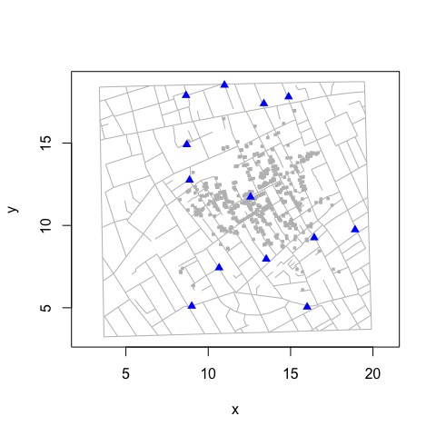
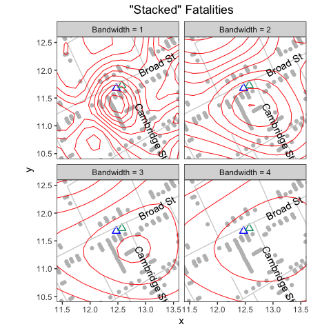
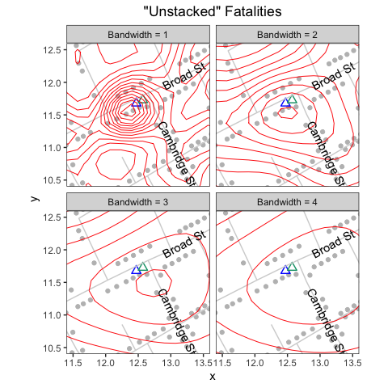

“Unstacking” Bars
================
lindbrook
2024-03-29

## Overview

In his map of the 1854 cholera outbreak in London, John Snow uses stacks
of bars to represent the number of fatalities at a given address. A
location with one fatality is represented by a single, horizontal bar
that lies parallel to road where the fatality occurred. A location with
five fatalities is represented by five horizontally stacked bars:[^1]


In 1992, Rusty Dodson and Waldo Tobler digitized the map. While the
original [URL](http://www.ncgia.ucsb.edu/pubs/snow/snow.html) no longer
works, their efforts have been preserved in [Internet Archive’s Wayback
Machine](https://web.archive.org/web/20100703153945/http://ncgia.ucsb.edu/Publications/Software/cholera/streets).
The data are also available in Michael Friendly’s
[‘HistData’](https://cran.r-project.org/package=HistData) R package.
That package is the starting point for this project.

Each bar and pump is assigned a unique x-y coordinate. Each road is
translated into a series of straight line segments, defined by the
segment’s endpoints. These data are plotted below:



Despite its appeal, I would argue that stacked bars are visually and
computationally problematic. The reason, simply put, is that not all
bars are created equal. Even though they are identical in terms of their
appearance and the only thing that appears to distinguish them is their
location, bars can actually play different roles.

Sometimes a bar represents the location of a fatality, sometimes it
doesn’t. Standalone bars, a stack with a single bar (i.e., an addresses
with one fatality), or the bar at the base of a stack represent a
location and a count. Bars above the base case do not. They exist only
to create the stacking effect to visually represent the number of
fatalities at the address.

This duality is problematic. Because a map is a visual device that
illustrates spatial relationships, it’s natural to assume that the
position of each element (e.g., each bar) reflects an actual, physical
location. When we violate this assumption, we undermine the visual
integrity of the map. This can handicap our analysis. This is
particularly true given that 44% (257/578) of the bars in Snow’s map
fall into this second, geographically uninformative category.

To address these problems, I “unstack” Dodson and Tobler’s data. I do so
in two ways. In the first, I give all all cases in a stack (i.e., at the
same “address”) the same x-y coordinate. These data are available in
`fatalities.unstacked`. In the second, I make the address rather than
the the case the unit of observation: each address is a single
observation with a single x-y coordinate, and the number of cases
observed at that location is an attribute of that address. These data
are available in `fatalities.address`.

## Data details

To illustrate the differences between these two data sets, consider how
they handle the largest outlier on Snow’s map: the eighteen cases at 38
Broad Street.

With `fatalities`, all members of the stack have different coordinates:

``` r
## The 18 cases at 38 Broad Street ##

broad38 <- c(239, 12, 310, 398, 562, 397, 421, 190, 290, 61, 174, 547, 523,
             521, 138, 59, 340, 508)

fatalities[fatalities$case %in% broad38, ]
>     case        x        y        lon      lat
> 12    12 12.34107 11.48214 -0.1368065 51.51321
> 59    59 12.58271 11.01057 -0.1366110 51.51298
> 61    61 12.47289 11.21463 -0.1367018 51.51309
> 138  138 12.56326 11.04593 -0.1366320 51.51301
> 174  174 12.48731 11.17735 -0.1366808 51.51307
> 190  190 12.44094 11.28124 -0.1367157 51.51312
> 239  239 12.31552 11.51159 -0.1368204 51.51324
> 290  290 12.45943 11.24890 -0.1367157 51.51310
> 310  310 12.35546 11.44285 -0.1367855 51.51319
> 340  340 12.59532 10.98533 -0.1365971 51.51298
> 397  397 12.40901 11.34986 -0.1365063 51.51313
> 398  398 12.36903 11.41560 -0.1367855 51.51319
> 421  421 12.42551 11.31754 -0.1367367 51.51315
> 508  508 12.61480 10.95197 -0.1365761 51.51296
> 521  521 12.54972 11.07519 -0.1366320 51.51302
> 523  523 12.53218 11.10452 -0.1366459 51.51304
> 547  547 12.51176 11.14190 -0.1366669 51.51305
> 562  562 12.39045 11.37820 -0.1367716 51.51317
```

With `fatalities.unstacked`, all members of the stack have the same
coordinate:

``` r
fatalities.unstacked[fatalities.unstacked$case %in% broad38, ]
>     case        x        y        lon      lat
> 12    12 12.31552 11.51159 -0.1368204 51.51324
> 59    59 12.31552 11.51159 -0.1368204 51.51324
> 61    61 12.31552 11.51159 -0.1368204 51.51324
> 138  138 12.31552 11.51159 -0.1368204 51.51324
> 174  174 12.31552 11.51159 -0.1368204 51.51324
> 190  190 12.31552 11.51159 -0.1368204 51.51324
> 239  239 12.31552 11.51159 -0.1368204 51.51324
> 290  290 12.31552 11.51159 -0.1368204 51.51324
> 310  310 12.31552 11.51159 -0.1368204 51.51324
> 340  340 12.31552 11.51159 -0.1368204 51.51324
> 397  397 12.31552 11.51159 -0.1368204 51.51324
> 398  398 12.31552 11.51159 -0.1368204 51.51324
> 421  421 12.31552 11.51159 -0.1368204 51.51324
> 508  508 12.31552 11.51159 -0.1368204 51.51324
> 521  521 12.31552 11.51159 -0.1368204 51.51324
> 523  523 12.31552 11.51159 -0.1368204 51.51324
> 547  547 12.31552 11.51159 -0.1368204 51.51324
> 562  562 12.31552 11.51159 -0.1368204 51.51324
```

With `fatalities.address`, the 18 cases are represented by a single
observation, case 239, which serves as the “address”:

``` r
fatalities.address[136:140, ]
>     anchor         x        y case.count        lon      lat
> 136    237 15.775540 13.98787          2 -0.1340355 51.51439
> 137    238 12.900190 10.33882          1 -0.1363598 51.51266
> 138    239 12.315520 11.51159         18 -0.1368204 51.51324
> 139    240  9.794394 11.77236          1 -0.1388027 51.51339
> 140    242 12.677590 12.05460          1 -0.1365133 51.51351
```

## Virtues of “unstacking”

To illustrate the virtues of “unstacked” data, consider the following.

### Kernel density contours

The graphs below plot the bivariate kernel density contours, of varying
bandwidths, on the “stacked” and “unstacked” data. The contours help
illustrate the spatial distribution or topography of fatalities, and
provide an estimate of the epicenter of the outbreak.

With the “stacked” data, `fatalities`, the contours are looser
(reflecting lower proximity) and the epicenter is further south than we
might expect given that the Broad Street pump (blue triangle)[^2] is the
accepted source of the outbreak. The problem is that the “vertical”
stack of 18 cases (west of the pump at 38 Broad Street) and the
“horizontal” stack of 5 cases (south of the pump at 10 Cambridge Street)
pull the fit downward in a southerly direction.



With `fatalities.unstacked`, the contours are “tighter” (reflecting
greater proximity) and the epicenter is located further north, nearer to
the pump and to Broad Street:



## “Unstacking” via classification

The main roadblock to “unstacking” is that there is no notion of an
“address” in the data: bars are merely points and the streets are merely
line segments.[^3] Nothing links a point to a segment. And nothing
connects one bar in a stack to another bar in the same stack. All
elements exist independently of one another. The only reason why the map
“works” is that the fatalities and roads data have proximate x-y
coordinates.

To “unstack” the data, we need to match each bar to a specific road
(segment) and to a specific stack. To accomplish these tasks, I use two
types of classification. For those interested, the details are found in
“computing street addresses”, which is available
[online](https://github.com/lindbrook/cholera/blob/master/docs/notes/unstacking.bars.notes.md)
in this package’s GitHub repository.

## Notes

[^1]: The map was originally published in Snow’s 1855 book “On The Mode
    Of Communication Of Cholera”, which was reprinted as John Snow et.
    al., 1936. *Snow on Cholera: Being a Reprint of Two Papers*. New
    York: The Common Wealth Fund. You can also find the map online (a
    high resolution version is available at
    <https://www.ph.ucla.edu/epi/snow/highressnowmap.html>) and in many
    books, including Edward Tufte’s 1997 “Visual Explanations: Images
    and Quantities, Evidence and Narrative”.

[^2]: The blue triangle is the “correct” location of the pump as
    included in the amended, second version of the map that appears in
    the Vestry report. The empty green triangle is the pump’s “wrong”
    location from the original map.

[^3]: In Friendly’s ‘HistData’ package, these data are called
    `Snow.deaths` and `Snow.streets`.
