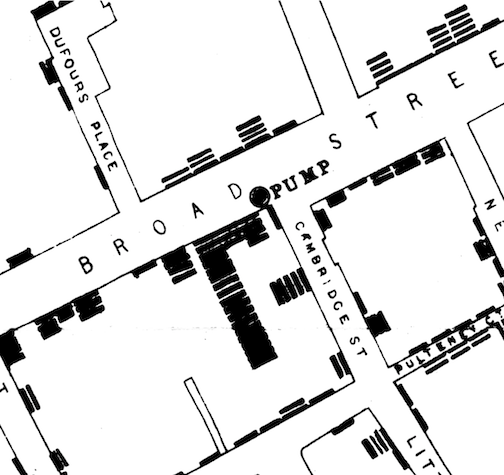

```{r, echo = FALSE, message = FALSE}
knitr::opts_chunk$set(collapse = TRUE, comment = "#>")
library("cholera")
library("HistData")
library("ggplot2")
library("KernSmooth")

bandwidth <- 0.5

top <- c(1:12, 14)
right <- c(37, 62, 74, 142, 147, 205, 240, 248, 280, 360, 405, 419, 465)
bottom <- c(483, seq(487, 495, 2), 498, 500, seq(503, 519, 2))
left <- c(31, 79, 114, 285, 348, 397, 469)
border <- sort(c(bottom, left, top, right))

map.border <- Snow.streets[Snow.streets$street %in% border == TRUE, ]
border.list <- split(map.border[, c("x", "y")], map.border$street)

## Roads ##

roads.list <- split(roads[, c("x", "y")], roads$street)

road.segments <- lapply(unique(roads$street), function(i) {
  dat <- roads[roads$street == i, ]
  names(dat)[names(dat) %in% c("x", "y")] <- c("x1", "y1")
  seg.data <- dat[-1, c("x1", "y1")]
  names(seg.data) <- c("x2", "y2")
  dat <- cbind(dat[-nrow(dat), ], seg.data)
  dat$id <- paste0(dat$street, "-", seq_len(nrow(dat)))
  dat
})

road.segments <- do.call(rbind, road.segments)

```

## Overview

In his map of the 1854 cholera outbreak in London, John Snow uses stacks of bars to represent the number of fatalities at a given address. A location with one fatality is represented by a single, horizontal bar that lies parallel to road where the fatality occurred. A location with five fatalities is represented by five horizontally stacked bars:^[The map was originally published in Snow's 1855 book "On The Mode Of Communication Of Cholera", which was reprinted as John Snow et. al., 1936. _Snow on Cholera: Being a Reprint of Two Papers_. New York: The Common Wealth Fund. You can also find the map online (a high resolution version is available at http://www.ph.ucla.edu/epi/snow/highressnowmap.html) and in many books, including Edward Tufte's 1997 "Visual Explanations: Images and Quantities, Evidence and Narrative".]


In 1992, Rusty Dodson and Waldo Tobler digitized the map. Each bar and pump was assigned a unique x-y coordinate. Each road was translated into series of straight line segments, defined by their endpoints. While the original data are no longer available,^[http://www.ncgia.ucsb.edu/pubs/snow/snow.html] they are preserved in Michael Friendly's 'HistData' package. The data are plotted below:

```{r, fig.width = 5.25, fig.height = 5.25, fig.align = "center", echo = FALSE}
roads.list <- split(roads[, c("x", "y")], roads$street)
plot(fatalities[, c("x", "y")], xlim = range(roads$x), ylim = range(roads$y),
     pch = 15, cex = 0.5, col = "gray", asp = 1)
invisible(lapply(roads.list, lines, col = "gray"))
points(HistData::Snow.pumps[, c("x", "y")], pch = 17, cex = 1, col = "blue")

```

Despite the appeal of stacked bars, I would argue that they are visually and computationally problematic. The reason, simply put, is that not all bars are created equal. Even though they are identical in terms of their appearance and the only thing that appears to distinguish them is their position on the map, bars can actually play different roles.

Sometimes a bar represent the location of a fatality, sometimes it doesn't. Standalone bars, a stack with a one single bar (i.e., an addresses with one fatality), or the bar at the base of a stack represent a location. However, bars above the base case do not. Their only purpose is to create the visual stacking effect to represent the number of fatalities at an address.

Within a map, this duality can be a problem. Because a map is a visual device that illustrates spatial relationships, it's natural to assume that the position of an elements (e.g., a bar) reflects an actual, physical location. When we violate this assumption, we undermine the visual interpretation of the map and potentially handicap our analysis. This is particularly true given that 44% (257/578) of bars in Snow's map fall into the second, geographically uninformative category.

To address these problems, I "unstack" Dodson and Tobler's data. I do so in two ways. In the first, which is available in _fatalities.unstacked_, all cases in a stack (i.e., at the same "address") are given the same x-y coordinate. In the second, which is available in _fatalities.address_, the unit of observation is the address rather than the the case: each address is a single observation with a single x-y coordinate, and the number of cases observed at that location becomes an attribute of the address.

## Data details

To illustrate the differences between the two, first consider how the datasets treat the largest outlier on Snow's map: the eighteen cases at 38 Broad Street.

```{r}
## The 18 cases at 38 Broad Street ##

broad38 <- c(239, 12, 310, 398, 562, 397, 421, 190, 290, 61, 174, 547, 523,
             521, 138, 59, 340, 508)

# With fatalities, all members of the stack have different coordinates

fatalities[fatalities$case %in% broad38, ]

# With fatalities.unstacked, all members of the stack have identical coordinates

fatalities.unstacked[fatalities.unstacked$case %in% broad38, ]

```

With _fatalities.address_, the 18 cases are represented by a single observation, case 239, which serves as the "address":

```{r}
# The 18 cases at 38 Broad street are nominally represented by case 239

fatalities.address[136:140, ]
```

## Virtues of "unstacking"

To illustrate the virtues of "unstacked" data, consider the following.

### Kernel density contours

The graphs below apply bivariate kernel density contours, of varying bandwidths, to the "stacked" and "unstacked" data. The contours help to illustrate the spatial distribution or topography of fatalities, and provides a way to estimate the location of the epicenter, if not the source, of the outbreak.

With the "stacked" data, _fatalities_, the contours are looser (more uncertainty) and the epicenter is further south than what we might expect given that the Broad Street pump (blue triangle)^[The blue triangle is the "correct" location of the pump as included in the amended, second version of the map that appears in the Vestry report. The empty green triangle is the pump's "wrong" location from the original map.] is the recognized source of the outbreak. The problem is that the "vertical" stack of 18 cases (west of the pump at 38 Broad Street) and the "horizontal" stack of 5 cases (south of the pump at 10 Cambridge Street) pull the fit downward in a southerly direction.

```{r, fig.width = 5.25, fig.height = 5.25, fig.align = "center", echo = FALSE}

roads.list <- split(roads[, c("x", "y")], roads$street)

## Graph parameters ##
bw <- 1:4
facets <- paste("Bandwidth =", bw)
x.range <- c(11.5, 13.5)
y.range <- c(10.5, 12.5)

## Data ##

Snow.deathsB <- lapply(rep("fatalities", max(bw)), get)
Snow.pumpsB <- lapply(rep("Snow.pumps", max(bw)), get)

for (i in seq_along(Snow.deathsB)) {
  Snow.deathsB[[i]]$facet <- facets[i]
}

Snow.deathsB2 <- Snow.deathsB
Snow.deathsB <- do.call(rbind, Snow.deathsB)

# Cambridge Street #
street.name <- "Cambridge Street"
cambridge.data <- roads[roads$name == street.name, ]
cambridge.data <- cambridge.data[order(cambridge.data$x), ]
d1 <- cambridge.data[-nrow(cambridge.data), c("x", "y")]
d2 <- cambridge.data[-1, c("x", "y")]

intercept.slope <-lapply(seq_len(nrow(cambridge.data) - 1), function(i) {
  coef(lm(y ~ x, data = rbind(d1[i, ], d2[i, ])))
})

sel <- 3
cambridge.angle <- atan(intercept.slope[[sel]][2]) * 180L / pi
cambridge.x <- mean(cambridge.data[sel:(sel + 1), "x"])
cambridge.y <- intercept.slope[[sel]][1] +
  intercept.slope[[sel]][2] * cambridge.x
cambridge.df <- data.frame(x = cambridge.x, y = cambridge.y)

# Broad Street #
street.name <- "Broad Street"
broad.data <- roads[roads$name == street.name, ]
broad.list <- roads.list[paste(unique(broad.data$street))]
broad.list <- lapply(broad.list, function(df) {
  df[order(df$x, decreasing = TRUE), ]
})

broad.pts.data <- do.call(rbind, broad.list)
broad.pts.data <- broad.pts.data[seq_len(nrow(broad.pts.data)) %% 2 != 0, ]

segment.ols <- lapply(broad.list, function(x) {
  coef(lm(y ~ x, data = x))
})

sel <- "193"
seg.id <- do.call(rbind, strsplit(rownames(broad.pts.data), "[.]"))[, 1]
i <- which(seg.id == sel)

broad.angle <- atan(segment.ols[[sel]]["x"]) * 180 / pi
broad.x <- median(broad.pts.data[i:(i + 1), "x"])
broad.y <- segment.ols[[sel]][1] + segment.ols[[sel]][2] * broad.x
broad.df <- data.frame(x = broad.x, y = broad.y)

## Graph ##

p <- ggplot(data = Snow.deathsB, aes(x = x, y = y)) +
  geom_point(color = "gray") +
  geom_point(data = pumps.vestry, aes(x = x, y = y), color = "blue", pch = 2,
             size = 2.5, stroke = 0.75) +
  geom_point(data = pumps, aes(x = x, y = y), color = "#009E73", pch = 2,
          size = 2.5, stroke = 0.75) +
  coord_fixed(xlim = x.range, ylim = y.range) +
  theme_bw() +
  theme(panel.grid.major = element_blank(),
        panel.grid.minor = element_blank(),
        plot.title = element_text(hjust = 0.5)) +
  facet_wrap(~ facet, nrow = 2) +
  ggtitle('"Stacked" Fatalities')

for (i in seq_along(roads.list)) {
  p <- p + geom_path(data = roads.list[[i]], aes(x = x, y = y),
    color = "lightgray")
}

for (i in seq_along(bw)) {
  p <- p + geom_density_2d(data = Snow.deathsB2[[i]], aes(x = x, y = y),
    color = "red", size = 1/3, h = bw[i])
}

p + geom_text(data = broad.df, aes(x = x, y = y), label = "Broad St",
              angle = broad.angle) +
  geom_text(data = cambridge.df, aes(x = x, y = y), label = "Cambridge St",
            angle = cambridge.angle)

```

With _fatalities.unstacked_, the contours are "tighter" (less uncertainty) and the epicenter are located further north, nearer to the roads, the pump and to Broad Street:

```{r, fig.width = 5.25, fig.height = 5.25, fig.align = "center", echo = FALSE}

## Data ##

fatalities.addressB <- lapply(rep("fatalities.address", max(bw)), get)
fatalities.unstackedB <- lapply(rep("fatalities.unstacked", max(bw)), get)

for (i in seq_along(fatalities.addressB)) {
  fatalities.addressB[[i]]$facet <- facets[i]
}

for (i in seq_along(fatalities.unstackedB)) {
  fatalities.unstackedB[[i]]$facet <- facets[i]
}

fatalities.addressB <- do.call(rbind, fatalities.addressB)

## Graph ##

p <- ggplot(data = fatalities.addressB, aes(x = x, y = y)) +
  geom_point(color = "gray") +
  geom_point(data = pumps.vestry, aes(x = x, y = y), color = "blue", pch = 2,
             size = 2.5, stroke = 0.75) +
  geom_point(data = pumps, aes(x = x, y = y), color = "#009E73", pch = 2,
           size = 2.5, stroke = 0.75) +
  coord_fixed(xlim = x.range, ylim = y.range) +
  theme_bw() +
  theme(panel.grid.major = element_blank(),
        panel.grid.minor = element_blank(),
        plot.title = element_text(hjust = 0.5)) +
  facet_wrap(~ facet, nrow = 2) +
  ggtitle('"Unstacked" Fatalities')

for (i in seq_along(roads.list)) {
  p <- p + geom_path(data = roads.list[[i]], aes(x = x, y = y),
    color = "lightgray")
}

for (i in seq_along(bw)) {
  p <- p + geom_density_2d(data = fatalities.unstackedB[[i]], aes(x = x, y = y),
    color = "red", size = 1/3, h = bw[i])
}

p + geom_text(data = broad.df, aes(x = x, y = y), label = "Broad St",
              angle = broad.angle) +
  geom_text(data = cambridge.df, aes(x = x, y = y), label = "Cambridge St",
            angle = cambridge.angle)

```

## "Unstacking" via classification

The main roadblock to "unstacking" is that there is no notion of an "address" in the data. Bars are merely points. Streets are merely line segments.^[In Friendly's HistData package, these data are called "Snow.deaths" and "Snow.streets".] Nothing links the points to segments. And nothing connects one bar in a stack to another. All elements exist independently of one another. The only reason why the map "works" is that the fatalities and roads data have overlapping x-y coordinates.

To "unstack" the data, we need to match each bar to a specific road (segment) and to a specific stack. To accomplish these tasks, I employ two different methods of classification.

### Orthogonal projection

The first method works by orthogonal projection. For each bar, the algorithm draws a series of lines that pass through the bar and that are orthogonal to "nearby" road segment.^[To reduce computation, I only consider road segments with at least one endpoint within approximately 50 meters of the bar (i.e., a distance of 0.5 on the map's scale).] If the projected line intersects or bisects a road segment, it becomes a candidate for the bar's home segment. If there's more than one candidate, the algorithm chooses the segment that is "closest" to the bar: the segment with the shortest orthogonal projector.

To illustrate, consider the following stylized example. For case 12, there are three possible "home" road segments: the solid blue, solid red and the solid green segments. Of the three, only _red_ and _green_ are viewed as candidates. The problem with _blue_ is that its orthogonal projector (the blue arrow) does not intersect the solid blue segment. Of the two remaining candidates, _red_ is chosen because it is closer to case 12 than _green_: the red arrow is shorter than the green one.

```{r, fig.width = 5.25, fig.height = 5.25, fig.align = "center", echo = FALSE}

case.select <- 12
case <- Snow.deaths[case.select, c("x", "y")]

plot(fatalities[, c("x", "y")], xlim = x.range, ylim = y.range, pch = NA,
  asp = 1)
invisible(lapply(roads.list, lines, col = "lightgray"))
points(fatalities[, c("x", "y")], col = "gray")
text(fatalities[case.select, c("x", "y")], labels = case.select, pos = 1,
  col = "red")
title(main = paste("Orthogonal Classification: Broad Street Case", case.select))

# "Unit" Circle
radius <- 0.5
unit.base <- 100
unit.radians <- 2 * pi / unit.base
circumference.x <- fatalities[case.select, "x"] + radius *
                   cos(0:unit.base * unit.radians)
circumference.y <- fatalities[case.select, "y"] + radius *
                   sin(0:unit.base * unit.radians)
lines(circumference.x, circumference.y)

candidate <- c("216-1", "217-1", "243-1")
street.color <- c("red", "dodgerblue", "green2")

invisible(lapply(seq_along(candidate), function(i) {
  seg.data <- road.segments[road.segments$id == candidate[i],
    c("x1", "y1", "x2", "y2")]
  segments(seg.data$x1, seg.data$y1, seg.data$x2, seg.data$y2,
    col = street.color[i], lwd = 2)
  points(seg.data[, c("x1", "y1")], pch = 0)
  points(seg.data[, c("x2", "y2")], pch = 0)
}))

invisible(lapply(seq_along(candidate), function(i) {
  seg.data <- road.segments[road.segments$id == candidate[i],
    c("x1", "y1", "x2", "y2")]
  seg.df <- data.frame(x = c(seg.data$x1, seg.data$x2),
                       y = c(seg.data$y1, seg.data$y2))
  ols <- lm(y ~ x, data = seg.df)
  segment.slope <- coef(ols)[2]
  segment.intercept <- coef(ols)[1]
  orthogonal.slope <- -1 / segment.slope
  orthogonal.intercept <- case$y - orthogonal.slope * case$x
  x.proj <- (orthogonal.intercept - segment.intercept) /
            (segment.slope - orthogonal.slope)
  y.proj <- segment.slope * x.proj + segment.intercept
  arrows(case$x, case$y, x.proj, y.proj, col = street.color[i], lwd = 2,
    length = 1/8)
  abline(ols, lty = "dashed", col = street.color[i], lwd = 1)
}))

points(fatalities[case.select, c("x", "y")], pch = 20, col = "red", cex = 1.5)
text(cambridge.df$x, cambridge.df$y, "Cambridge St", srt = cambridge.angle)
text(broad.df$x, broad.df$y, "Broad St", srt = broad.angle)

```

This procedure correctly classifies 515 of 578 of the cases, an error rate of 10.9%. Errors occur due to ambiguities surrounding a case's "home" segment. Unlike Snow's map where a bar's "horizontal" orientation indicates its "home" road segment, Dodson and Tobler only record a case's x-y coordinate. This can lead to problems at street intersections, where a point may be closer to the "wrong" segment, and at addresses with many cases.^[This is further exacerbated by the fact that the width of roads is not always taken into consideration. This creates instances where cases on one side of the street appear to be closer to the road than those on the other side.  One particular case of note is Portland Mews. In Snow's map, Portland Mews is a large yard or square. In Dodson and Tobler, Portland Mews simply a set of line segments, which possibly corresponds to the roadway through the location. As a result, given the orientation of the cases of Snow's map and location of the cases in Dodson and Tobler, these three cases will appear to belong to a single cluster instead of two separate ones. I manually chose a more distant road segment on Portland Mews that better reflects the orientation of bars in Snow's map.] The problem with multiple cases is that stacking can push cases away from their "home" segment. Consider the figure below. Even though visual inspection (the alignment of the stack) should lead us to choose _black_, the algorithm chooses _red_. The reason for the error is that stacking pushes the case so far from _black_ that it falls outside of the range of consideration. I corrected these errors by manually recoding cases.

```{r, fig.width = 5.25, fig.height = 5.25, fig.align = "center", echo = FALSE}

case.select <- 290
case <- Snow.deaths[case.select, c("x", "y")]

plot(fatalities[, c("x", "y")], xlim = x.range, ylim = y.range, pch = NA,
  asp = 1)
invisible(lapply(roads.list, lines, col = "lightgray"))
points(fatalities[, c("x", "y")], col = "gray")
text(fatalities[case.select, c("x", "y")], labels = case.select, pos = 1,
  col = "red")
title(main = paste("Classification Error: Broad Street Case", case.select))

# "Unit" Circle #
radius <- 0.5
unit.base <- 100
unit.radians <- 2 * pi / unit.base
circumference.x <- Snow.deaths[case.select, "x"] + radius *
                   cos(0:unit.base * unit.radians)
circumference.y <- Snow.deaths[case.select, "y"] + radius *
                   sin(0:unit.base * unit.radians)
lines(circumference.x, circumference.y)

candidate <- c("216-1", "243-2")
street.color <- c("black", "red")

invisible(lapply(seq_along(candidate), function(i) {
  seg.data <- road.segments[road.segments$id == candidate[i],
    c("x1", "y1", "x2", "y2")]
  segments(seg.data$x1, seg.data$y1, seg.data$x2, seg.data$y2,
    col = street.color[i], lwd = 2)
  points(seg.data[, c("x1", "y1")], pch = 0)
  points(seg.data[, c("x2", "y2")], pch = 0)
}))

invisible(lapply(seq_along(candidate), function(i) {
  seg.data <- road.segments[road.segments$id == candidate[i],
    c("x1", "y1", "x2", "y2")]
  seg.df <- data.frame(x = c(seg.data$x1, seg.data$x2),
                       y = c(seg.data$y1, seg.data$y2))
  ols <- lm(y ~ x, data = seg.df)
  segment.slope <- coef(ols)[2]
  segment.intercept <- coef(ols)[1]
  orthogonal.slope <- -1 / segment.slope
  orthogonal.intercept <- case$y - orthogonal.slope * case$x
  x.proj <- (orthogonal.intercept - segment.intercept) /
            (segment.slope - orthogonal.slope)
  y.proj <- segment.slope * x.proj + segment.intercept
  arrows(case$x, case$y, x.proj, y.proj, col = street.color[i], lwd = 2,
    length = 1/8)
  abline(ols, lty = "dashed", col = street.color[i], lwd = 1)
}))

text(cambridge.df$x, cambridge.df$y, "Cambridge St", srt = cambridge.angle)
text(broad.df$x, broad.df$y, "Broad St", srt = broad.angle)

```

### Cluster analysis

To link a bar to a stack, I use hierarchical cluster analysis.^[Specifically, I use stats::hclust(), which is included with base R and which, by default, employs a "complete" method of agglomerative hierarchical clustering.] To make this task easier, I use a bar's orthogonal coordinates rather that its x-y coordinate . That is, I use the point where the the orthogonal projection from the bar intersects its "home" road segment. Doing so reduces the dimensionality of the problem (the algorithm only needs to compare positions of points along a line) and virtually eliminates any classification error.^[What makes this possible is that, by design, its "vertical" dispersion, the spread of x-y points along the orthogonal axis, is much greater than its "horizontal" dispersion, the spread of orthogonal points along the road's line segment. In an ideal world, the "horizontal" dispersion would be zero and all points in a stack would be perfectly aligned. In practice, this is not the case.]

The figure below illustrates this approach. Using a case's x-y coordinate, the graph plots the case's numeric ID and draws the corresponding orthogonal projector to Broad Street. Matching a bar to a stack, which is equivalent to identifying a stack, means identifying distinct clusters of points along the road segment. For the case at hand, visual inspection leads us to expect that we should find 8 different clusters: 4 on the north side, 4 on the south.

```{r, fig.width = 5.25, fig.height = 5.25, fig.align = "center", echo = FALSE}

broad.st.cases <- c(12, 21, 25, 32, 42, 72, 91, 93, 122, 190, 194, 212, 232,
                    239, 310, 321, 343, 373, 389, 396, 397, 398, 421, 496, 562,
                    570, 572, 574, 577)

orthogonal.projection <- lapply(broad.st.cases, function(i) {
  case <- fatalities[i, c("x", "y")]

  within.radius <- "216-1"

  ortho.proj.test <- lapply(within.radius, function(x) {
    seg.data <- road.segments[road.segments$id == x, c("x1", "y1", "x2", "y2")]

    seg.df <- data.frame(x = c(seg.data$x1, seg.data$x2),
                         y = c(seg.data$y1, seg.data$y2))

    ols <- lm(y ~ x, data = seg.df)
    segment.slope <- coef(ols)[2]
    segment.intercept <- coef(ols)[1]
    orthogonal.slope <- -1 / segment.slope
    orthogonal.intercept <- case$y - orthogonal.slope * case$x

    x.proj <- (orthogonal.intercept - segment.intercept) /
              (segment.slope - orthogonal.slope)

    y.proj <- segment.slope * x.proj + segment.intercept

    # segment bisection/intersection test

    distB <- dist(rbind(seg.df[1, ], c(x.proj, y.proj))) +
             dist(rbind(seg.df[2, ], c(x.proj, y.proj)))

    bisect.test <- signif(dist(seg.df)) == signif(distB)

    if (bisect.test) {
      ortho.dist <- c(dist(rbind(c(case$x, case$y), c(x.proj, y.proj))))
      ortho.pts <- data.frame(x.proj, y.proj)
      data.frame(id = x, ortho.pts, ortho.dist, stringsAsFactors = FALSE)
    } else NA
  })

  out <- do.call(rbind, ortho.proj.test)
  sel <- which.min(out$ortho.dist)
  out[sel, ]
})

ortho.proj <- do.call(rbind, orthogonal.projection)
rownames(ortho.proj) <- NULL
ortho.proj$case <- broad.st.cases
vars <- c("id", "case", "x.proj", "y.proj", "ortho.dist")
ortho.proj <- ortho.proj[, vars]

# ## Classification errors ##

road.segment.fix <- list("216-1" = c(290, 61, 174, 547, 523, 521, 138, 59, 340,
  508))

# Recompute orthogonal distances

ortho.projB <- lapply(seq_along(road.segment.fix), function(i) {
  case <- fatalities[unlist(road.segment.fix[[i]]), ]
  seg.id <- names(road.segment.fix[i])
  seg.data <- road.segments[road.segments$id == seg.id, ]

  seg.df <- data.frame(x = c(seg.data$x1, seg.data$x2),
                       y = c(seg.data$y1, seg.data$y2))

  ols <- lm(y ~ x, data = seg.df)
  segment.slope <- coef(ols)[2]
  segment.intercept <- coef(ols)[1]
  orthogonal.slope <- -1 / segment.slope
  orthogonal.intercept <- case$y - orthogonal.slope * case$x

  x.proj <- (orthogonal.intercept - segment.intercept) /
            (segment.slope - orthogonal.slope)

  y.proj <- segment.slope * x.proj + segment.intercept

  proj.data <- lapply(1:nrow(case), function(j) {
    dat <- rbind(case[j, c("x", "y")], c(x.proj[j], y.proj[j]))
    cbind(x.proj[j], y.proj[j], c(dist(dat)))
  })

  out <- data.frame(seg.id, case$case, do.call(rbind, proj.data),
    stringsAsFactors = FALSE)
  names(out) <- c("id", "case", "x.proj", "y.proj", "ortho.dist")
  out
})

ortho.projB <- do.call(rbind, ortho.projB)
rownames(ortho.projB) <- NULL

ortho.proj <- rbind(ortho.proj, ortho.projB)
ortho.proj <- ortho.proj[order(ortho.proj$case), ]

# Plot #

i <- "216-1"

case <- ortho.proj[ortho.proj$id == i, "case"]
ortho <- ortho.proj[ortho.proj$id == i, c("x.proj", "y.proj")]

vars <- c("x1", "y1", "x2", "y2")
seg.coord <- road.segments[road.segments$id == i, vars]

plot(fatalities[case, c("x", "y")], asp = 1, pch = NA)
invisible(lapply(roads.list, lines, col = "lightgray"))
segments(seg.coord$x1, seg.coord$y1, seg.coord$x2, seg.coord$y2, col = "red")

points(seg.coord[, c("x1", "y1")], pch = 0)
points(seg.coord[, c("x2", "y2")], pch = 0)

proj.dat <- cbind(ortho, fatalities[case, c("x", "y")])

invisible(apply(proj.dat, 1, function(z) {
  segments(z["x"], z["y"], z["x.proj"], z["y.proj"], col = "lightgray")
}))

text(fatalities[case, c("x", "y")], labels = case, cex = 0.9)
title(main = "Virtues of Orthogonal Projection: Broad Street")

# Cambridge Street #
street.name <- "Cambridge Street"
cambridge.data <- roads[roads$name == street.name, ]
cambridge.data <- cambridge.data[order(cambridge.data$x), ]
d1 <- cambridge.data[-nrow(cambridge.data), c("x", "y")]
d2 <- cambridge.data[-1, c("x", "y")]

intercept.slope <- lapply(seq_len(nrow(cambridge.data) - 1), function(i) {
  coef(lm(y ~ x, data = rbind(d1[i, ], d2[i, ])))
})

sel <- 2
cambridge.angle <- atan(intercept.slope[[sel]][2]) * 180L / pi
cambridge.x <- mean(cambridge.data[sel:(sel + 1), "x"])
cambridge.y <- intercept.slope[[sel]][1] +
  intercept.slope[[sel]][2] * cambridge.x
cambridge.df <- data.frame(x = cambridge.x, y = cambridge.y)

text(cambridge.df$x, cambridge.df$y, "Cambridge St", srt = cambridge.angle)

# Broad Street #
street.name <- "Broad Street"
broad.data <- roads[roads$name == street.name, ]
broad.list <- roads.list[paste(unique(broad.data$street))]
broad.list <- lapply(broad.list, function(df) {
  df[order(df$x, decreasing = TRUE), ]
})

broad.pts.data <- do.call(rbind, broad.list)
broad.pts.data <- broad.pts.data[seq_len(nrow(broad.pts.data)) %% 2 != 0, ]

segment.ols <- lapply(broad.list, function(x) {
  coef(lm(y ~ x, data = x))
})

sel <- "203"
seg.id <- do.call(rbind, strsplit(rownames(broad.pts.data), "[.]"))[, 1]
i <- which(seg.id == sel)

broad.angle <- atan(segment.ols[[sel]]["x"]) * 180 / pi
broad.x <- median(broad.pts.data[i:(i + 1), "x"])
broad.y <- segment.ols[[sel]][1] + segment.ols[[sel]][2] * broad.x
broad.df <- data.frame(x = broad.x, y = broad.y)

text(broad.df$x, broad.df$y, "Broad St", srt = broad.angle)

```

One can be confirm the results by examining Snow's map:^[In Snow's map, one can see 5 addresses on the north side of the block of Broad Street between Dufours Place and Poland Street (the road running north-south just visible on the east or left side of the graph) but only 4 of those addresses fall on the street segment in Dodson and Tobler. The reason for the discrepancy is that intersections with other streets, regardless of which side of the road they may fall, define the end points of road segments. This is why the south side of this segment of Broad Street only includes 4 addresses: the endpoints are defined by Dufours Place on the left (west) and Cambridge Street on the right (east).]



The one fly in the ointment is that addresses directly opposite one another will have "identical" orthogonal points and will appear to belong to the same "address". A simple solution to distinguish clusters on opposite sides of the street is to compute the _sign_ of the arithmetic difference between a case's x-y coordinate and its orthogonal coordinate.

For example, consider cases 321 and 239. They lie on opposite sides of Broad Street. In the figure below, 321's coordinates are shown in blue while 239's are shown in red. When we take the signs of the differences, we get (-, +) for 321 and (+, -) for 239. This distinguishes cases on the north side from those on the south side.

```{r, fig.width = 5.25, fig.height = 5.25, fig.align = "center", echo = FALSE}

sel <- c(321, 239)

sig.fig <- 2

plot(fatalities[sel, c("x", "y")], asp = 1, pch = NA)
invisible(lapply(roads.list, lines, col = "lightgray"))
segments(seg.coord$x1, seg.coord$y1, seg.coord$x2, seg.coord$y2, col = "gray")
points(fatalities[fatalities$case %in% sel, c("x", "y")],
  col = c("red", "blue"))

obs <- fatalities[sel, c("x", "y")]
ort <- ortho.proj[ortho.proj$case %in% sel, c("x.proj", "y.proj")]
arrows(obs[1, "x"], obs[1, "y"], ort[1, "x.proj"], ort[1, "y.proj"],
  col = "blue", length = 1/8)
arrows(obs[2, "x"], obs[2, "y"], ort[2, "x.proj"], ort[2, "y.proj"],
  col = "red", length = 1/8)
points(ort[1, "x.proj"], ort[1, "y.proj"], pch = 0, col = "blue")
points(ort[2, "x.proj"], ort[2, "y.proj"], pch = 0, col = "red")

text(fatalities[fatalities$case %in% sel, c("x", "y")],
  labels = fatalities[fatalities$case %in% sel, "case"], pos = 2,
  col = c("red", "blue"))

lab.1 <- paste0("(", round(obs[1, "x"], sig.fig), ", ", round(obs[1, "y"],
  sig.fig), ")")
lab.2 <- paste0("(", round(obs[2, "x"], sig.fig), ", ", round(obs[2, "y"],
  sig.fig), ")")
lab.3 <- paste0("(", round(ort[1, "x.proj"], sig.fig), ", ",
  round(ort[1, "y.proj"], sig.fig), ")")
lab.4 <- paste0("(", round(ort[2, "x.proj"], sig.fig), ", ",
  round(ort[2, "y.proj"], sig.fig), ")")

text(fatalities[fatalities$case == 321, c("x", "y")], labels = lab.1,
  pos = 4, cex = 0.8, col = "blue")
text(fatalities[fatalities$case == 239, c("x", "y")], labels = lab.2,
  pos = 4, cex = 0.8, col = "red")
text(ort[1, ], labels = lab.3, pos = 2, cex = 0.8, col = "blue")
text(ort[2, ], labels = lab.4, pos = 4, cex = 0.8, col = "red")

title(main = "North v. South: Broad Street Cases 321 & 239")

# Broad Street #
street.name <- "Broad Street"
broad.data <- roads[roads$name == street.name, ]
broad.list <- roads.list[paste(unique(broad.data$street))]
broad.list <- lapply(broad.list, function(df) {
  df[order(df$x, decreasing = TRUE), ]
})

broad.pts.data <- do.call(rbind, broad.list)
broad.pts.data <- broad.pts.data[seq_len(nrow(broad.pts.data)) %% 2 != 0, ]

segment.ols <- lapply(broad.list, function(x) {
  coef(lm(y ~ x, data = x))
})

sel <- "216"
seg.id <- do.call(rbind, strsplit(rownames(broad.pts.data), "[.]"))[, 1]
i <- which(seg.id == sel)

broad.angle <- atan(segment.ols[[sel]]["x"]) * 180 / pi
broad.x <- median(broad.pts.data[i:(i + 1), "x"])
broad.y <- segment.ols[[sel]][1] + segment.ols[[sel]][2] * broad.x
broad.df <- data.frame(x = broad.x, y = broad.y)

text(broad.df$x, broad.df$y, "Broad St", srt = broad.angle)

```

In general, for roads with positive slopes (e.g., Broad Street), the differences for cases on the north/west side will be (-, +) while those on the south/east side will be (+, -); for roads with negative slopes (e.g., Cambridge Street), the differences for cases on the north/east side will be (-, -) while those on the south/west side will be (+, +).^[The two limiting cases occur when roads run either along the East-West axis (i.e., 0 degrees) or the North-South axis (i.e., 90 degrees). For the former, cases on the north side will be (0, +) while those on the south side will be (0, -); for the latter, cases on the east side will be (+, 0) while those on the west side will be (-, 0).]

With this information, I can use cluster analysis to identify stacks, or "addresses", on each side of a candidate road segment. Since we expect the distances between cases in a stack or "address" to be small, I use an arbitrarily low but reasonable cutoff "height" of 0.05. The two dendrograms below represent the North and South sides of Broad Street. We can see that this procedure correctly classifies the 8 different groups or stacks that can be seen in the figure above and that can be verified by looking at Snow's map.

```{r, fig.width = 5.25, fig.height = 5.25, fig.align = "center", echo = FALSE}

cutpoint <- 0.05

i <- "216-1"

case <- ortho.proj[ortho.proj$id == i, "case"]
ortho <- ortho.proj[ortho.proj$id == i, c("x.proj", "y.proj")]

orientation <- sign(Snow.deaths[case, c("x", "y")] - ortho)

if (all(orientation$x * orientation$y == -1)) {
  orientation$side <- ifelse(orientation$x == 1 & orientation$y == -1, 0, 1)
}

if (all(orientation$x * orientation$y == 1)) {
  orientation$side <- ifelse(orientation$x == 1 & orientation$y == 1, 0, 1)
}

if (length(unique(orientation$side)) == 2) {
  sideA <- as.numeric(rownames(orientation[orientation$side == 0, ]))
  sideB <- as.numeric(rownames(orientation[orientation$side == 1, ]))
  data.South <- ortho.proj[ortho.proj$case %in% sideA, c("x.proj", "y.proj")]
  data.North <- ortho.proj[ortho.proj$case %in% sideB, c("x.proj", "y.proj")]

  rownames(data.South) <- sideA
  rownames(data.North) <- sideB

  if (nrow(data.South) >= 2) {
    clusterA <- hclust(dist(data.South))
    outA <- cutree(clusterA, h = cutpoint)
  } else {
    outA <- 1
    names(outA) <- rownames(data.South)
  }

  if (nrow(data.North) >= 2) {
    clusterB <- hclust(dist(data.North))
    outB <- cutree(clusterB, h = cutpoint)
  } else {
    outB <- 1
    names(outB) <- rownames(data.North)
  }

  outB <- max(outA) +  outB
  census <- c(outA, outB)
  out <- data.frame(case = as.numeric(names(census)), group = census,
    stringsAsFactors = FALSE)
  rownames(out) <- NULL
}

plot(clusterB, main = "Broad Street: North Side")
abline(h = 0.05, lty = "dashed", col = "blue")
axis(4, at = 0.05, labels = 0.05, col.axis = "blue", col.ticks = "blue")

plot(clusterA, main = "Broad Street: South Side")
abline(h = 0.05, lty = "dashed", col = "red")
axis(4, at = 0.05, labels = 0.05, col.axis = "red", col.ticks = "red")

```
